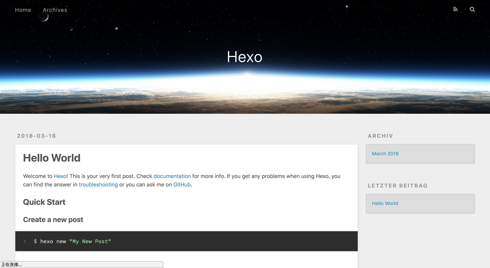
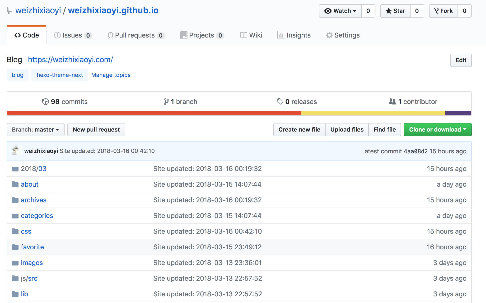
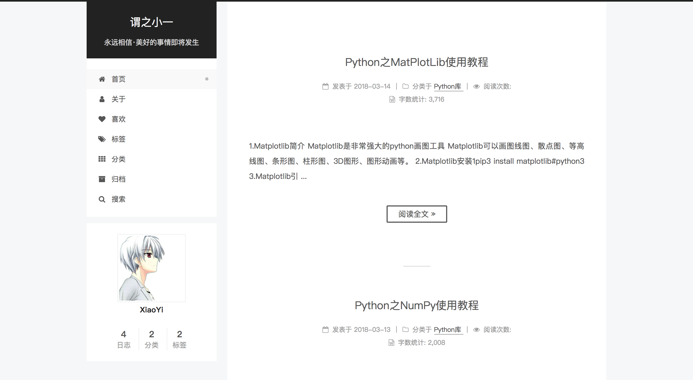
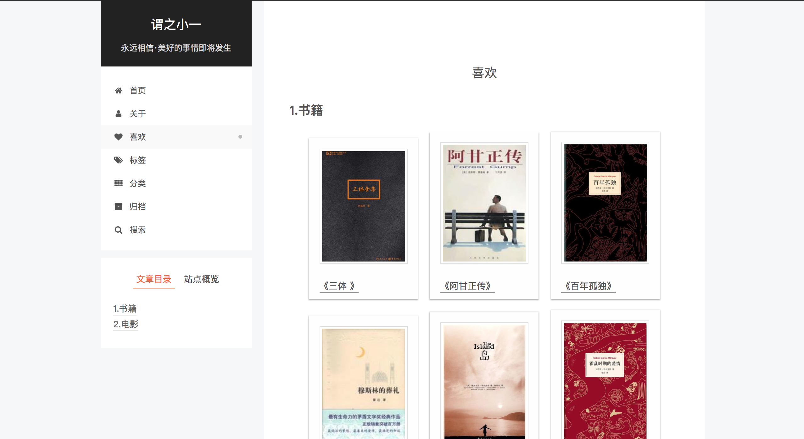
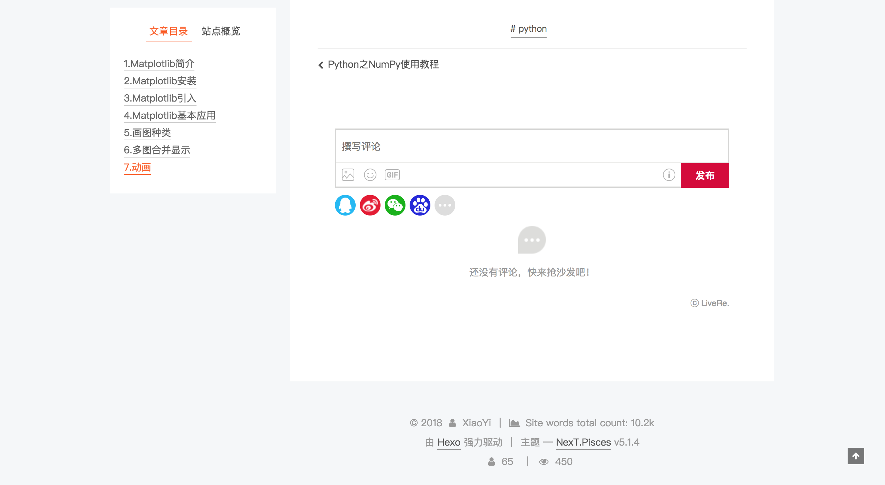
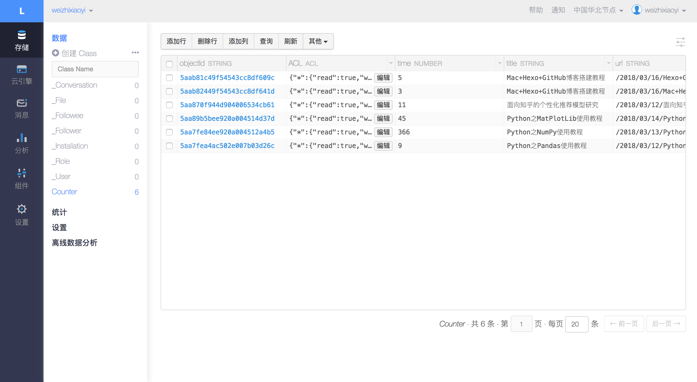
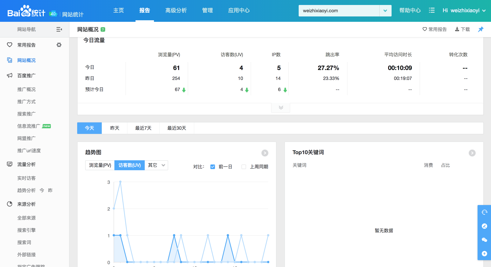
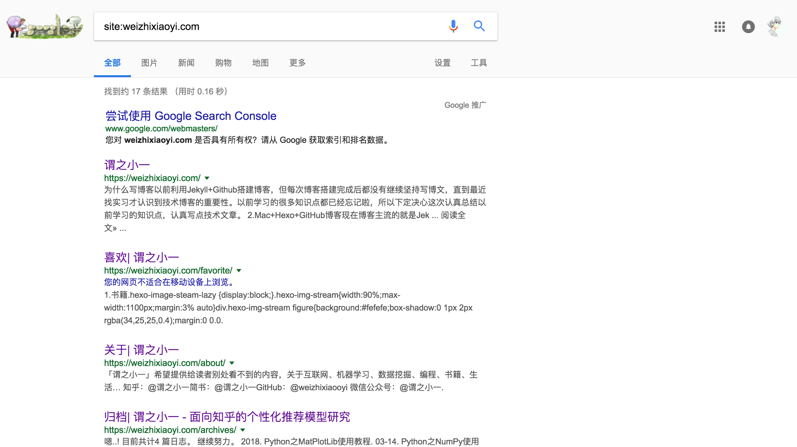
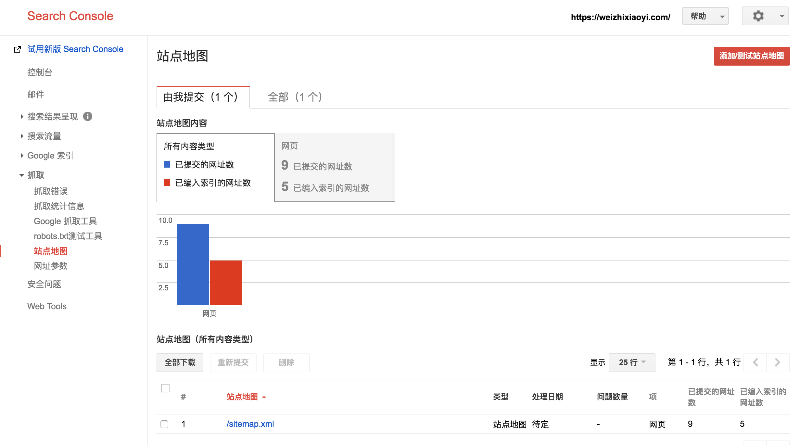

### 1.为什么写博客

以前利用Jekyll+Github搭建博客，但每次博客搭建完成后都没有继续坚持写博文，直到最近找实习才认识到技术博客的重要性。以前学习的很多知识点都已经忘记啦，所以下定决心这次认真总结以前学习的知识点，认真写点技术文章。

### 2.Mac+Hexo+GitHub博客

现在博客主流的就是Jekyll和Hexo两种格式，选择Jekyll还是Hexo就根据个人喜好啦，但个人更推荐使用Hexo，选择Hexo的主要原因。

+ Jekyll没有本地服务器，无法实现本地文章预览，需要上传到WEB容器中才能预览功能，而Hexo可以通过简单的命令实现本地预览功能，并直接发布到WEB容器中实现同步。
+ Jekyll主题和Hexo主题对比而言，Hexo主题更加简洁美观(个人审美原因)。

选择GitHub的原因不用多说，程序员的乐园，更是支持pages功能，虽然很多其他社区也支持，比如GitLab、coding、码云等，但GitHub更加活跃，自己的项目就是放在上面，所以更加方便。但GitHub有最大一点不好之处便是*百度爬虫无法爬去博客内容*，自己也找了好久解决方法，比如利用coding托管(免费版绑定域名有广告)、CDN加速(对于流量太小的网站没什么用)，所以暂时没什么太好的解决方法。

### 3.博客本地环境搭建

#### 3.1安装Node.js和Git

Mac上安装可以选择图形化方式和终端安装，此处直接使用客户端方式安装。Node.js官网下载文件，根据提示安装即可，安装成功后在目录*/usr/local/bin*目录下。测试Node.js和npm，出现下述信息则安装成功。

```
node -v
v8.10.0
```

```
npm -v
5.6.0
```

Git官网下载相应文件根据提示直接进行安装，检查git是否安装成功，直接查看git版本即可。

> Git --version 
>
> git version 2.15.0

#### 3.2安装Hexo

Node.js和Git都安装成功后开始安装Hexo。安装时注意权限问题，加上sudo，其中-g表示全局安装。

```mac
sudo npm install -g hexo
```

#### 3.3博客初始化

创建存储博客的文件，比如命名为myblog，然后进入到myblog之中。

```
cd myblog
```

执行下述命令初始化本地博客，下载一些列文件。

```
hexo init
```

执行下述命令安装npm。

```
sudo npm install
```

执行下述命令生成本地html文件并开启服务器，然后通过http://localhost:4000查看本地博客。

```
hexo g
hexo s
```



### 4.本地博客关联GitHub

#### 4.1本地博客代码上传GitHub

注册并登陆GitHub账号后，新建仓库，名称必须为`user.github.io`，如`weizhixiaoyi.github.io`。



终端cd到myblog文件夹下，打开_config.yml文件。或者用其他文本编辑器打开可以，推荐sublime。

```Vim
vim _config.yml
```

打开后至文档最后部分，将deploy配置如下。

```Python
deploy:
  type: git
  repository: https://github.com/weizhixiaoyi/weizhixiaoyi.github.io.git
  branch: master
```

其中将repository中`weizhixiaoyi`改为自己的用户名，注意type、repository、branch后均有空格。通过如下命令在myblog下生成静态文件并上传到服务器。

```
hexo g
hexo d
```

若执行`hexo g`出错则执行`npm install hexo --save`，若执行`hexo d`出错则执行`npm install hexo-deployer-git --save `。错误修正后再次执行`hexo g`和`hexo d`。

若未关联GitHub，执行`hexo d`时会提示输入GitHub账号用户名和密码，即:

```
username for 'https://github.com':
password for 'https://github.com':
```

`hexo d`执行成功后便可通过https://weizhixiaoyi.github.io访问博客，看到的内容和http://localhost:4000相同。

#### 4.2添加ssh keys到GitHub

添加ssh key后不需要每次更新博客再输入用户名和密码。首先检查本地是否包含ssh keys。如果存在则直接将ssh key添加到GitHub之中，否则进入新生成ssh key。

执行下述命令生成新的ssh key，将`your_email@example.com`改成自己以注册的GitHub邮箱地址。默认会在`~/.ssh/id_rsa.pub`中生成`id_rsa`和`id_rsa.pub`文件。

```
ssh-keygen -t rsa -C "your_email@exampl"		
```

Mac下利用`open ~/.ssh  `打开文件夹，打开id_rsa.pub文件，里面的信息即为ssh key，将此信息复制到GitHub的Add ssh key`路径GitHub->Setting->SSH keys->add SSH key`界面即可。Title里填写任意标题，将复制的内容粘贴到key中，点击Add key完成添加。

此时本地博客内容便已关联到GitHub之中，本地博客改变之后，通过`hexo g`和`hexo d`便可更新到GitHub之中，通过https://weizhixiaoyi.github.io访问便可看到更新内容。

### 5.更换Hexo主题

可以选择Hexo主题官网页面搜索喜欢的theme，这里我选择hexo-theme-next当作自己主题，hex-theme-next主题是GitHub中hexo主题star最高的项目，非常推荐使用。

终端cd到myblog目录下执行如下所示命令。

```
git clone https://github.com/iissnan/hexo-theme-next themes/next
```

将blog目录下_config.yml里的theme的名称`landscape`更改为`next`。

执行如下命令（每次部署文章的步骤）

```
hexo g  //生成缓存和静态文件
hexo d  //重新部署到服务器
```

当本地博客部署到服务器后，网页端无变化时可以采用下述命令。

```
hexo clean  //清楚缓存文件(db.json)和已生成的静态文件(public)
```

### 6.配置Hexo-theme-next主题

Hexo-theme-next主题便为精于心、简于形，简介的界面下能够呈现丰富的内容，访问[next官网](http://theme-next.iissnan.com/)查看配置内容。配置文件主要修改next中_config.yml文件，next有三种主题选择，分别为Muse、Mist、Pisces三种，个人选择的是Pisces主题。主题增加标签、分类、归档、喜欢（书籍和电影信息流）、文章阅读统计、访问人数统计、评论等功能，博客界面如下所示。







#### 6.1增加标签、分类、归档页

首先将next/config.yml文件中将`menu`中`tags` ` catagories` `archive`前面的`#`。例如增加标签页，通过`hexo new page 'tags'`增加新界面，在myblog/sources中发现多了tags文件夹，修改index.md中内容，将type更改为`tags`。利用`hexo g`和`hexo d`将界面重新上传到服务器便可看到新增加的标签页，分类和归档页同理。

#### 6.2增加喜欢界面

喜欢界面用于展现自己看过的书籍和电影，通过图片流的形式进行安装。

从GitHub上https://github.com/weizhixiaoyi 中的themes/next/scripts下载image-stream.js，放到你的主题/scripts目录中。如果博客主题已经默认引入了jQuery，建议在配置中将image_stream.jquery设置为false。

```Query
image_stream:
	jquery: false
```

在Hexo博客的本地目录中创建一个favorite页面目录，同6.1步骤。并在Next主题中配置config.yml，配置如下所示，其中heart表示图标为心形。

```
menu:
  home: / || home
  about: /about/ || user
  favorite: /favorite/ || heart
  tags: /tags/ || tags
  categories: /categories/ || th
  archives: /archives/ || archive
```

然后在source/favorite/index.md中使用插件自定义的两个模版来生成页面，index.md内容格式如下所示。

```





```
#### 6.3文章阅读统计

文章阅读统计采用LeanCloud，能够提供直观的文章被访问次数，方便作者了解文章写作的质量。Next主题支持leancloud统计，但需要提供app_id和app_key，因此我们需另外注册leancloud账号，注册过程在此便不再赘述。

注册成功之后进行创建新应用，设置相应用户名便创建成功。进入用户界面创建Class，在此需要注意的是Class名称必须为Counter，之后此表便是文章数量统计表。然后我们进入设置中的应用key模块便可获得app_id和app_key，进入next主题的config.yml中，找到leancloud位置复制即可，同时将enable设置为true。另外我们也可以在后台人为修改文章访问量，比如将Python之NumPy使用教程访问量增加。

```
leancloud_visitors:
  enable: true 
  app_id: Sj2lCA09ErubMSsa2v9oFU9Y-gzGzoHsz #<app_id>
  app_key: qJejurdHKM06N75OQedX4SDK #<app_key>
```



#### 6.4增加百度统计

百度统计能够清晰看出网站访问数据。在百度官网注册账号后，添加绑定个人网站，在管理页面中找到`代码获取`。

```javascript
<script>
var _hmt = _hmt || [];
(function() {
  var hm = document.createElement("script");
  hm.src = "https://hm.baidu.com/hm.js?b54e835b3551fd0696954b3aedf5d645";
  var s = document.getElementsByTagName("script")[0]; 
  s.parentNode.insertBefore(hm, s);
})();
</script>
```

将代码中`b54e835b3551fd0696954b3aedf5d645`复制到next主题_config.yml的`baidu_analytics`中。接下来通过`代码安装检查`来检查代码是否安装成功，安装成功后便可查看网站详细统计信息。



#### 6.4增加评论功能

多说、网易云跟帖关闭，畅言需要备案，disqus被墙而且界面不是太美观。新出来的来必力倒是挺不错，支持QQ、微信、微博、百度、人人账号登陆，可以选择常用表情和gif动画，并支持自定义搜索表情。

进入来必力官网注册账号，填写网站域名，进入代码管理界面获得data-uid，复制到next主题_config.yml中的livere_uid处便可，重新提交网站便可看到评论专区。`编写文章时应在头部添加comments: true`

### 7.绑定个人域名

现在使用的域名`weizhixiaoyi.github.io`是github提供的二级域名，也可绑定自己的个性域名`weizhixiaoyi.com`。域名是在阿里云购买，年费为55元，也可以在狗爹`https://sg.godaddy.com`购买，购买好域名之后便可以直接解析。

#### 7.1GitHub端

在next主题中source文件夹中创建`CNAME`文件，没有后缀名，然后将个人域名`weizhixiaoyi.com`添加进`CNAME`文件即可，然后通过`hexo g` `hexo d`重新部署网站。

#### 7.2域名解析

如果将域名指向另外一个域名，需要增加CNAME记录。登陆阿里云官网，进入控制台中域名设置，添加解析。

+ 记录类型：CNAME
+ 主机记录：@
+ 解析线路：默认
+ 记录值：weizhixiaoyi.github.io

解析成功后，等待几分钟便可登陆weizhixiaoyi.com查看网站内容。

### 7.博客SEO优化

SEO优化也就是搜索引擎优化，搜索引擎优化即为增加博客内容被搜索引擎爬取次数，以此增加博客的点击率和曝光度。如果想让自己博客更加容易被搜索到，便是让百度爬虫、谷歌爬虫主动去爬取自己博客内容，但由于Github博客屏蔽百度爬虫，所以只能将自己的博客收录到谷歌，当然这种方法适合于墙外用户。

#### 7.1确认收录情况

在谷歌上搜索`site:weizhixiaoyi.com`，如果能搜索内容就已经被谷歌收录，否则就没有被谷歌收录。



#### 7.1网站身份验证

验证网站的目的就是证明你是网站的所有者，这里使用站长平台功能进行验证，另外没有梯子的朋友可以通过`shadowsock`+`搬瓦工`自行搭建。

进入谷歌站长平台中的搜索引擎提交入口，添加域名，选择验证方式。个人选择的是在网页中添加标签，进入next主题文件夹，然后找到layout/_partials/，打开head.swig文件，在theme_google_site_verification处添加如下信息。

```

  <meta name="google-site-verification" content="E1Oy09IV-Rsypa8wpY-yrplcH8RMIHLCzj3m91nX1Eo" />

```

然后回到`myblog`文件夹下将_config.yml中google_site_vertification设置为`true`。当然你也可以选择其他验证方式，比如添加html文档。信息添加成功之后便可利用`hexo g`和`hexo d`更新博客内容，至此网站身份验证结束。

#### 7.2添加Sitemap

sitemap站点地图是一种文件格式，可以通过该文件列出您网站上的链接，从而将您网站内容告知谷歌和其他搜索引擎。

首先安装针对谷歌的插件`npm install hexo-generator-sitemap --save`，然后进入`myblog`文件夹下将`sitemap`设置如下。

```
# sitemap
sitemap:
  path: sitemap.xml
```

#### 7.3谷歌收录博客

谷歌收录操作比较简单，就是向Google站长工具提交sitemap，成功登陆Google账号后，添加站点验证。站点验证通过后找到站点地图界面，然后进行添加站点地图地址就行啦。等待1天后通过`site:weizhixiaoyi.com`能够搜索到博客内容，便证明谷歌搜索引擎已收录网站内容。



另外也可通过bing站长管理工具进行收录网站内容，将网站内容呈现给更多需要帮助的人。针对百度爬虫不能爬取Github博客内容问题，我尝试过利用coding托管(免费版绑定域名有广告)、CDN加速(对于流量太小的网站没什么用)，但感觉效果都不是太好，所以问题亟待解决，等找到合适的解决办法之后再告知大家。

### 8.ToDoList

+ 寻找更好的方法解决百度爬虫无法爬取博客内容的问题
+ 博客增加转发功能

------

### 9.推广

更多内容请关注公众号’谓之小一’，若有疑问可在公众号后台提问，随时回答，欢迎关注，内容转载请注明出处。

