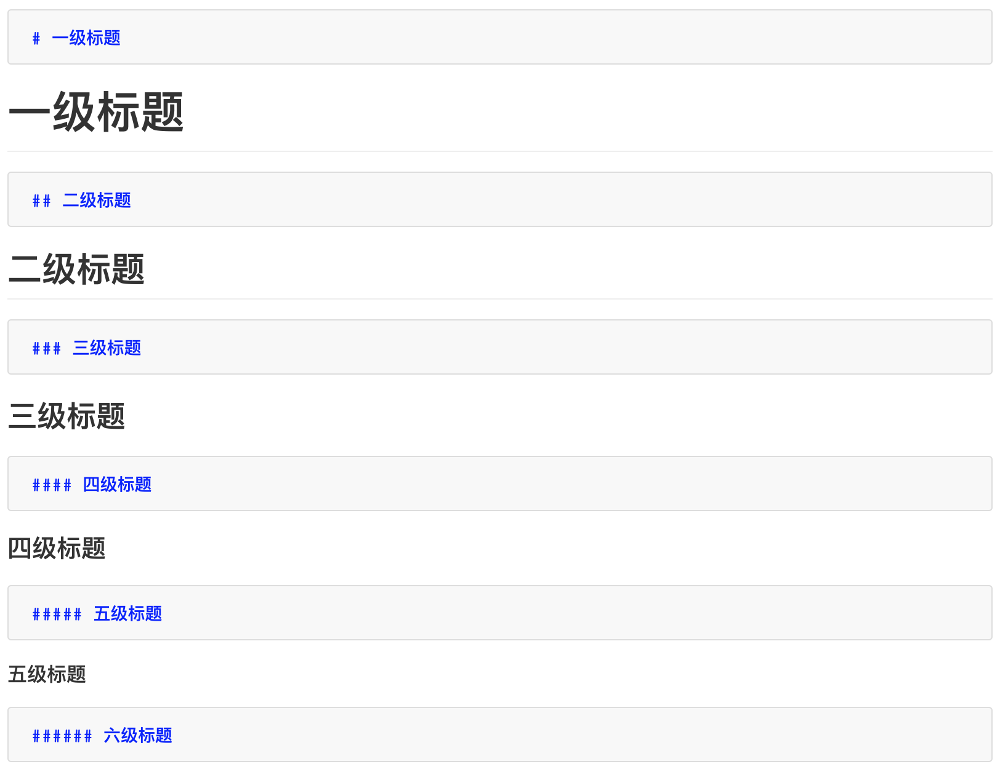
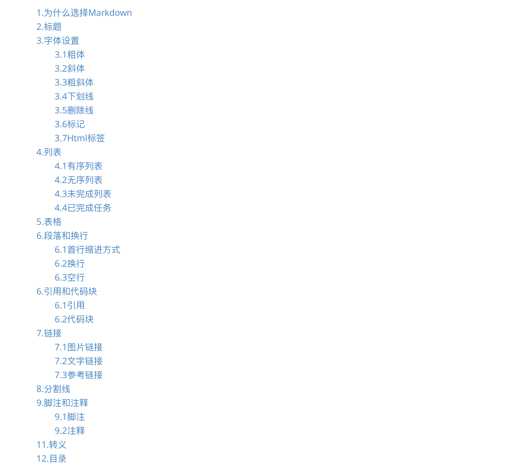

[博客搭建教程](https://weizhixiaoyi.com/2018/03/16/Mac+Hexo+GitHub%E5%8D%9A%E5%AE%A2%E6%90%AD%E5%BB%BA%E6%95%99%E7%A8%8B/)写完之后，很多同学都比较感兴趣，那么在此也写下Markdown写作教程，更快捷、方便的写作博文。当然网上已经有太多人写Markdown教程，那么很多人难免问这个问题，为什么你还要花时间去写如此一篇教程呢？是因为哪怕是同样的内容，写出来之后便有我自己的风格，能让更多人浅显易懂的了解这些知识，同时也能增加我的个人理解，共同学习。

### 1.为什么选择Markdown

首先通过Github搭建博客，我们只能用Markdown文档，然后直接转换成Html网页展现出来。但除了这个原因之外，更吸引我的地方便是其简单、快捷、高效的写作方式，通过轻文本标记语言，利用简洁的语法进行排版，达到所见及所得的效果，书写的过程只考虑内容和文字本身，写作的过程便是享受。目前CSDN、简书、博客园、知乎等平台均支持Markdown写作。当然富文本写作方式也有其迷人之处，比如我用**印象笔记**至此已经写了200+的笔记，有时间给大家写个印象笔记教程，如何高效收集、管理生活中的知识点与信息流。

### 2.标题

标题通过`#`的个数进行区分，Markdown共支持6级标题。



### 3.字体设置

#### 3.1粗体

文字前后加`**`来表示粗体。

```markdown
**粗体**
```

**粗体**

#### 3.2斜体

文字前后加`*`来表示斜体。

```markdown
*斜体*
```

*斜体*

#### 3.3粗斜体

文字前后加`***`来表示粗斜体。

```markdown
***粗斜体***
```

***粗斜体***

#### 3.4下划线

文字前后加`<u>` `</u>`来表示下划线。

```markdown
<u>下滑线</u>
```

<u>下划线</u>

#### 3.5删除线

文字前后加`~~`来表示删除线。

```markdown
~~删除线~~
```

~~删除线~~

#### 3.6标记

文字前后加`` `来表示标记，该符号位于Esc键下面。

```markdown
`标记`
```

`标记`

#### 3.7Html标签

```Markdown
<font face="微软雅黑" color="red" size="6">字体及字体颜色和大小</font>
```

<font face="微软雅黑" color="red" size="3">字体及字体颜色和大小</font>

### 4.列表

#### 4.1有序列表

采用`1.  ` 后加空格形式表示有序列表。

```markdown
1. 有序列表1
2. 有序列表2
3. 有序列表3
```

1. 有序列表1
2. 有序列表2
3. 有序列表3

#### 4.2无序列表

采用`+` `-` `* ` `=`符号表示无序列表，支持多级嵌套。

```markdown
+ 有序列表1
+ + 有序列表1.1
+ + 有序列表1.2
+ 有序列表2
+ 有序列表3
```

- 无序列表1
  - 无序列表1.1
  - 无序列表1.2
- 无序列表2
- 无序列表3

#### 4.3未完成列表

采用`- []`表示未完成任务，各符号间均有空格。

```markdown
- [ ] 未完成任务1
- [ ] 未完成任务2
- [ ] 未完成任务3
```

- [ ] 未完成任务1
- [ ] 未完成任务2
- [ ] 未完成任务3

#### 4.4已完成任务

采用`- [x] `表示已完成任务，各符号间均有空格。同时可直接在未完成任务间`打勾`来转换成已完成任务。

```markdown
- [x] 已完成任务1
- [x] 已完成任务2
- [x] 已完成任务3
```

- [ ] 已完成任务1
- [ ] 已完成任务2
- [ ] 已完成任务3

### 5.表格

表格对齐方式

- 居左：:----
- 居中：:----:或-----
- 居由：----:

```markdown
| 标题1           |      标题2      |           标题3 |
| :-------------- | :-------------: | --------------: |
| 居左测试文本1.1 | 居中测试文本2.1 | 居右测试文本3.1 |
| 居左测试文本1.2 | 居中测试文本2.2 | 居右测试文本3.2 |
```

| 标题1           |      标题2      |           标题3 |
| :-------------- | :-------------: | --------------: |
| 居左测试文本1.1 | 居中测试文本2.1 | 居右测试文本3.1 |
| 居左测试文本1.2 | 居中测试文本2.2 | 居右测试文本3.2 |

### 6.段落和换行

#### 6.1首行缩进方式

+ `&emsp;`中文空格
+ `&ensp;`半中文空格
+ `&nbsp;`英文空格
+ ` `输入法切换到全角双击空格

#### 6.2换行

+ ` ` ` `换行处连续打两个空格
+ 换行处使用`<br>`进行换行

#### 6.3空行

+ ` ` ` ` 空行处连续打两个空格
+ 换行处使用`<br>`进行空行

### 6.引用和代码块

#### 6.1引用

若在文章中需要引入一段话等，可以采用引用的方式呈现，支持多级引用。

```Markdown
> 引用1
> > 引用1.1
> > 引用1.2
> 引用2
```

> 引用1
>
> > 引用1.1
> >
> > 引用1.2
>
> 引用2

#### 6.2代码块

代码前后添加```` `表示代码块。

```markdown
​```Python
print('代码块')
​```
```

```python
print（'代码块'）
```

### 7.链接

#### 7.1图片链接

采用``来表示图片链接。

```Markdown

```


#### 7.2文字链接

采用`[]()`表示文字链接。

```Markdown
[链接名称](链接地址)
```

[文字链接](weizhixiaoyi.com)

#### 7.3参考链接

采用`[ ]: `表示参考链接，注意符号后有空格。

```markdown
[ ]: url title
```

[参考链接]: https://weizhixiaoyi.com	"谓之小一"

### 8.分割线

上下文无关时可使用分割符进行分开。

- 连续多个`-`  (>=3)
- 连续多个`*` （>=3）
- 连续多个下划线`_` （>=3）

```
---分割线
***分割线
___分割线
```

------

------

------

### 9.脚注和注释

#### 9.1脚注

采用`[^]:表示脚注，注意空格。

```markdown
[^]: 脚注
```

[^]: 脚注

#### 9.2注释

采用`<!---->`表示注释.

```markdown
<!--注释-->
```

<!--注释-->

### 11.转义

Markdown通过反斜杠`\`来插入在语法中有其他意义的符号，Markdown支持以下符号来进行转义。

```markdown
\\反斜线
\`反引号
\*星号
\_下划线
\{}花括号
\[]方括号
\()括弧
\#井字号
\+加号
\-减号
\.英文句点
\!感叹号
```

\\反斜线
\`反引号
\*星号
\_下划线
\{}花括号
\[]方括号
\()括弧
\#井字号
\+加号
\-减号
\.英文句点
\!感叹号

### 12.目录

采用`[TOC]`来生成文章目录。

```Markdown
[TOC]
```



-----

### 13.推广

更多内容请关注公众号’谓之小一’，若有疑问可在公众号后台提问，随时回答，欢迎关注，内容转载请注明出处。


