### 1.Matplotlib简介

 1. Matplotlib是非常强大的python画图工具
 2. Matplotlib可以画图线图、散点图、等高线图、条形图、柱形图、3D图形、图形动画等。 

### 2.Matplotlib安装
```
pip3 install matplotlib#python3
```
### 3.Matplotlib引入
```
import matplotlib.pyplot as plt#为方便简介为plt
import numpy as np#画图过程中会使用numpy
import pandas as pd#画图过程中会使用pandas
```
### 4.Matplotlib基本应用
```
x=np.linspace(-1,1,50)#定义x数据范围
y1=2*x+1#定义y数据范围
y2=x**2
plt.figure()#定义一个图像窗口
plt.plot(x,y)#plot()画出曲线
plt.show()#显示图像
```
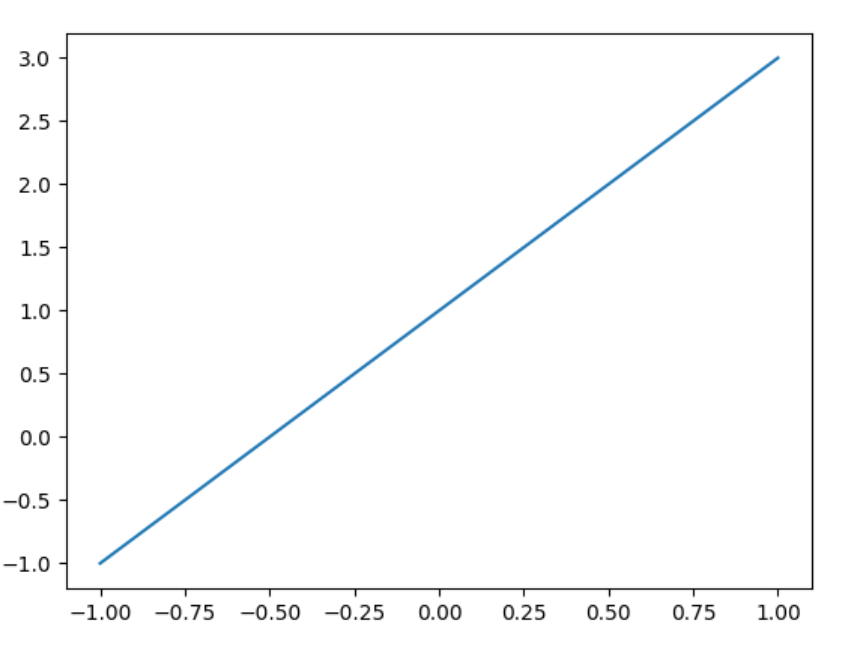
#### 4.1figure图像
matplotlib的figure为单独图像窗口，小窗口内还可以有更多的小图片。
```
x=np.linspace(-3,3,50)#50为生成的样本数
y1=2*x+1
y2=x**2
plt.figure(num=1,figsize=(8,5))#定义编号为1 大小为(8,5)
plt.plot(x,y1,color='red',linewidth=2,linestyle='--')#颜色为红色，线宽度为2，线风格为--
plt.plot(x,y2)#进行画图
plt.show()#显示图
```
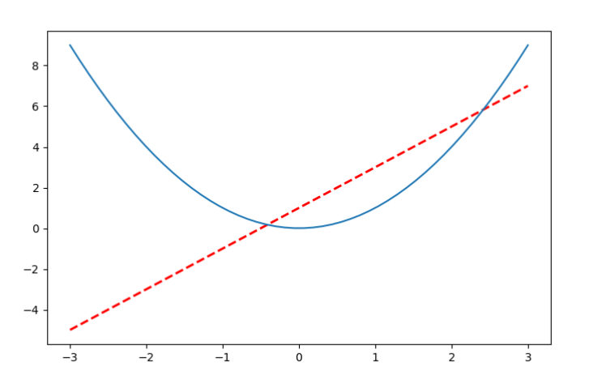
#### 4.2设置坐标轴
```
x=np.linspace(-3,3,50)
y1=2*x+1
y2=x**2
plt.figure(num=2,figsize=(8,5))
plt.plot(x,y1,color='red',linewidth=2,linestyle='-')
plt.plot(x,y2)#进行画图
plt.xlim(-1,2)
plt.ylim(-2,3)
plt.xlabel("I'm x")
plt.ylabel("I'm y")
plt.show()
```
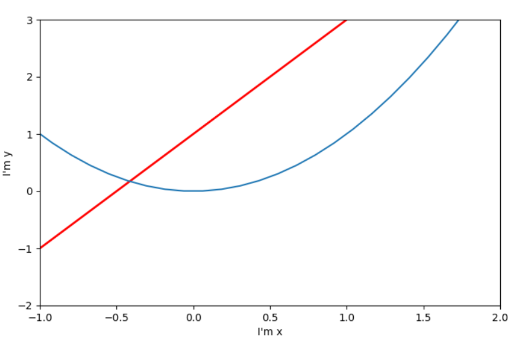
自定义坐标轴
```
x=np.linspace(-3,3,50)
y1=2*x+1
y2=x**2
plt.figure(num=2,figsize=(8,5))
plt.plot(x,y1,color='red',linewidth=2,linestyle='-')
plt.plot(x,y2)#进行画图
plt.xlim(-1,2)
plt.ylim(-2,3)
plt.xlabel("I'm x")
plt.ylabel("I'm y")
new_ticks=np.linspace(-1,2,5)#小标从-1到2分为5个单位
print(new_ticks)
#[-1.   -0.25  0.5   1.25  2.  ]
plt.xticks(new_ticks)#进行替换新下标
plt.yticks([-2,-1,1,2,],
           [r'$really\ bad$','$bad$','$well$','$really\ well$'])
plt.show()
```
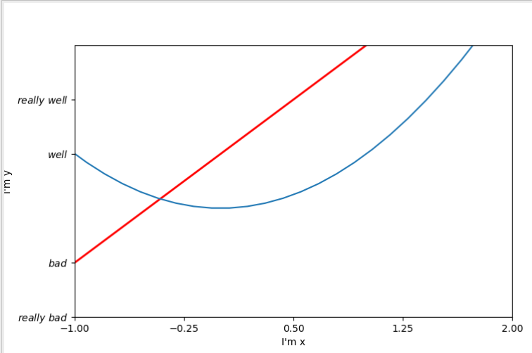
设置边框属性
```
x=np.linspace(-3,3,50)
y1=2*x+1
y2=x**2
plt.figure(num=2,figsize=(8,5))
plt.plot(x,y1,color='red',linewidth=2,linestyle='--')
plt.plot(x,y2)#进行画图
plt.xlim(-1,2)
plt.ylim(-2,3)
new_ticks=np.linspace(-1,2,5)#小标从-1到2分为5个单位
plt.xticks(new_ticks)#进行替换新下标
plt.yticks([-2,-1,1,2,],
           [r'$really\ bad$','$bad$','$well$','$really\ well$'])
ax=plt.gca()#gca=get current axis
ax.spines['right'].set_color('none')#边框属性设置为none 不显示
ax.spines['top'].set_color('none')
plt.show()
```
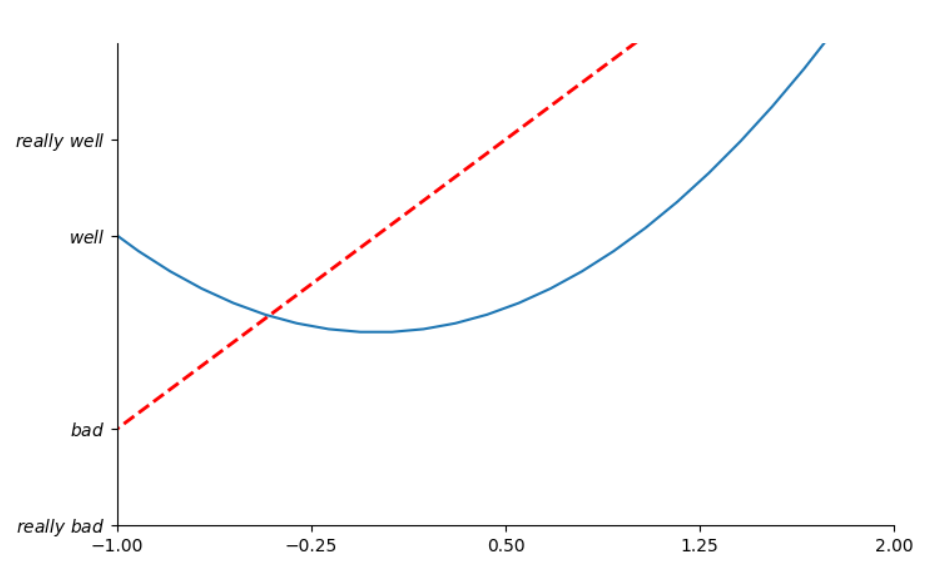
调整移动坐标轴
```
x=np.linspace(-3,3,50)
y1=2*x+1
y2=x**2
plt.figure(num=2,figsize=(8,5))
plt.plot(x,y1,color='red',linewidth=2,linestyle='--')
plt.plot(x,y2)#进行画图
plt.xlim(-1,2)
plt.ylim(-2,3)
new_ticks=np.linspace(-1,2,5)#小标从-1到2分为5个单位
plt.xticks(new_ticks)#进行替换新下标
plt.yticks([-2,-1,1,2,],
           [r'$really\ bad$','$bad$','$well$','$really\ well$'])
ax=plt.gca()#gca=get current axis
ax.spines['right'].set_color('none')#边框属性设置为none 不显示
ax.spines['top'].set_color('none')
ax.xaxis.set_ticks_position('bottom')#使用xaxis.set_ticks_position设置x坐标刻度数字或名称的位置 所有属性为top、bottom、both、default、none
ax.spines['bottom'].set_position(('data', 0))#使用.spines设置边框x轴；使用.set_position设置边框位置，y=0位置 位置所有属性有outward、axes、data
ax.yaxis.set_ticks_position('left')
ax.spines['left'].set_position(('data',0))#坐标中心点在(0,0)位置
plt.show()
```
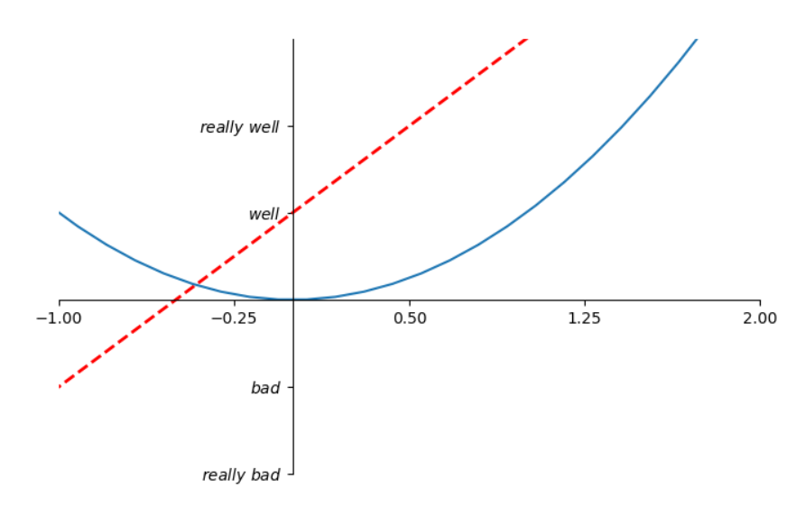
#### 4.3添加图例
matplotlib中legend图例帮助我们展示数据对应的图像名称。
```
x=np.linspace(-3,3,50)
y1=2*x+1
y2=x**2
plt.figure(num=2,figsize=(8,5))
plt.xlim(-1,2)
plt.ylim(-2,3)
new_ticks=np.linspace(-1,2,5)#小标从-1到2分为5个单位
plt.xticks(new_ticks)#进行替换新下标
plt.yticks([-2,-1,1,2,],
           [r'$really\ bad$','$bad$','$well$','$really\ well$'])

l1,=plt.plot(x,y1,color='red',linewidth=2,linestyle='--',label='linear line')
l2,=plt.plot(x,y2,label='square line')#进行画图
plt.legend(loc='best')#显示在最好的位置
plt.show()#显示图
```
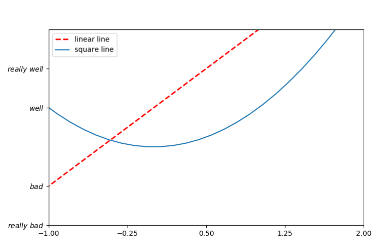
调整位置和名称，单独修改label信息，我们可以在plt.legend输入更多参数
```
plt.legend(handles=[l1, l2], labels=['up', 'down'],  loc='best')
#loc有很多参数 其中best自分配最佳位置
'''
 'best' : 0,          
 'upper right'  : 1,
 'upper left'   : 2,
 'lower left'   : 3,
 'lower right'  : 4,
 'right'        : 5,
 'center left'  : 6,
 'center right' : 7,
 'lower center' : 8,
 'upper center' : 9,
 'center'       : 10,
 '''
```
#### 4.4标注

```
x=np.linspace(-3,3,50)
y = 2*x + 1
plt.figure(num=1, figsize=(8, 5))
plt.plot(x, y,)

#移动坐标轴
ax = plt.gca()
ax.spines['right'].set_color('none')
ax.spines['top'].set_color('none')
ax.xaxis.set_ticks_position('bottom')
ax.spines['bottom'].set_position(('data', 0))
ax.yaxis.set_ticks_position('left')
ax.spines['left'].set_position(('data', 0))

#标注信息
x0=1
y0=2*x0+1
plt.scatter(x0,y0,s=50,color='b')
plt.plot([x0,x0],[y0,0],'k--',lw=2.5)#连接(x0,y0)(x0,0) k表示黑色 lw=2.5表示线粗细
#xycoords='data'是基于数据的值来选位置，xytext=(+30,-30)和textcoords='offset points'对于标注位置描述和xy偏差值，arrowprops对图中箭头类型设置
plt.annotate(r'$2x0+1=%s$' % y0, xy=(x0, y0), xycoords='data', xytext=(+30, -30),
             textcoords='offset points', fontsize=16,
             arrowprops=dict(arrowstyle='->', connectionstyle="arc3,rad=.2"))
#添加注视text（-3.7,3）表示选取text位置 空格需要用\进行转译 fontdict设置文本字体             
plt.text(-3.7, 3, r'$This\ is\ the\ some\ text. \mu\ \sigma_i\ \alpha_t$',
         fontdict={'size': 16, 'color': 'r'})
plt.show()
```
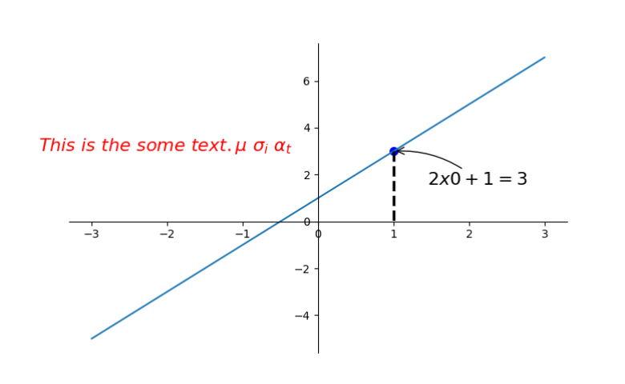
#### 4.5能见度调整
```
x=np.linspace(-3, 3, 50)
y=0.1*x
plt.figure()
plt.plot(x, y, linewidth=10, zorder=1)
plt.ylim(-2, 2)

#移动坐标轴
ax = plt.gca()
ax.spines['right'].set_color('none')
ax.spines['top'].set_color('none')
ax.spines['top'].set_color('none')
ax.xaxis.set_ticks_position('bottom')
ax.spines['bottom'].set_position(('data', 0))
ax.yaxis.set_ticks_position('left')
ax.spines['left'].set_position(('data', 0))

#label.set_fontsize(12)重新调整字体大小 bbox设置目的内容的透明度相关参数 facecolor调节box前景色 edgecolor设置边框 alpha设置透明度 zorder设置图层顺序
for label in ax.get_xticklabels() + ax.get_yticklabels():
    label.set_fontsize(12)
    label.set_bbox(dict(facecolor='red', edgecolor='None', alpha=0.7, zorder=2))
plt.show()
```
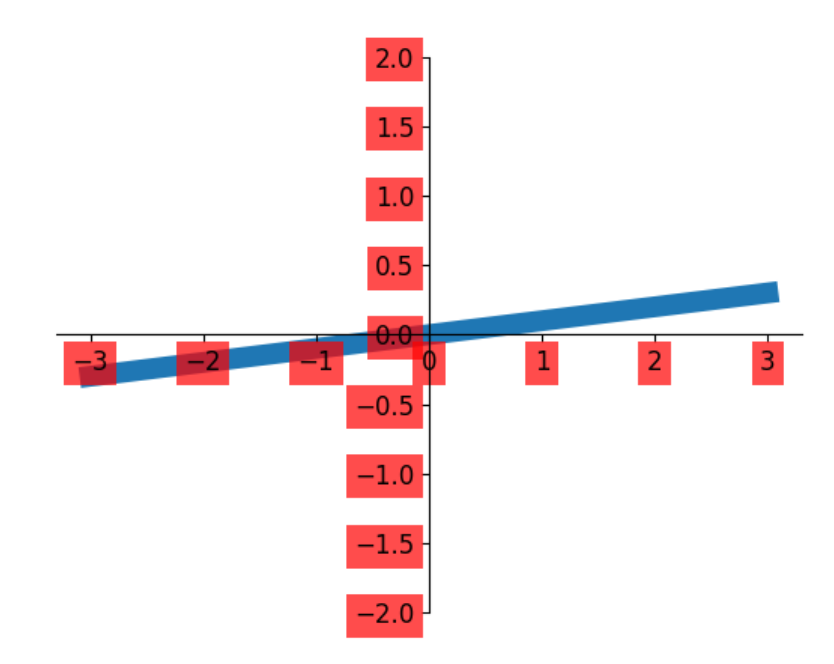
### 5.画图种类
#### 5.1Scatter散点图
```
n=1024
X=np.random.normal(0,1,n)#每一个点的X值
Y=np.random.normal(0,1,n)#每一个点的Y值
T=np.arctan2(Y,X)#arctan2返回给定的X和Y值的反正切值
#scatter画散点图 size=75 颜色为T 透明度为50% 利用xticks函数来隐藏x坐标轴
plt.scatter(X,Y,s=75,c=T,alpha=0.5)
plt.xlim(-1.5,1.5)
plt.xticks(())#忽略xticks
plt.ylim(-1.5,1.5)
plt.yticks(())#忽略yticks
plt.show()
```

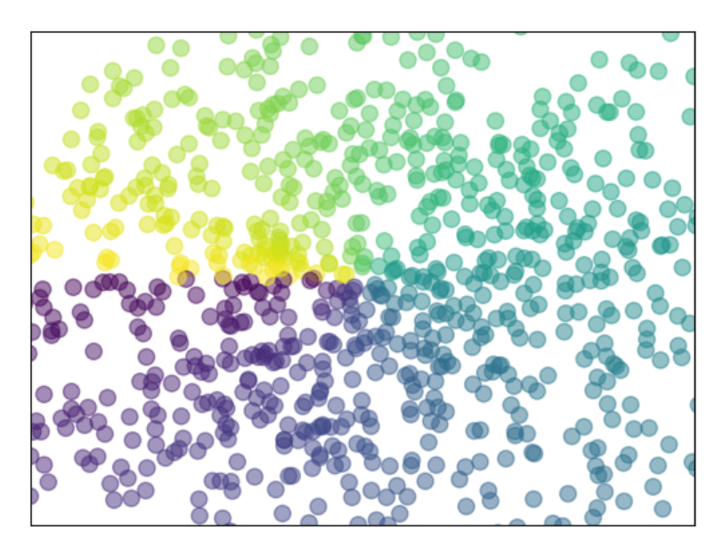
#### 5.2条形图
```
#基本图形
n=12
X=np.arange(n)
Y1=(1-X/float(n))*np.random.uniform(0.5,1,n)
Y2=(1-X/float(n))*np.random.uniform(0.5,1,n)
plt.bar(X,+Y1,facecolor='#9999ff',edgecolor='white')
plt.bar(X,-Y2,facecolor='#ff9999',edgecolor='white')

#标记值
for x,y in zip(X,Y1):#zip表示可以传递两个值
    plt.text(x+0.4,y+0.05,'%.2f'%y,ha='center',va='bottom')#ha表示横向对齐 bottom表示向下对齐
for x,y in zip(X,Y2):
    plt.text(x+0.4,-y-0.05,'%.2f'%y,ha='center',va='top')
plt.xlim(-0.5,n)
plt.xticks(())#忽略xticks
plt.ylim(-1.25,1.25)
plt.yticks(())#忽略yticks
plt.show()
```
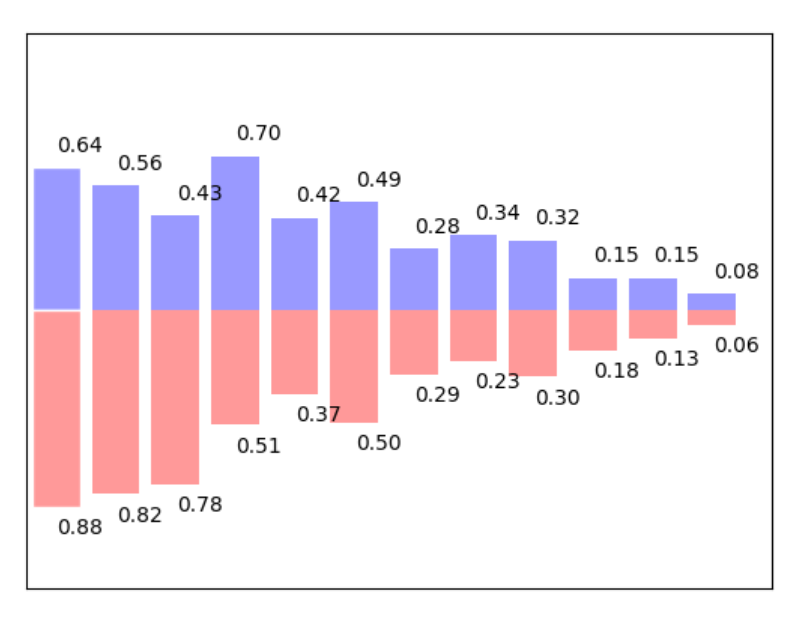
#### 5.3等高线图

```
n=256
x=np.linspace(-3,3,n)
y=np.linspace(-3,3,n)
X,Y=np.meshgrid(x,y)#meshgrid从坐标向量返回坐标矩阵
#f函数用来计算高度值 利用contour函数把颜色加进去 位置参数依次为x,y,f(x,y)，透明度为0.75，并将f(x,y)的值对应到camp之中
def f(x,y):
    return (1 - x / 2 + x ** 5 + y ** 3) * np.exp(-x ** 2 - y ** 2)
plt.contourf(X,Y,f(X,Y),8,alpha=0.75,cmap=plt.cm.hot)#8表示等高线分成多少份 alpha表示透明度 cmap表示color map
#使用plt.contour函数进行等高线绘制 参数依次为x,y,f(x,y)，颜色选择黑色，线条宽度为0.5
C=plt.contour(X,Y,f(X,Y),8,colors='black',linewidth=0.5)
#使用plt.clabel添加高度数值 inline控制是否将label画在线里面，字体大小为10
plt.clabel(C,inline=True,fontsize=10)
plt.xticks(())#隐藏坐标轴
plt.yticks(())
plt.show()
```
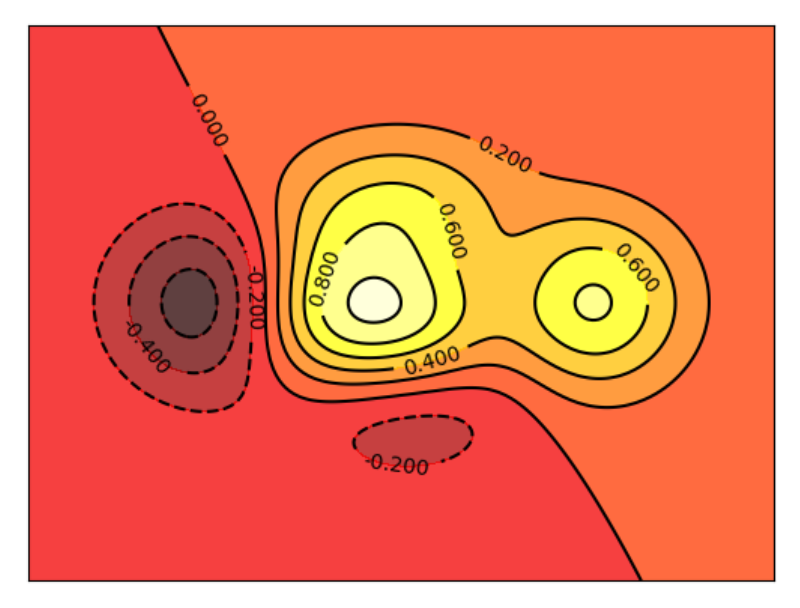
#### 5.4Image图片
利用matplotlib打印出图像
```
a = np.array([0.313660827978, 0.365348418405, 0.423733120134,
              0.365348418405, 0.439599930621, 0.525083754405,
              0.423733120134, 0.525083754405, 0.651536351379]).reshape(3,3)
#origin='lower'代表的就是选择的原点位置
plt.imshow(a,interpolation='nearest',cmap='bone',origin='lower')#cmap为color map
plt.colorbar(shrink=.92)#右边颜色说明 shrink参数是将图片长度变为原来的92%
plt.xticks(())
plt.yticks(())
plt.show()              
```
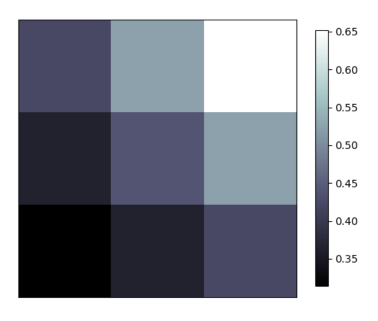
出图方式 此处采用内插法中的nearest-neighbor
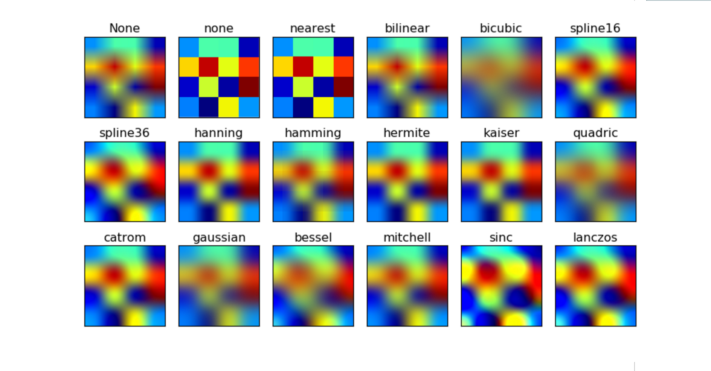
#### 5.53D图像
```
import numpy as np
import matplotlib.pyplot as plt
from mpl_toolkits.mplot3d import Axes3D#需另外导入模块Axes 3D
fig=plt.figure()#定义图像窗口
ax=Axes3D(fig)#在窗口上添加3D坐标轴
#将X和Y值编织成栅格
X=np.arange(-4,4,0.25)
Y=np.arange(-4,4,0.25)
X,Y=np.meshgrid(X,Y)
R=np.sqrt(X**2+Y**2)
Z=np.sin(R)#高度值
#将colormap rainbow填充颜色，之后将三维图像投影到XY平面做等高线图，其中ratride和cstride表示row和column的宽度
ax.plot_surface(X,Y,Z,rstride=1,cstride=1,cmap=plt.get_cmap('rainbow'))#rstride表示图像中分割线的跨图
#添加XY平面等高线 投影到z平面
ax.contourf(X,Y,Z,zdir='z',offset=-2,cmap=plt.get_cmap('rainbow'))#把图像进行投影的图形 offset表示比0坐标轴低两个位置
ax.set_zlim(-2,2)
plt.show()
```
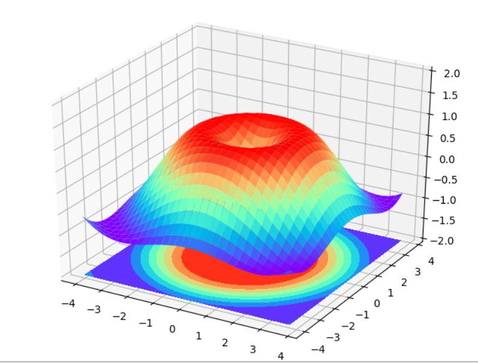

### 6.多图合并显示

#### 6.1Subplot多合一显示

均匀图中图：MatPlotLib可以组合许多的小图在大图中显示，使用的方法叫做subplot。

```python
plt.figure()
plt.subplot(2,1,1)#表示整个图像分割成2行2列，当前位置为1
plt.plot([0,1],[0,1])#横坐标变化为[0,1] 竖坐标变化为[0,2]

plt.subplot(2,3,4)
plt.plot([0,1],[0,2])

plt.subplot(2,3,5)
plt.plot([0,1],[0,3])

plt.subplot(2,3,6)
plt.plot([0,1],[0,4])
plt.show()
```

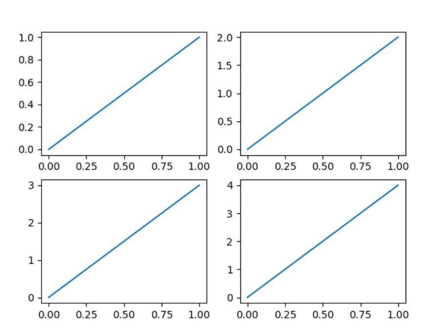

不均匀图中图

```python
plt.figure()
plt.subplot(2,1,1)#将整个窗口分割成2行1列，当前位置表示第一个图
plt.plot([0,1],[0,1])#横坐标变化为[0,1],竖坐标变化为[0,1]

plt.subplot(2,3,4)#将整个窗口分割成2行3列，当前位置为4
plt.plot([0,1],[0,2])

plt.subplot(2,3,5)
plt.plot([0,1],[0,3])

plt.subplot(2,3,6)
plt.plot([0,1],[0,4])
plt.show()
```

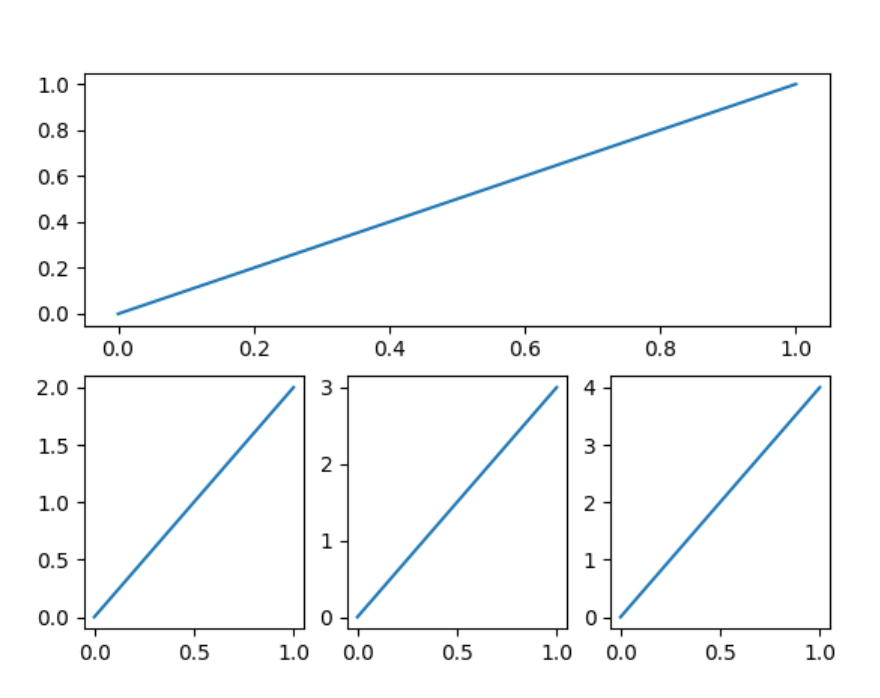

#### 6.2SubPlot分格显示

方法一

```python
import matplotlib.gridspec as gridspec#引入新模块
plt.figure()
'''
使用plt.subplot2grid创建第一个小图，(3,3)表示将整个图像分割成3行3列，(0,0)表示从第0行0列开始作图，colspan=3表示列的跨度为3。colspan和rowspan缺省时默认跨度为1
'''
ax1 = plt.subplot2grid((3, 3), (0, 0), colspan=3)  # stands for axes
ax1.plot([1, 2], [1, 2])
ax1.set_title('ax1_title')#设置图的标题

#将图像分割成3行3列，从第1行0列开始做图，列的跨度为2
ax2 = plt.subplot2grid((3, 3), (1, 0), colspan=2)

#将图像分割成3行3列，从第1行2列开始做图，行的跨度为2
ax3 = plt.subplot2grid((3, 3), (1, 2), rowspan=2)

#将图像分割成3行3列，从第2行0列开始做图，行与列的跨度默认为1
ax4 = plt.subplot2grid((3, 3), (2, 0))
ax4.scatter([1, 2], [2, 2])
ax4.set_xlabel('ax4_x')
ax4.set_ylabel('ax4_y')
ax5 = plt.subplot2grid((3, 3), (2, 1))
```

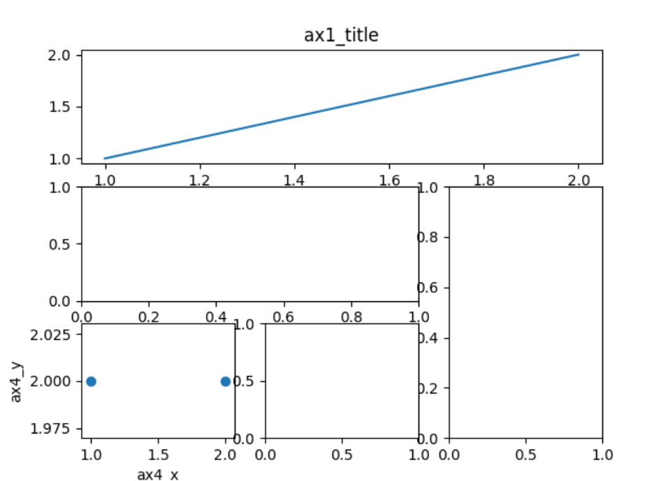

方法二

```Python
plt.figure()
gs = gridspec.GridSpec(3, 3)#将图像分割成3行3列
ax6 = plt.subplot(gs[0, :])#gs[0:1]表示图占第0行和所有列
ax7 = plt.subplot(gs[1, :2])#gs[1,:2]表示图占第1行和第二列前的所有列
ax8 = plt.subplot(gs[1:, 2])
ax9 = plt.subplot(gs[-1, 0])
ax10 = plt.subplot(gs[-1, -2])#gs[-1.-2]表示这个图占倒数第1行和倒数第2行
plt.show()
```

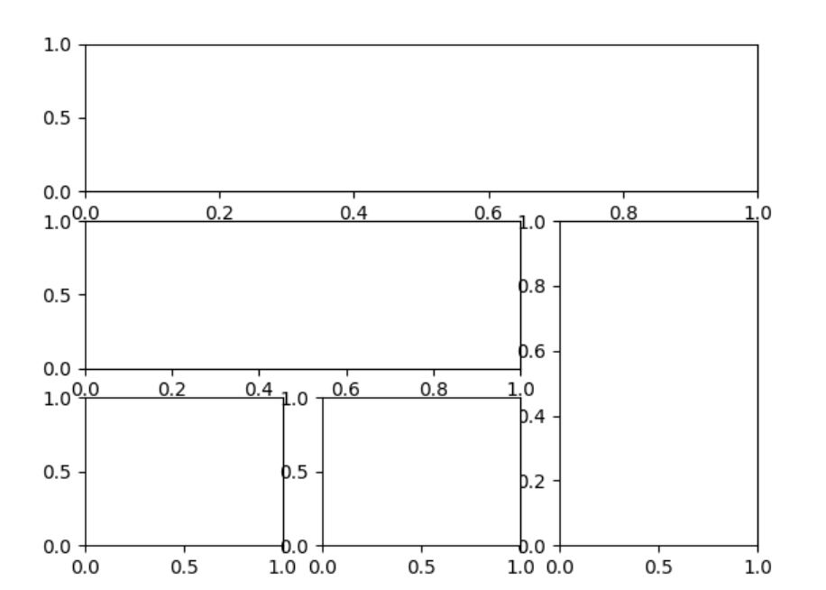

方法三

```Python
'''
建立一个2行2列的图像窗口，sharex=True表示共享x轴坐标，sharey=True表示共享y轴坐标，((ax11,ax12),(ax13,1x14))表示从到至右一次存放ax11,ax12,ax13,ax114
'''
f, ((ax11, ax12), (ax13, ax14)) = plt.subplots(2, 2, sharex=True, sharey=True)
ax11.scatter([1,2], [1,2])ax11.scatter 坐标范围x为[1,2]，y为[1,2]
plt.tight_layout()#表示紧凑显示图像
plt.show()
```

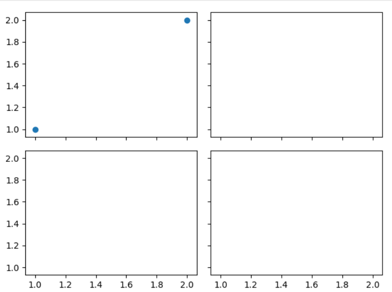

#### 6.3图中图

```Python
fig=plt.figure()
#创建数据
x=[1,2,3,4,5,6,7]
y=[1,3,4,2,5,8,6]

#绘制大图：假设大图的大小为10，那么大图被包含在由(1,1)开始，宽8高8的坐标系之中。
left, bottom, width, height = 0.1, 0.1, 0.8, 0.8
ax1 = fig.add_axes([left, bottom, width, height])  # main axes
ax1.plot(x, y, 'r')#绘制大图，颜色为red
ax1.set_xlabel('x')#横坐标名称为x
ax1.set_ylabel('y')
ax1.set_title('title')#图名称为title

#绘制小图，注意坐标系位置和大小的改变
ax2 = fig.add_axes([0.2, 0.6, 0.25, 0.25])
ax2.plot(y, x, 'b')#颜色为buue
ax2.set_xlabel('x')
ax2.set_ylabel('y')
ax2.set_title('title inside 1')

#绘制第二个小兔
plt.axes([0.6, 0.2, 0.25, 0.25])
plt.plot(y[::-1], x, 'g')#将y进行逆序
plt.xlabel('x')
plt.ylabel('y')
plt.title('title inside 2')
plt.show()
```

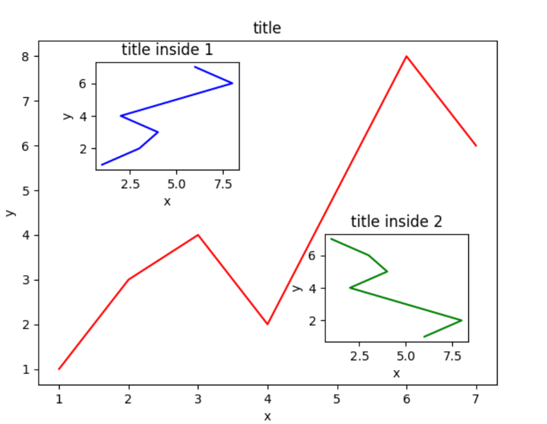

#### 6.4次坐标轴

```Python
x=np.arange(0,10,0.1)
y1=0.5*x**2
y2=-1*y1
fig, ax1 = plt.subplots()

ax2 = ax1.twinx()#镜像显示
ax1.plot(x, y1, 'g-')
ax2.plot(x, y2, 'b-')

ax1.set_xlabel('X data')
ax1.set_ylabel('Y1 data', color='g')#第一个y坐标轴
ax2.set_ylabel('Y2 data', color='b')#第二个y坐标轴
plt.show()
```

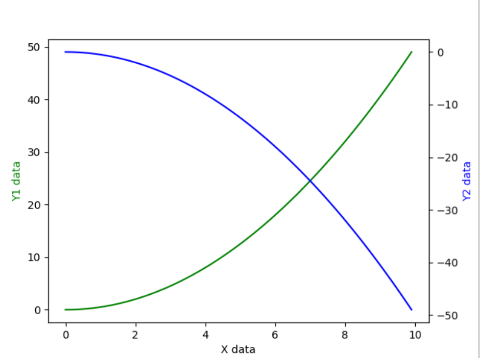

### 7.动画

```Python
from matplotlib import animation#引入新模块
fig,ax=plt.subplots()
x=np.arange(0,2*np.pi,0.01)#数据为0~2PI范围内的正弦曲线
line,=ax.plot(x,np.sin(x))# line表示列表

#构造自定义动画函数animate，用来更新每一帧上x和y坐标值，参数表示第i帧
def animate(i):
    line.set_ydata(np.sin(x+i/100))
    return line,

#构造开始帧函数init
def init():
    line.set_ydata(np.sin(x))
    return line,

# frame表示动画长度，一次循环所包含的帧数；interval表示更新频率 
# blit选择更新所有点，还是仅更新新变化产生的点。应该选True，但mac用户选择False。
ani=animation.FuncAnimation(fig=fig,func=animate,frames=200,init_func=init,interval=20,blit=False)
plt.show()
```

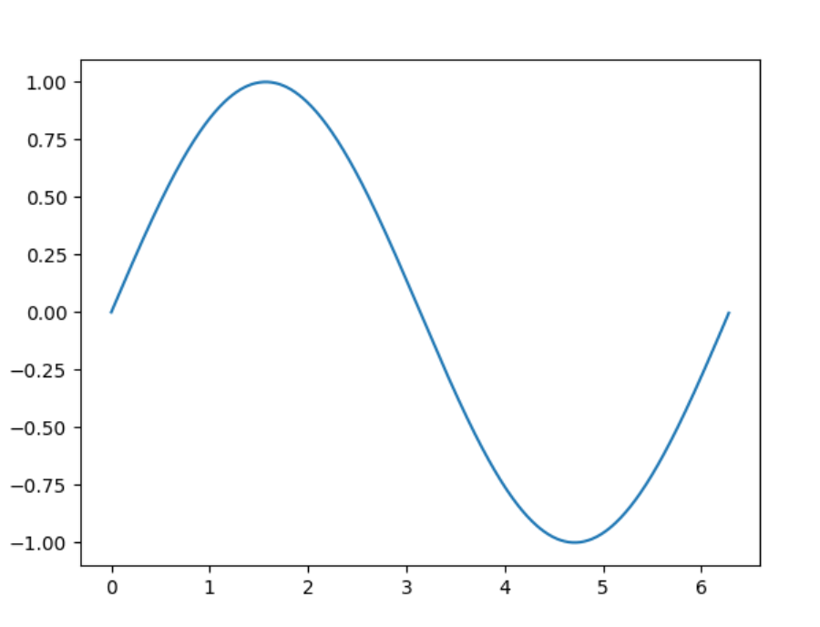

**MatPlotLib之中还有很多画图方法，由于篇幅有限不再赘述，更多内容参考MatPlotLib Tutorials。**

----------


更多内容请关注公众号'谓之小一'，若有疑问可在公众号后台提问，随时回答，内容转载请注明出处。

