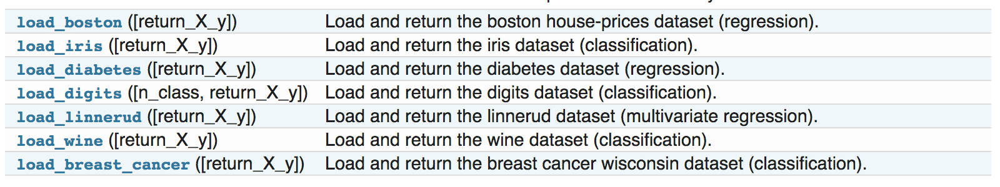
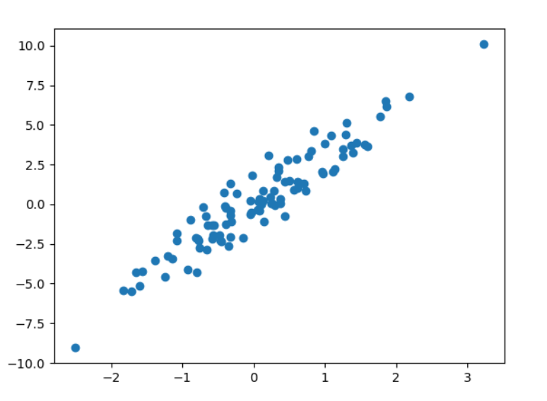
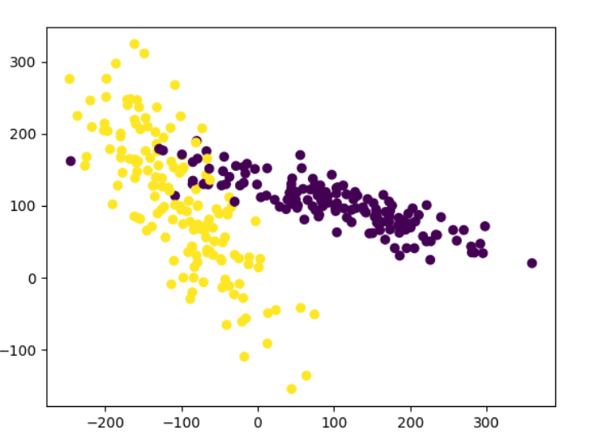
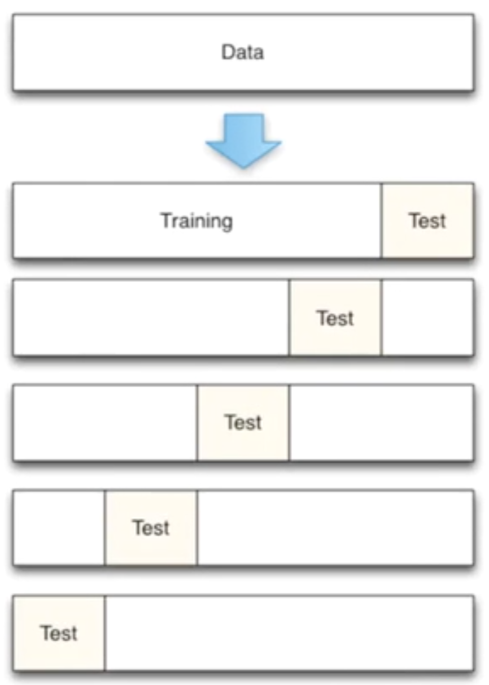
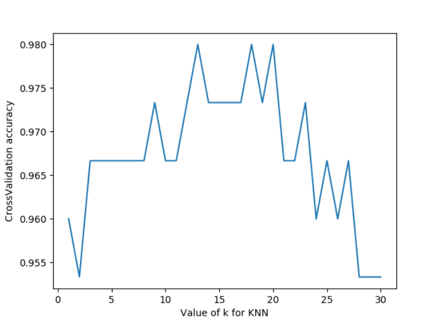
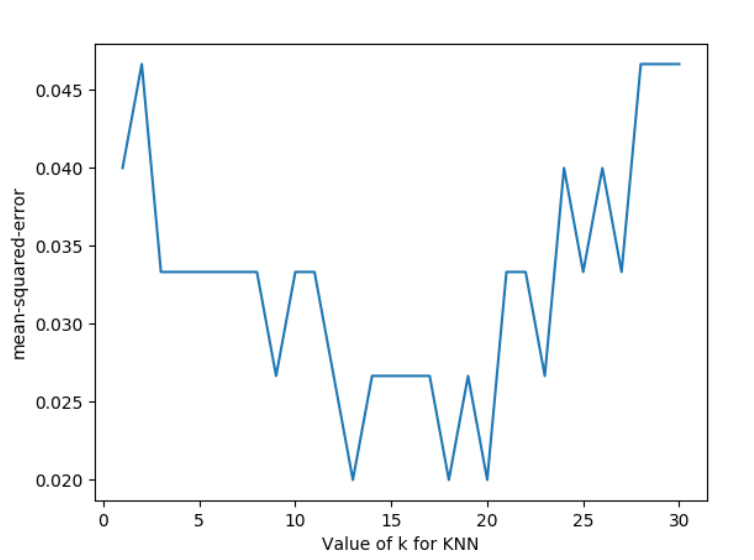
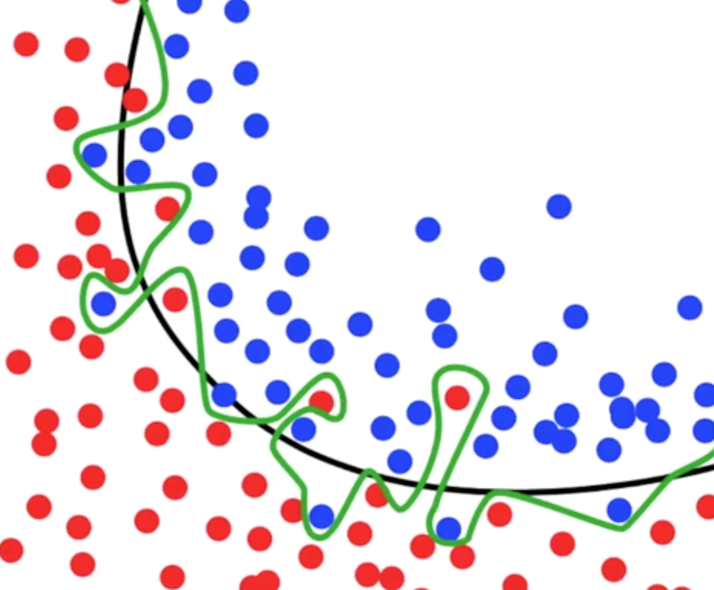
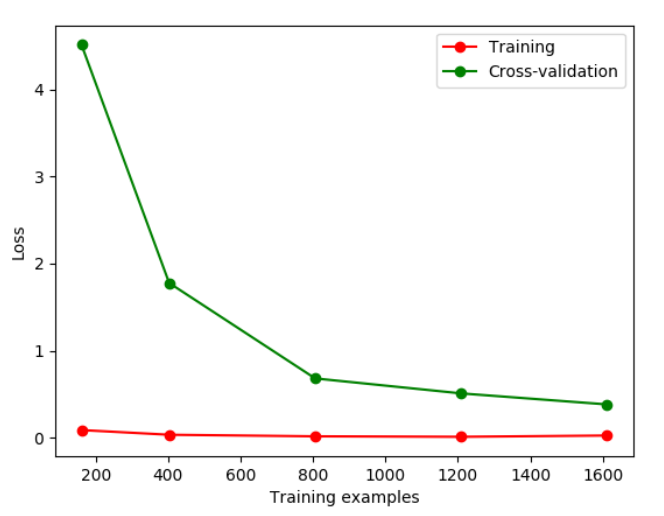
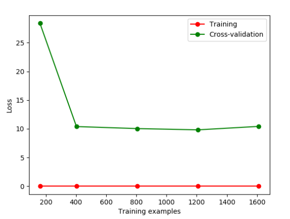
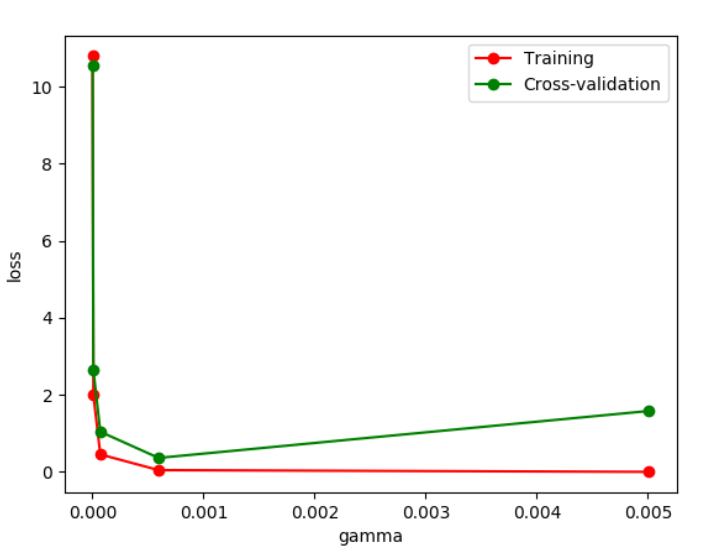

### 1.Sklearn简介

Scikit-learn(sklearn)是机器学习中常用的第三方模块，对常用的机器学习方法进行了封装，包括回归(Regression)、降维(Dimensionality Reduction)、分类(Classfication)、聚类(Clustering)等方法。当我们面临机器学习问题时，便可根据下图来选择相应的方法。Sklearn具有以下特点：

+ 简单高效的数据挖掘和数据分析工具


+ 让每个人能够在复杂环境中重复使用
+ 建立NumPy、Scipy、MatPlotLib之上


### 2.Sklearn安装

Sklearn安装要求`Python(>=2.7 or >=3.3)`、`NumPy (>= 1.8.2)`、`SciPy (>= 0.13.3)`。如果已经安装NumPy和SciPy，安装scikit-learn可以使用`pip install -U scikit-learn`。

### 3.Sklearn通用学习模式

Sklearn中包含众多机器学习方法，但各种学习方法大致相同，我们在这里介绍Sklearn通用学习模式。首先引入需要训练的数据，Sklearn自带部分数据集，也可以通过相应方法进行构造，`4.Sklearn datasets`中我们会介绍如何构造数据。然后选择相应机器学习方法进行训练，训练过程中可以通过一些技巧调整参数，使得学习准确率更高。模型训练完成之后便可预测新数据，然后我们还可以通过`MatPlotLib`等方法来直观的展示数据。另外还可以将我们已训练好的Model进行保存，方便移动到其他平台，不必重新训练。

```python
from sklearn import datasets#引入数据集,sklearn包含众多数据集
from sklearn.model_selection import train_test_split#将数据分为测试集和训练集
from sklearn.neighbors import KNeighborsClassifier#利用邻近点方式训练数据

###引入数据###
iris=datasets.load_iris()#引入iris鸢尾花数据,iris数据包含4个特征变量
iris_X=iris.data#特征变量
iris_y=iris.target#目标值
X_train,X_test,y_train,y_test=train_test_split(iris_X,iris_y,test_size=0.3)#利用train_test_split进行将训练集和测试集进行分开，test_size占30%
print(y_train)#我们看到训练数据的特征值分为3类
'''
[0 0 0 0 0 0 0 0 0 0 0 0 0 0 0 0 0 0 0 0 0 0 0 0 0 0 0 0 0 0 0 0 0 0 0 0 0
 0 0 0 0 0 0 0 0 0 0 0 0 0 1 1 1 1 1 1 1 1 1 1 1 1 1 1 1 1 1 1 1 1 1 1 1 1
 1 1 1 1 1 1 1 1 1 1 1 1 1 1 1 1 1 1 1 1 1 1 1 1 1 1 2 2 2 2 2 2 2 2 2 2 2
 2 2 2 2 2 2 2 2 2 2 2 2 2 2 2 2 2 2 2 2 2 2 2 2 2 2 2 2 2 2 2 2 2 2 2 2 2
 2 2]
 '''

###训练数据###
knn=KNeighborsClassifier()#引入训练方法
knn.fit(X_train,y_train)#进行填充测试数据进行训练

###预测数据###
print(knn.predict(X_test))#预测特征值
'''
[1 1 1 0 2 2 1 1 1 0 0 0 2 2 0 1 2 2 0 1 0 0 0 0 0 0 2 1 0 0 0 1 0 2 0 2 0
 1 2 1 0 0 1 0 2]
'''
print(y_test)#真实特征值
'''
[1 1 1 0 1 2 1 1 1 0 0 0 2 2 0 1 2 2 0 1 0 0 0 0 0 0 2 1 0 0 0 1 0 2 0 2 0
 1 2 1 0 0 1 0 2]
'''
```

### 4.Sklearn datasets

Sklearn提供一些标准数据，我们不必再从其他网站寻找数据进行训练。例如我们上面用来训练的`load_iris`数据，可以很方便的返回数据特征变量和目标值。除了引入数据之外，我们还可以通过`load_sample_images()`来引入图片。



除了sklearn提供的一些数据之外，还可以自己来构造一些数据帮助我们学习。

```python
from sklearn import datasets#引入数据集
#构造的各种参数可以根据自己需要调整
X,y=datasets.make_regression(n_samples=100,n_features=1,n_targets=1,noise=1)

###绘制构造的数据###
import matplotlib.pyplot as plt
plt.figure()
plt.scatter(X,y)
plt.show()
```



### 5.Sklearn Model的属性和功能

数据训练完成之后得到模型，我们可以根据不同模型得到相应的属性和功能，并将其输出得到直观结果。假如通过线性回归训练之后得到线性函数`y=0.3x+1`，我们可通过`_coef`得到模型的系数为0.3，通过`_intercept`得到模型的截距为1。

```Python
from sklearn import datasets
from sklearn.linear_model import LinearRegression#引入线性回归模型

###引入数据###
load_data=datasets.load_boston()
data_X=load_data.data
data_y=load_data.target
print(data_X.shape)
#(506, 13)data_X共13个特征变量

###训练数据###
model=LinearRegression()
model.fit(data_X,data_y)
model.predict(data_X[:4,:])#预测前4个数据

###属性和功能###
print(model.coef_)
'''
[ -1.07170557e-01   4.63952195e-02   2.08602395e-02   2.68856140e+00
  -1.77957587e+01   3.80475246e+00   7.51061703e-04  -1.47575880e+00
   3.05655038e-01  -1.23293463e-02  -9.53463555e-01   9.39251272e-03
  -5.25466633e-01]
'''
print(model.intercept_)
#36.4911032804
print(model.get_params())#得到模型的参数
#{'copy_X': True, 'normalize': False, 'n_jobs': 1, 'fit_intercept': True}
print(model.score(data_X,data_y))#对训练情况进行打分
#0.740607742865
```

### 6.Sklearn数据预处理

数据集的标准化对于大部分机器学习算法来说都是一种常规要求，如果单个特征没有或多或少地接近于标准正态分布，那么它可能并不能在项目中表现出很好的性能。在实际情况中,我们经常忽略特征的分布形状，直接去均值来对某个特征进行中心化，再通过除以非常量特征(non-constant features)的标准差进行缩放。

例如, 许多学习算法中目标函数的基础都是假设所有的特征都是零均值并且具有同一阶数上的方差(比如径向基函数、支持向量机以及L1L2正则化项等)。如果某个特征的方差比其他特征大几个数量级，那么它就会在学习算法中占据主导位置，导致学习器并不能像我们说期望的那样，从其他特征中学习。例如我们可以通过Scale将数据缩放，达到标准化的目的。

```python
from sklearn import preprocessing
import numpy as np
a=np.array([[10,2.7,3.6],
            [-100,5,-2],
            [120,20,40]],dtype=np.float64)
print(a)
print(preprocessing.scale(a))#将值的相差度减小
'''
[[  10.     2.7    3.6]
 [-100.     5.    -2. ]
 [ 120.    20.    40
[[ 0.         -0.85170713 -0.55138018]
 [-1.22474487 -0.55187146 -0.852133  ]
 [ 1.22474487  1.40357859  1.40351318]]
'''
```

我们来看下预处理前和预处理预处理后的差别，预处理之前模型评分为`0.511111111111`，预处理后模型评分为`0.933333333333`，可以看到预处理对模型评分有很大程度的提升。

```Python
from sklearn.model_selection import train_test_split
from sklearn.datasets.samples_generator import make_classification
from sklearn.svm import SVC
import matplotlib.pyplot as plt

###生成的数据如下图所示###
plt.figure
X,y=make_classification(n_samples=300,n_features=2,n_redundant=0,n_informative=2,             random_state=22,n_clusters_per_class=1,scale=100)
plt.scatter(X[:,0],X[:,1],c=y)
plt.show()

###利用minmax方式对数据进行规范化###
X=preprocessing.minmax_scale(X)#feature_range=(-1,1)可设置重置范围
X_train,X_test,y_train,y_test=train_test_split(X,y,test_size=0.3)
clf=SVC()
clf.fit(X_train,y_train)
print(clf.score(X_test,y_test))
#0.933333333333
#没有规范化之前我们的训练分数为0.511111111111,规范化后为0.933333333333,准确度有很大提升
```



### 7.交叉验证

交叉验证的基本思想是将原始数据进行分组，一部分做为训练集来训练模型，另一部分做为测试集来评价模型。交叉验证用于评估模型的预测性能，尤其是训练好的模型在新数据上的表现，可以在一定程度上减小过拟合。还可以从有限的数据中获取尽可能多的有效信息。

机器学习任务中，拿到数据后，我们首先会将原始数据集分为三部分：**训练集、验证集和测试集**。 训练集用于训练模型，验证集用于模型的参数选择配置，测试集对于模型来说是未知数据，用于评估模型的泛化能力。不同的划分会得到不同的最终模型。

以前我们是直接将数据分割成70%的训练数据和测试数据，现在我们利用K折交叉验证分割数据，首先将数据分为5组，然后再从5组数据之中选择不同数据进行训练。



```python
from sklearn.datasets import load_iris
from sklearn.model_selection import train_test_split
from sklearn.neighbors import KNeighborsClassifier

###引入数据###
iris=load_iris()
X=iris.data
y=iris.target

###训练数据###
X_train,X_test,y_train,y_test=train_test_split(X,y,test_size=0.3)
#引入交叉验证,数据分为5组进行训练
from sklearn.model_selection import cross_val_score
knn=KNeighborsClassifier(n_neighbors=5)#选择邻近的5个点
scores=cross_val_score(knn,X,y,cv=5,scoring='accuracy')#评分方式为accuracy
print(scores)#每组的评分结果
#[ 0.96666667  1.          0.93333333  0.96666667  1.        ]5组数据
print(scores.mean())#平均评分结果
#0.973333333333
```

那么是否**n_neighbor=5**便是最好呢，我们来调整参数来看模型最终训练分数。

```Python
from sklearn import datasets
from sklearn.model_selection import train_test_split
from sklearn.neighbors import KNeighborsClassifier
from sklearn.model_selection import cross_val_score#引入交叉验证
import  matplotlib.pyplot as plt
###引入数据###
iris=datasets.load_iris()
X=iris.data
y=iris.target
###设置n_neighbors的值为1到30,通过绘图来看训练分数###
k_range=range(1,31)
k_score=[]
for k in k_range:
    knn=KNeighborsClassifier(n_neighbors=k)
    scores=cross_val_score(knn,X,y,cv=10,scoring='accuracy')#for classfication
    k_score.append(loss.mean())
plt.figure()
plt.plot(k_range,k_score)
plt.xlabel('Value of k for KNN')
plt.ylabel('CrossValidation accuracy')
plt.show()
#K过大会带来过拟合问题,我们可以选择12-18之间的值
```

我们可以看到n_neighbor在12-18之间评分比较高，实际项目之中我们可以通过这种方式来选择不同参数。另外我们还可以选择`2-fold Cross Validation`,`Leave-One-Out Cross Validation`等方法来分割数据，比较不同方法和参数得到最优结果。



我们将上述代码中的循环部分改变一下，评分函数改为`neg_mean_squared_error`，便得到对于不同参数时的损失函数。

```
for k in k_range:
    knn=KNeighborsClassifier(n_neighbors=k)
    loss=-cross_val_score(knn,X,y,cv=10,scoring='neg_mean_squared_error')# for regression
    k_score.append(loss.mean())
```



### 8.过拟合问题

什么是过拟合问题呢？例如下面这张图片，黑色线已经可以很好的分类出红色点和蓝色点，但是在机器学习过程中，模型过于纠结准确度，便形成了绿色线的结果。然后在预测测试数据集结果的过程中往往会浪费很多时间并且准确率不是太好。



我们先举例如何辨别**overfitting**问题。Sklearn.learning_curve中的learning curve可以很直观的看出Model学习的进度，对比发现有没有过拟合。

```Python
from sklearn.model_selection import learning_curve
from sklearn.datasets import load_digits
from sklearn.svm import SVC
import matplotlib.pyplot as plt
import numpy as np

#引入数据
digits=load_digits()
X=digits.data
y=digits.target

#train_size表示记录学习过程中的某一步,比如在10%,25%...的过程中记录一下
train_size,train_loss,test_loss=learning_curve(
    SVC(gamma=0.1),X,y,cv=10,scoring='neg_mean_squared_error',
    train_sizes=[0.1,0.25,0.5,0.75,1]
)
train_loss_mean=-np.mean(train_loss,axis=1)
test_loss_mean=-np.mean(test_loss,axis=1)

plt.figure()
#将每一步进行打印出来
plt.plot(train_size,train_loss_mean,'o-',color='r',label='Training')
plt.plot(train_size,test_loss_mean,'o-',color='g',label='Cross-validation')
plt.legend('best')
plt.show()
```



如果我们改变gamma的值，那么会改变相应的Loss函数。损失函数便在10左右停留，此时便能直观的看出过拟合。




下面我们通过修改gamma参数来修正过拟合问题。

```Python
from sklearn.model_selection import  validation_curve#将learning_curve改为validation_curve
from sklearn.datasets import load_digits
from sklearn.svm import SVC
import matplotlib.pyplot as plt
import numpy as np
#引入数据
digits=load_digits()
X=digits.data
y=digits.target

#改变param来观察Loss函数情况
param_range=np.logspace(-6,-2.3,5)
train_loss,test_loss=validation_curve(
    SVC(),X,y,param_name='gamma',param_range=param_range,cv=10,
    scoring='neg_mean_squared_error'
)
train_loss_mean=-np.mean(train_loss,axis=1)
test_loss_mean=-np.mean(test_loss,axis=1)

plt.figure()
plt.plot(param_range,train_loss_mean,'o-',color='r',label='Training')
plt.plot(param_range,test_loss_mean,'o-',color='g',label='Cross-validation')
plt.xlabel('gamma')
plt.ylabel('loss')
plt.legend(loc='best')
plt.show()
```

通过改变不同的gamma值我们可以看到Loss函数的变化情况。从图中可以看到，如果gamma的值大于0.001便会出现过拟合的问题，那么我们构建模型时gamma参数设置应该小于0.001。



### 9.保存模型

我们花费很长时间用来训练数据，调整参数，得到最优模型。但如果改变平台，我们还需要重新训练数据和修正参数来得到模型，将会非常的浪费时间。此时我们可以先将model保存起来，然后便可以很方便的将模型迁移。

```python
from sklearn import svm
from sklearn import datasets

#引入和训练数据
iris=datasets.load_iris()
X,y=iris.data,iris.target
clf=svm.SVC()
clf.fit(X,y)

#引入sklearn中自带的保存模块
from sklearn.externals import joblib
#保存model
joblib.dump(clf,'sklearn_save/clf.pkl')

#重新加载model，只有保存一次后才能加载model
clf3=joblib.load('sklearn_save/clf.pkl')
print(clf3.predict(X[0:1]))
#存放model能够更快的获得以前的结果
```

### 10.推广

更多内容请关注公众号’谓之小一’，若有疑问可在公众号后台提问，随时回答，欢迎关注，内容转载请注明出处。

