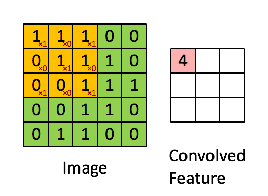
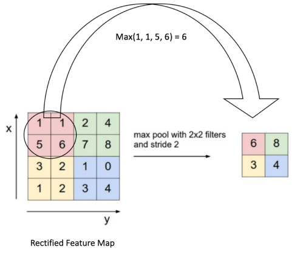

### 0.杂谈

本来个人是准备毕业直接工作的，但前段时间学校保研大名单出来之后，发现本人有保研机会，于是就和主管请了几天假，回学校准备保研的事情。经过两天的准备，也是非常幸运，成功拿到本院的保研名额。明确得到保研名额的时候已经是9月18号，然而国家推免系统开放时间是9月28号，也就是说我只还有10天时间准备保研，而且这个时间点很多学校夏令营、预报名活动早已结束，不再接受学生申请。所以能够申请的学校也就很少，同时这10天之间，还要赶回北京实习，所以时间还是很赶的。

短短10天，发生了很多有趣的事情，但不论怎样，最后的结果还是很不错的，成功保研到**华中科技大学**，全国排名前10左右的高校，而且计算机很强 。但华科要求，本科非985高校不允许读学硕，只能读专硕。我倒觉得无所谓，反正不准备继续读博，学硕、专硕没有太大区别。

被华科预录取之后，导师要求提前到实验室学习，于是10月10号便来到实验室搬砖。怎么说呢，感觉还是挺累的，比工作还累，早9晚10。但确实能够学习到很多东西，实验室环境很不错，每人一台电脑，等等福利都很好。至此，一直准备工作的我，成功走上读研之路，加油啦。前段时间一直想写篇关于**从双非到985高校的飞跃之路**，但感觉有点哗众取宠，以后看情况再写吧。

最后，个人准备从推荐方向慢慢转到NLP方向，但推荐方向不会放弃，继续学习。OK，开始学习算法，今天准备讲解**CNN(卷积神经网络)**。学习卷积神经网络之前，建议学习下深度神经网络，没学习过的可以看我之前写的文章，[深度神经网络之前向传播算法](https://mp.weixin.qq.com/s?__biz=MzU3MjA2NTQzMw==&mid=2247483903&idx=1&sn=4e3f92578399013eba9f203d35afe972&chksm=fcd7d209cba05b1ffc66494ea8008c669e40f3045398695b479aba14e1c425f85b7c8f033c4f&token=937283080&lang=zh_CN#rd)、[深度神经网络之反向传播算法](https://mp.weixin.qq.com/s?__biz=MzU3MjA2NTQzMw==&mid=2247483911&idx=1&sn=bcc0fe6a4a0c20a422f254b3264a5fb8&chksm=fcd7d1f1cba058e7bddefb3d47ba6f87879663c15a5cea5c6653138d0fb1aa9d3454e2ea605a&token=937283080&lang=zh_CN#rd)、[深度神经网络之损失函数和激活函数](https://mp.weixin.qq.com/s?__biz=MzU3MjA2NTQzMw==&mid=2247483920&idx=1&sn=e72c2ce47cffdf80aefcf441f3660099&chksm=fcd7d1e6cba058f0d4ebb65997f1649f2fd203fb22d6e166dc2b4cc1373fcdf696ca1b9db83c&token=937283080&lang=zh_CN#rd)、[深度神经网络之正则化](https://mp.weixin.qq.com/s?__biz=MzU3MjA2NTQzMw==&mid=2247483926&idx=1&sn=53dc36cd5bcc4fa31ce48b76f2d3e105&chksm=fcd7d1e0cba058f6a4a55104bb57fc5976c4cbbd3f96a575074689d1e97dd1d4e2f245074757&token=937283080&lang=zh_CN#rd)。

### 1.CNN基本结构

首先我们来看看卷积神经网络(CNN)的基本结构。如上图所示，可以看出最左边的图片就是我们的**输入层**，计算机理解为输入若干个矩阵。接着是**卷积层(Convolution Layer)**，卷积层是CNN所特有的，卷积层使用的激活函数是ReLU，之前在DNN之中介绍过ReLU的激活函数，形式如$ReLU=\max(0,x)$。卷积层后面的是**池化层**，池化层也是CNN所特有的，池化层没有激活函数。

卷积层+池化层的组合可以在CNN隐藏层中出现多次，实际使用中根据模型需要而定。同时我们也可以灵活使用卷积层+卷积层，或者卷积层+卷积层+池化层的组合，卷积层+池化层的组合在构建模型时没有限制，但最常见的CNN都是若干卷积层+池化层的组合。

在若干卷积层+池化层的组合后面是**全连接层(Fully Connected Layer)**，全连接层就是之前讲到的DNN结构，只是**输出层**使用了Softmax激活函数来做图像识别的分类。从上面模型可以看出，CNN相对于DNN，比较特殊的是卷积层和池化层。如果之前熟悉DNN的话，只要把卷积层和池化层的原理理解清楚，那么CNN就简单啦。

### 2.卷积

既然是学习卷积神经网络，那自然需要了解什么是卷积。在学习高等数学的时候，微积分中卷积表达式和其离散形式如下所示。
$$
s(t)=\int x(t-a)w(a)da
$$

$$
s(t) = \sum _a x(t-a)w(a)
$$

当然也可以用矩阵进行表达，其中*****表示卷积。
$$
s(t)=(X*W)(t)
$$
如果是二维的卷积，则其表达式如下所示。
$$
s(i,j)=(X*W)(i,j)=\sum_m \sum_n x(i-m,j-n)w(m,n)
$$
在CNN中，虽然我们也是说卷积，但严格意义上和数学上所定义的卷积稍有不同，比如对于二维的卷积，其定义如下所示，其中X为输入，W为卷积核。如果X是二维输入，那么W也是二维矩阵，如果X是多维张量，那么W也是多维张量。
$$
s(i,j)=(X*W)(i,j)=\sum_m \sum_n x(i+m,j+n)w(m,n)
$$
卷积有什么简单利用呢？我们举个例子，假如有两枚骰子，然后把骰子扔出去，求两枚骰子点数之和加起来为4的概率是多少。

上述例子的关键点便是两个骰子点数之和加起来要等于4，这正是卷积的应用场景。假设利用f表示第一枚骰子，g表示第二枚骰子。f(1)表示点数为1的概率，f(2)表示点数为2的概率。那么两枚骰子点数加起来为4的情况有f(1)g(3)、f(2)g(2)、f(3)g(1)，因此两枚骰子点数加起来为4的概率为f(1)g(3)+f(2)g(2)+f(3)g(1)。符合卷积的定义，那么转换成卷积的标准形式便是
$$
(f*g)(4)=\sum _{m=1} ^{3} f(4-m)g(m)
$$

### 3.CNN卷积层

现在我们来深入CNN中的卷积层，如下图所示，针对图像进行卷积计算。图中的输入是二维的3\*4的矩阵，卷积核是2\*2的矩阵。这里我们假设卷积是每次移动一个像素来进行卷积，首先对左上角2\*2局部和卷积核进行卷积计算，即各个位置的元素相乘再相加，得到的输出值S00为aw+bx+ey+fz。接着我们将输入的局部向右平移一个像素，现在是(b,c,f,g)四个元素构成的矩阵和卷积核进行卷积，这样便能够得到值为S01的元素。同样的方法能够得到S02,S10,S11,S12的元素，最后能够得到为2\*3的输出矩阵S。

下面我们再看一个动态的卷积过程，其中输入是5\*5的矩阵，卷积核是3\*3的矩阵，卷积的步幅是一个像素，卷积的结果是3*3的矩阵。

上面举例都是二维的输入，卷积过程比较简单，那么如果输入是多维怎么计算呢？比如输入对应的是彩色图像，每个矩阵分别对应R、G、B矩阵。在斯坦福大学cs231n课程上，有个动态例子，链接为http://cs231n.github.io/assets/conv-demo/index.html，可以看着动图理解。

其中原输入矩阵为3个5\*5的矩阵，在输入周围加上了1的padding，变成了3个7\*7的矩阵。另外使用了两个卷积核，我们只关注于卷积核W0。由于输入是3个7\*7的矩阵，或者说是7\*7\*3的张量，那么对应的卷积核W0应该是3\*3\*3的张量。另外这里每次卷积计算移动2个像素，也就是步幅为2。

最终的卷积过程和上面的2维矩阵计算类似，这里采用的是两个张量的三个子矩阵计算后，再把卷积的结果相加，最后再加上偏移量b。因此7\*7\*3的张量和3\*3\*3的卷积核张量W0计算后，结果是一个3\*3的矩阵，同时由于我们有两个卷积核，那么最终结果便是3\*3\*2的张量。如果把上面的卷积过程用数学表达出来的话，那么表达式如下所示，其中n_in为输入矩阵的个数，或者说是最后一维的维数。Xk代表第k个输入矩阵，Wk代表第k个子卷积核矩阵，s(i,j)即卷积核W对应的输出矩阵元素的值。
$$
s(i,j)=(X*W)(i,j)+b = \sum _{k=1}^{n\_in}(X_k*W_k)(i,j)+b
$$

### 4.CNN池化层

CNN池化层就是对输入张量的各个子矩阵进行压缩，假如是2\*2的池化，那么就是将子矩阵的每2\*2的元素变成一个元素，如果是3\*3的池化，便是将子矩阵每3\*3的元素变成一个元素，这样输入矩阵的维度也就降低。常见的池化标准是Max或者Average，即取对应区域的最大值或者平均值。如下图所示，4\*4的矩阵在池化后变成2\*2的矩阵，矩阵维度进行了压缩。

### 5.CNN前向传播

前面已经了解卷积神经网络的基本结构，包括输入层、若干卷积层+ReLU激活函数、若干的池化层、DNN全连接层，以及最后用Softmax激活函数的输出层。以彩色的汽车样本图像为例，图中的CONV即为卷积层、POLL即为池化层，FC即为DNN的全连接层。要理解CNN的前向传播算法，重点是输入层的前向传播、卷积层的前向传播、池化层的前向传播。另外全连接层传播和用Softmax激活函数的输出层的前向传播已经在DNN中讲解，这里不再赘述。

### 6.CNN输入层前向传播到卷积层

以图像为例，如果样本是二维的黑白图片，那么输入层X便是一个矩阵，矩阵的值等于图片的各个像素的值，这时和卷积层相连的卷积核W也就是一个矩阵。如果样本是RGB彩色图片，那么输入X便是3个矩阵，即每个对应R、G、B的矩阵，或者说是一个张量，这时和卷积层相连的卷积核W也是张量，每个卷积核都由3个子矩阵组成。同样的方法，对于3D的彩色图片，输入X可以是4维、5维等的张量，那么对应的卷积核W也是个高维的张量。不管维度多少，对于我们的输入，前向传播算法可以表示为如下所示，其中上标表示层数，*****表示卷积，b表示偏倚，σ表示激活函数，一般都是ReLU激活函数。
$$
a^2=\sigma (a^1 *W^2 + b^2)
$$
和DNN的前向传播比较一下，两者形式非常像，只是CNN这儿是张量的卷积，而不是矩阵的乘法。最后，我们需要定义一些CNN模型参数，即为

- 卷积核个数K。假设我们有K个卷积核，那么我们输入层的输出就有K个，即第二层卷积层的输入有K个。
- 卷积核中每个子矩阵的大小。一般我们都用子矩阵为方振的卷积核，比如F\*F的子矩阵。
- 填充Padding(简称P)。卷积的时候，为了可以更好的识别边缘，一般会在输入矩阵周围加上若干圈的0再进行卷积，加多少圈则P为多少。
- 步幅Stride（简称S）。即在卷积过程中每次移动的像素距离大小。

### 7.隐藏层前向传播到卷积层

假设隐藏层的输出是M个矩阵对应的三维张量，则输出到卷积层的卷积核也是M个子矩阵对应的三维张量，这时表达式如下所示。其中上标代表层数，*****表示卷积，b表示偏倚量，σ表示激活函数，这里一般用ReLU。
$$
a^l = \sigma(z^l) = \sigma(a^{l-1}*W^l + b^l)
$$
以可以写成M个子矩阵卷积后对应位置想加的形式，即为
$$
a^l = \sigma(z^l) = \sigma(\sum_{k=1}^M z_k^l)=\sigma(\sum _{k=1}^M a_k^{l-1}*W_k^l + b^l)
$$
这里和上节的区别在于，这里的输入是隐藏层来的，而不是我们输入原始图片所形成的矩阵。同样，这里我们也需要定义卷积核的个数K，卷积核子矩阵的维度F，填充大小P以及步幅S。

### 8.隐藏层前向传播到池化层

池化层的处理逻辑比较简单，目的便是对输入矩阵进行缩小概括。比如输入的矩阵是N\*N维的，而需要的池化大小区域是k\*k维的，那么输出的矩阵都是(N/k)\*(N/k)维度。这里需要定义的CNN模型参数为

+ 池化区域的大小k。
+ 池化的标准，一般是Max或者Average。

### 9.隐藏层前向传播到全连接层

由于全连接层就是普通的DNN模型结构，因此我们可以直接使用DNN的前向传播算法逻辑，表达式如下所示，这里的激活函数一般用sigmoid或者tanh函数。
$$
a^l=\sigma(z^l) = \sigma(W^la^{l-1}+ b^l)
$$
经过若干全连接层之后，最后一层为Softmax输出层。此时输出层和普通的全连接层唯一的区别是，激活函数是Softmax函数。这里需要定义的CNN模型参数为

+ 全连接层的激活函数。
+ 全连接层各层神经元的个数。

### 10.CNN前向传播算法总结

输入：1个图片样本，CNN模型的层数L和所有隐藏层的类型。对于卷积层，要定义卷积核的大小K，卷积核子矩阵的维度F，填充大小P，步幅S。对于池化层，要定义池化层区域大小k和池化标准(Max或Average)。对于全连接层，定义全连接层的激活函数(输出层除外)和各层神经元的个数。

输出：CNN模型的输出$a^L$。

+ 根据输入层的填充大小P，填充原始图片的边缘，得到输入张量$a^1$。

+ 初始化所有隐藏层的参数W，b。

+ from 2 to L-1

  + 如果$l$层是卷积层，其中*****表示卷积，则输出为

  $$
  a^l=ReLU(z^l)=ReLU(a^{l-1}*W^l+b^l)
  $$

  + 如果第$l$层是池化层，则输出为$a^l=pool(a^{l-1})$，这里的pool指按照池化区域大小k和池化标准将输入张量缩小的过程。
  + 如果第$l$层是全连接层，则输出为

  $$
  a^l=\sigma(z^l) = \sigma(W^la^{l-1}+b^l)
  $$

+ 对于输出层第L层
  $$
  a^L=Softmax(z^L)=Softmax(W^La^{L-1}+b^L)
  $$

上面就是CNN前向传播算法全过程，下篇来讨论CNN的反向传播算法。

### 11.推广

更多内容请关注公众号**谓之小一**，若有疑问可在公众号后台提问，随时回答，欢迎关注，内容转载请注明出处。

