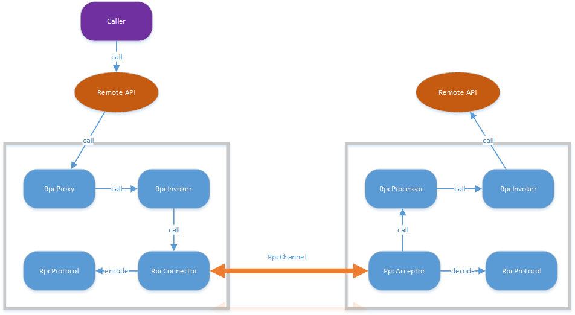
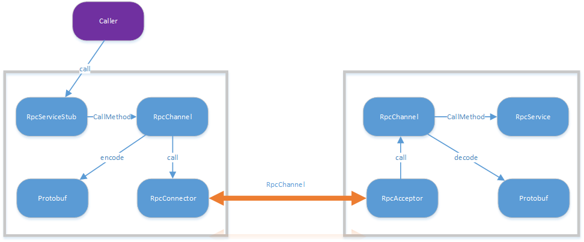

### 1.Protobuf简介

**Protobuf(Google Protocol Buffers)**提供一种灵活、高效、自动化的机制，用于序列化结构数据。Protobuf仅需自定义一次所需要的数据格式，然后我们就可以使用Protobuf编译器自动生成各种语言的源码，方便我们读写自定义的格式化数据。另外Protobuf的使用与平台和语言无关，可以在不破坏原数据格式的基础上，扩展新的数据。

我们可以将Protobuf与XML进行对比，但Protobuf更小、更快、更加简单。总结来说具有一下特点：
+ 性能好、效率高。Protobuf作用与XML、json类似，但它是二进制格式，所以性能更好。但同时因为是二进制格式，所以缺点也就是可读性差。
+ 代码生成机制，易于使用。
+ 解析速度快。
+ 支持多种语言，例C++、C#、Go、Java、Python等。
+ 向前兼容，向后兼容。

### 2.Protobuf安装

Mac用户可以使用brew进行安装，命令如下所示。

> brew install protobuf

如需要安装特定版本，可以先进行搜索有哪些版本，命令如下所示。搜索完成之后，采用上述brew安装方法，安装特定版本即可。

> brew search protobuf

安装完成之后，可以通过protoc \-\-version查看是否安装成功。

> protoc \-\-version
> libprotoc 3.6.0

另外可以通过which protoc命令查看protoc安装所在的位置。

> which protoc
> /usr/local/bin/protoc

### 3.Protobuf实例

#### 3.1编译.proto文件

首先我们需要创建一个以**.proto**结尾的文件，可以在其中定义**message**来指定所需要序列化的数据格式。每一个message都是一个小的信息逻辑单元，包含一系列的name-value值对。以官网上的示例，我们创建一个addressbook.proto文件，内容如下所示。

```python
syntax = "proto2";

package tutorial;

message Person {
  required string name = 1;
  required int32 id = 2;
  optional string email = 3;

  enum PhoneType {
    MOBILE = 0;
    HOME = 1;
    WORK = 2;
  }

  message PhoneNumber {
    required string number = 1;
    optional PhoneType type = 2 [default = HOME];
  }

  repeated PhoneNumber phones = 4;
}

message AddressBook {
  repeated Person people = 1;
}
```

+ **syntax=”proto2”**代表版本，目前支持proto2和proto3，不写默认proto2。
+ **package**类似于C++中的namespace概念。
+ **message**是包含了各种类型字段的聚集，相当于struct，并且可以嵌套。
+ proto3版本去掉了required和optional类型，保留了repeated(数组)。其中“＝1”，“＝2”表示每个元素的标识号，它会用在二进制编码中对域的标识，[1,15]之内的标志符在使用时占用一个字节，[16,2047]之内的标识号则占用2个字节，所以从最优化角度考虑，可以将[1,15]使用在一些较常用或repeated的元素上。同时为了考虑将来可能会增加新的标志符，我们要事先预留一些标志符。

构建好addressbook.proto文件后，运行Protobuf编译器编译.proto文件，运行方法如下所示。其中-I表示.protoc所在的路径，\-\-python_out表示指定生成的目标文件存在的路径，最后的参数表示要编译的.proto文件。

> protoc \-I=\$SRC\_DIR \-\-python_out=\$DST_DIR \$SRC_DIR/addressbook.proto 

其中SRC_DIR为目录，如果处于当前目录的话，可通过如下所示命令来编译.proto文件。

> protoc -I=. \-\-python_out=. addressbook.proto

编译完成之后会生成addressbook_pb2.py文件，里面包含序列化和反序列化等方法。

### 3.2序列化

```python
import addressbook_pb2
import sys

def PromptForAddress(person):
  person.id = int(raw_input("Enter person ID number: "))
  person.name = raw_input("Enter name: ")

  email = raw_input("Enter email address (blank for none): ")
  if email != "":
    person.email = email

  while True:
    number = raw_input("Enter a phone number (or leave blank to finish): ")
    if number == "":
        break

    phone_number = person.phones.add()
    phone_number.number = number

    type = raw_input("Is this a mobile, home, or work phone? ")
    if type == "mobile":
        phone_number.type = addressbook_pb2.Person.MOBILE
    elif type == "home":
        phone_number.type = addressbook_pb2.Person.HOME
    elif type == "work":
        phone_number.type = addressbook_pb2.Person.WORK
    else:
        print "Unknown phone type; leaving as default value."


if len(sys.argv) != 2:
  print "Usage:", sys.argv[0], "ADDRESS_BOOK_FILE"
  sys.exit(-1)

address_book = addressbook_pb2.AddressBook()

# Read the existing address book.
try:
  f = open(sys.argv[1], "rb")
  address_book.ParseFromString(f.read())
  f.close()
except IOError:
  print sys.argv[1] + ": Could not open file.  Creating a new one."

# Add an address.
PromptForAddress(address_book.people.add())

# Write the new address book back to disk.
f = open(sys.argv[1], "wb")
f.write(address_book.SerializeToString())
f.close()
```

创建add_person.py文件，代码如上所示，然后通过SerializeToString()方法来进行序列化addressbook.proto中所定义的信息。如果想要运行上述代码的话，我们首先需要创建一个输入文件，例如命名为input.txt，不需输入值。然后采用`python add_person input.txt`，便可进行序列化所输入的数据。如果运行`python add_person`的话，不指定输入文件，则会报错。

> Enter person ID number: 1001
> Enter name: 1001
> Enter email address (blank for none): hello@email.com
> Enter a phone number (or leave blank to finish): 10010
> Is this a mobile, home, or work phone? work
> Enter a phone number (or leave blank to finish): 

### 3.3反序列化

```python
#! /usr/bin/python
import addressbook_pb2
import sys

# Iterates though all people in the AddressBook and prints info about them.
def ListPeople(address_book):
  for person in address_book.people:
    print "Person ID:", person.id
    print "  Name:", person.name
    if person.HasField('email'):
      print "  E-mail address:", person.email

    for phone_number in person.phones:
      if phone_number.type == addressbook_pb2.Person.MOBILE:
        print "  Mobile phone #: ",
      elif phone_number.type == addressbook_pb2.Person.HOME:
        print "  Home phone #: ",
      elif phone_number.type == addressbook_pb2.Person.WORK:
        print "  Work phone #: ",
      print phone_number.number

# Main procedure:  Reads the entire address book from a file and prints all
#   the information inside.

if len(sys.argv) != 2:
  print "Usage:", sys.argv[0], "ADDRESS_BOOK_FILE"
  sys.exit(-1)

address_book = addressbook_pb2.AddressBook()

# Read the existing address book.
f = open(sys.argv[1], "rb")
address_book.ParseFromString(f.read())
f.close()

ListPeople(address_book)
```

创建list_person.py文件来进行反序列化，代码如上所示。通过`python list_person.py input.txt`命令来执行上述代码，输出结果如下所示。

> Person ID: 1001
> Name: 1001
> E-mail address: hello@email.com
> Work phone #:  10010

### 4.RPC简介

这里引用知乎用户**用心阁**关于**谁能用通俗的语言解释一下什么是 RPC 框架？**的问题答案来解释什么是RPC。**RPC(Remote Procedure Call)**是指远程过程调用，也就是说两台服务器A、B，一个应用部署在A服务器上，想要调用B服务器上应用提供的函数/方法，由于不在一个内存空间上，不能直接调用，需要通过网络来表达调用的语义和传达调用的数据。如果需要实现RPC，那么需要解决如下几个问题。

+ 通讯：主要是通过在客户端和服务器之间建立TCP连接，远程过程调用的所有交换的数据都在这个连接里传输。连接可以是按需连接，调用结束后就断掉，也可以是长连接，多个远程过程调用共享同一个连接。 
+ 寻址：A服务器上的应用怎么告诉底层的RPC框架，如何连接到B服务器（如主机或IP地址）以及特定的端口，方法的名称名称是什么。
+ 序列化：当A服务器上的应用发起远程过程调用时，方法的参数需要通过底层的网络协议，如TCP传递到B服务器。由于网络协议是基于二进制的，内存中的参数值要序列化成二进制的形式，也就是序列化（Serialize）或编组（marshal），通过寻址和传输将序列化的二进制发送给B服务器。 B服务器收到请求后，需要对参数进行反序列化，恢复为内存中的表达方式，然后找到对应的方法进行本地调用，然后得到返回值。 返回值还要发送回服务器A上的应用，也要经过序列化的方式发送，服务器A接到后，再反序列化，恢复为内存中的表达方式，交给A服务器上的应用 。



总结来说，RPC提供一种透明调用机制让使用者不必显示区分本地调用还是远程调用。如上图所示，客户方像调用本地方法一样去调用远程接口方法，RPC 框架提供接口的代理实现，实际的调用将委托给代理`RpcProxy` 。代理封装调用信息并将调用转交给`RpcInvoker` 去实际执行。在客户端的`RpcInvoker` 通过连接器`RpcConnector` 去维持与服务端的通道`RpcChannel`，并使用`RpcProtocol` 执行协议编码（encode）并将编码后的请求消息通过通道发送给服务方。RPC 服务端接收器 `RpcAcceptor` 接收客户端的调用请求，同样使用`RpcProtocol` 执行协议解码（decode）。解码后的调用信息传递给`RpcProcessor` 去控制处理调用过程，最后再委托调用给`RpcInvoker` 去实际执行并返回调用结果。

### 5.基于google protobuf的gRPC实现

我们可以利用protobuf实现序列化和反序列化，但如何实现RPC通信呢。为简单起见，我们先介绍gRPC，gRPC是google构建的RPC框架，这样我们就不再考虑如何写通信方法。

#### 5.1gRPC安装

首先安装gRPC，安装命令如下所示。

> pip install grpcio

然后安装protobuf相关的依赖库。

> pip install protobuf

然后安装python gRPC相关的protobuf相关文件。

> pip install grpcio-tools

#### 5.2gRPC实例

创建三个文件夹，名称为example、server、client，里面内容如下所示，具体含义在后面解释。

> + example
>   - \_\_init\_\_.py
>   - data.proto
>   - data\_pb2.py
>   - data\_pb2\_grpc.py
> + server
>   - server.py
> + client
>   + client.py

##### 5.2.1 example

example主要用于编写.proto文件并生成data接口，其中\_\_init\_\_.py的作用是方便其他文件夹引用example文件夹中文件，data.proto文件内容如下所示。

```python
syntax="proto3";
package example;

message Data{
    string text=1;
}

service FormatData{
    rpc DoFormat(Data) returns (Data) {}
}
```

然后在example目录下利用下述命令生成data_pb2.py和data_pb2_grpc.py文件。data_pb2.py用于序列化信息，data_pb2_grpc.py用于通信。

> python \-m grpc\_tools.protoc -I. \-\-python_out=. \-\-grpc_python_out=. ./data.proto

##### 5.2.2 server

server为服务器端，server.py实现接受客户端发送的数据，并对数据进行处理后返回给客户端。FormatData的作用是将服务器端传过来的数据转换为大写，具体含义见相关代码和注释。

```python
#! /usr/bin/env python
# -*- coding: utf-8 -*-
import grpc
import time
from concurrent import futures #具有线程池和进程池、管理并行编程任务、处理非确定性的执行流程、进程/线程同步等功能
from example import data_pb2
from example import data_pb2_grpc

_ONE_DAY_IN_SECONDS = 60*60*24
_HOST='localhost'
_PORT='8080'

class FormatData(data_pb2_grpc.FormatDataServicer):
    def DoFormat(self,request,context):
        str=request.text
        return data_pb2.Data(text=str.upper())

def serve():
    grpcServer=grpc.server(futures.ThreadPoolExecutor(max_workers=4))#最多有多少work并行执行任务
    data_pb2_grpc.add_FormatDataServicer_to_server(FormatData(),grpcServer)# 添加函数方法和服务器，服务器端会进行反序列化。
    grpcServer.add_insecure_port(_HOST+':'+_PORT) #建立服务器和端口
    grpcServer.start()# 启动服务端
    try:
        while True:
            time.sleep(_ONE_DAY_IN_SECONDS)
    except KeyboardInterrupt:
        grpcServer.stop(0)


if __name__=='__main__':
    serve()
```

##### 5.2.3 client

clinet为客户端，client.py实现客户端发送数据，并接受server处理后返回的数据，具体含义见相关代码和注释。

```python
#! /usr/bin/env python
# -*- coding: utf-8 -*-
import grpc
from example import data_pb2,data_pb2_grpc

_HOST='localhost'
_PORT='8080'

def run():
    conn=grpc.insecure_channel(_HOST+':'+_PORT)# 服务器信息
    client=data_pb2_grpc.FormatDataStub(channel=conn) #客户端建立连接
    for i in range(0,5):
        respnse = client.DoFormat(data_pb2.Data(text='hello,world!'))  # 序列化数据传递过去
        print("received: " + respnse.text)

if __name__=='__main__':
    run()
```

接下来运行server.py来启动服务器，然后运行client.py便可以得到结果，可以看到所有数据均已大写。最后需要关闭服务器端，否则一直会处于运行状态。

> received: HELLO,WORLD!
> received: HELLO,WORLD!
> received: HELLO,WORLD!
> received: HELLO,WORLD!
> received: HELLO,WORLD!

### 6.基于google protobuf的RPC实现

因为RPC需要我们实现通信，所以会有一定难度，代码量很大程度上也有增加，不方便在文中展现出来。所以我把代码放到了github上面，地址在[https://github.com/weizhixiaoyi/google-protobuf-service](https://github.com/weizhixiaoyi/google-protobuf-service)，有兴趣的可以看下。

总的来说，protobuf RPC定义了一个抽象的RPC框架，RpcServiceStub和RpcService类是protobuf编译器根据proto定义生成的类，RpcService定义了服务端暴露给客户端的函数接口，具体实现需要用户自己继承这个类来实现。RpcServiceStub定义了服务端暴露函数的描述，并将客户端对RpcServiceStub中函数的调用统一转换到调用RpcChannel中的CallMethod方法，CallMethod通过RpcServiceStub传过来的函数描述符和函数参数对该次rpc调用进行encode，最终通过RpcConnecor发送给服务方。对方以客户端相反的过程最终调用RpcSerivice中定义的函数。



事实上，protobuf rpc的框架只是RpcChannel中定义了空的CallMethod，所以具体怎样进行encode和调用RpcConnector都要自己实现。RpcConnector在protobuf中没有定义，所以这个完成由用户自己实现，它的作用就是收发rpc消息包。在服务端，RpcChannel通过调用RpcService中的CallMethod来具体调用RpcService中暴露给客户端的函数。

**参考**

> [用心阁-谁能用通俗的语言解释一下什么是 RPC 框架？](https://www.zhihu.com/question/25536695)
>
> [在于思考-python通过protobuf实现rpc](https://www.cnblogs.com/chengxuyuancc/p/5245749.html)

### 7.推广

更多内容请关注公众号**谓之小一**，若有疑问可在公众号后台提问，随时回答，欢迎关注，内容转载请注明出处。


