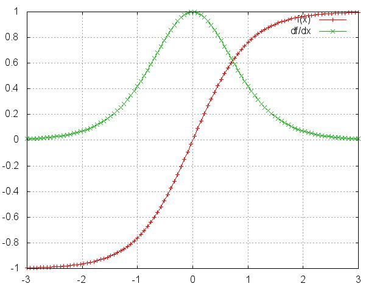
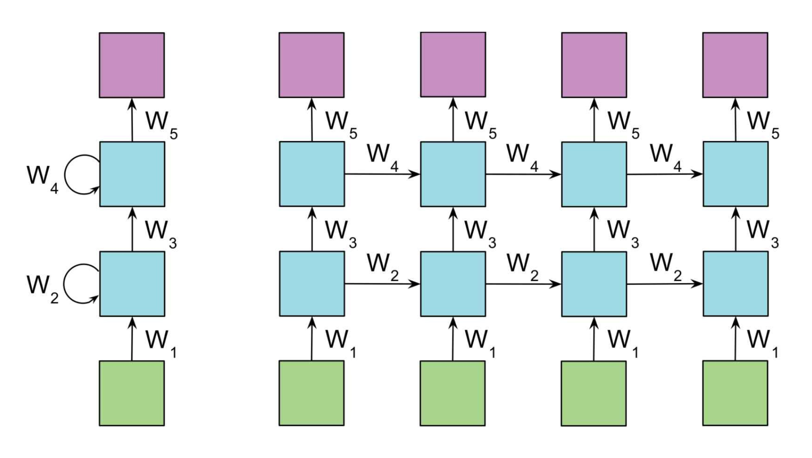

前面我们已经介绍了[深度神经网络](https://mp.weixin.qq.com/s?__biz=MzU3MjA2NTQzMw==&mid=2247483903&idx=1&sn=4e3f92578399013eba9f203d35afe972&chksm=fcd7d209cba05b1ffc66494ea8008c669e40f3045398695b479aba14e1c425f85b7c8f033c4f&token=1135020617&lang=zh_CN#rd)和[卷积神经网络](https://mp.weixin.qq.com/s?__biz=MzU3MjA2NTQzMw==&mid=2247483958&idx=1&sn=4527cba9c60fe8d634c5132398d17827&chksm=fcd7d1c0cba058d6c7d331affcaa3bf1a9bb532959a857763c3c31f069f1fcb343c67c89652a&token=1135020617&lang=zh_CN#rd)，这些算法都是前向反馈，模型的输出和模型本身没有关联关系。今天我们学习输出和模型间有反馈的神经网络，循环神经网络(Recurrent Neual Networks)，其广泛应用于自然语言处理中的语音识别，书写识别和机器翻译等领域。

### 1.RNN简介

前面介绍的DNN和CNN之中，训练样本的输入和输出都是确定的。但对于训练样本输入是连续的序列，训练样本长度不同的样本，比如一段连续的语音和手写文字，DNN和CNN是比较难处理的。而对于上述问题，RNN则是比较擅长，那么RNN是怎么做到的呢？

RNN假设输入样本是基于序列的，比如是从序列索引1到序列索引τ，对于其中的任意序列索引号t，输入是对应样本序列的$x^{(t)}$。而模型在序列索引号t位置的隐藏状态$h^{(t)}$，则由$x^{(t)}$和t-1时刻的隐藏状态$h^{(t-1)}$共同决定。在任意序列索引号t，也有相对应的模型预测输出$o^{t}$。通过预测输出$o^{(t)}$和训练序列的真实输出$y^{(t)}$，以及损失函数$L^{(t)}$，我们就可以用和DNN类似的方法来训练模型，接着用来预测测试样本的输出，下面我们来看看循环神经网络的模型。

### 2.RNN模型

循环神经网络有多种模型结构，这里我们介绍最主流的模型结构。上图中左边是没有按时间序列展开的图，右边是按照时间序列展开的结构，我们重点看右边的模型结构。这里描述了在序列索引号t附近的RNN模型，下面针对一些参数做具体说明。

+ $x^{(t)}$代表在序列索引号t时训练样本的输入，同样$x^{(t-1)}$和$x^{(t+1)}$分别代表t-1时刻和t+1时刻训练样本的输入。
+ $h^{(t)}$代表在序列索引号t时模型的隐藏状态，$h^{(t)}$由$x^{(t)}$和$h^{(t-1)}$共同决定。
+ $o^{(t)}$代表在序列索引号t时模型的输出，$o^{(t)}$由模型当前的隐藏状态$h^{(t)}$决定。
+ $L^{(t)}$代表在序列索引号t时模型的损失函数。
+ $y^{(t)}$代表在序列索引号t时训练样本序列的真实输出。
+ $U,W,V$矩阵是模型的线形关系参数，在整个RNN网络间是共享的，这点和DNN不同。正是因为参数的共享，体现了RNN模型循环反馈的思想。

### 3.RNN前向传播算法

根据上面介绍的模型，我们来看一下RNN前向传播算法，对于任意时刻序列索引号t，能够得到当前的隐藏状态。其中σ为RNN的激活函数，一般是tanh，b为偏倚系数。
$$
h^{(t)} = \sigma(z^{(t)}) = \sigma (Ux^{(t)} + Wh^{(t-1)} + b)
$$
序列索引号t时模型的输出$o^{(t)}$为
$$
o^{(t)} = Vh^{(t)} + c
$$
最终能够得到模型的预测输出，由于RNN是识别类的分类模型，所以下式激活函数一般是softmax函数。
$$
\hat{y}^{(t)}= \sigma (o ^{(t)})
$$
最后通过损失函数$L^{(t)}$，比如对数似然损失函数，我们可以量化模型在当前位置的损失，即$\hat{y}^{(t)}$和$y^{(t)}$的差距。

### 4.RNN反向传播算法

RNN反向传播算法和DNN思路相同，即通过梯度下降法进行迭代，得到合适的RNN模型参数U,W,V,b,c，传播过程中所有的参数在序列中各个位置是共享的，即反向传播中我们更新的是相同的参数。为了简化描述，反向传播时损失函数采用对数损失函数，隐藏层的激活函数为tanh函数，输出的激活函数为softmax函数。

对于RNN，由于我们在序列各位置都有损失函数，因此最终的损失函数L为
$$
L = \sum_{t=1}^{\tau}L^{(t)}
$$
其中V,c的梯度计算比较简单，如下所示
$$
\frac{\partial L}{\partial c} = \sum _{t=1}^{\tau} \frac{\partial L^{t}}{\partial c} = \sum _{t=1}^{\tau} \frac{\partial L^{(t)}}{o^{(t)}} \frac{\partial o^{(t)}}{\partial c} = \sum_{t=1}^{\tau} (\hat{y}^{(t)} - y^{(t)})
$$

$$
\frac{\partial L}{\partial V} = \sum _{t=1}^{\tau} \frac{\partial L^{t}}{\partial V} = \sum _{t=1}^{\tau} \frac{\partial L^{(t)}}{o^{(t)}} \frac{\partial o^{(t)}}{\partial V} = \sum_{t=1}^{\tau} (\hat{y}^{(t)} - y^{(t)})(h^{(t)})^T
$$

针对W,U,b的梯度计算比较复杂，从RNN模型可以看出，在反向传播时，在某一序列位置t的梯度损失，由当前位置的输出对应的梯度损失和序列索引位置t+1时的梯度损失两部分共同决定。对于W在某一序列位置t的梯度损失需要反向传播一步步来进行计算，此处定义序列索引t位置的隐藏状态梯度为
$$
\delta^{(t)} = \frac{\partial L}{\partial h^{(t)}}
$$
这样便可以像DNN一样从$\delta^{(t+1)}$递推得到$\delta^{(t)}$
$$
\delta^{(t)} = \frac{\partial L}{\partial o^{(t)}}\frac{\partial o^{(t)}}{\partial h^{(t)}} + \frac{\partial L}{\partial h^{(t + 1)}}\frac{\partial h^{(t + 1)}}{\partial h^{(t)}} 
= V^T(\hat{y}^{(t)} - y^{(t)}) + W^T \delta^{(t+1)} diag(1-(h^{(t+1)})^2)
$$
对于$\delta^{(\tau)}$后面没有其他的序列索引，因此有
$$
\delta^{(\tau)} = \frac{\partial L}{\partial o^{(\tau)}}\frac{\partial o^{(\tau)}}{\partial h^{(\tau)}} = V^T(\hat{y}^{(\tau)} - y^{(\tau)})
$$
有了$\delta^{(t)}$之后计算W,U,b也就很方便了，相应表达式如下所示
$$
\frac{\partial L}{\partial W} = \sum_{t=1}^{\tau} \frac{\partial L}{\partial h^{(t)}} \frac{\partial h^{(t)}}{\partial W} = \sum _{t=1} ^{\tau}diag(1-(h^{(t)})^2)\delta^{(t)}(h^{(t-1)})^T
$$

$$
\frac{\partial L}{\partial U} = \sum_{t=1}^{\tau} \frac{\partial L}{\partial h^{(t)}} \frac{\partial h^{(t)}}{\partial U} = \sum _{t=1} ^{\tau}diag(1-(h^{(t)})^2)\delta^{(t)}(x^{(t)})^T
$$

$$
\frac{\partial L}{\partial b} = \sum_{t=1}^{\tau} \frac{\partial L}{\partial h^{(t)}} \frac{\partial h^{(t)}}{\partial b} = \sum _{t=1} ^{\tau}diag(1-(h^{(t)})^2)\delta^{(t)}
$$

### 4.RNN梯度爆炸和梯度消失

RNN虽然理论上可以很好的解决序列数据的训练，但存在梯度爆炸和梯度消失问题，当序列很长的时候问题尤为严重。为什么会出现梯度爆炸和梯度消失问题呢？我们来看看反向传播过程中U的变化
$$
\frac{\partial L}{\partial U} = \sum_{t=1}^{\tau} \frac{\partial L}{\partial o^{(t)}} \frac{\partial o^{(t)}}{\partial h^{(t)}} (\prod _{i=k+1}^{t} \frac{ \partial h^{(i)}}{ \partial h^{(i-1)}}) \frac{\partial h^{(k)}}{\partial U}
$$
因为$h^{(t)} = \tanh (z^{(t)}) = \tanh (Ux^{(t)} + Wh^{(t-1)} + b)$，所以
$$
\prod _{i=k+1}^{t} \frac{ \partial h^{(i)}}{ \partial h^{(i-1)}} = \prod _{i=k+1}^{t} \tanh ^{'}W = \prod _{i=k+1}^{t} diag(1-(h^{(i)})^2)W^T
$$

从上图可以看出${\tanh}' \leq 1 $，对于训练过程中大部分情况tanh的导数是小于1的，如果W也是大于0小于1的值，则当t很大时，那么$\prod _{i=k+1}^{t} {\tanh}' W$便会趋于0。同理当W很大时，$\prod _{i=k+1}^{t} {\tanh}' W$便会趋于无穷，上述就是RNN之中梯度消失和梯度爆炸的原因。

### 5.其他

上面总结了通用的RNN模型的前向传播算法和反向传播算法，当然RNN还有很多其他的模型，比如多层RNN、双向循环RNN（如上图所示），在前向和反向传播时公式自然也会不同，但基本原理类似，有兴趣可查询其他资料继续学习。

RNN存在梯度爆炸和梯度消失问题，但怎么解决呢，下篇文章我们来介绍LSTM算法，看如何解决传播时出现的梯度爆炸和梯度消失问题。

### 6.推广

更多内容请关注公众号**谓之小一**，若有疑问可在公众号后台提问，随时回答，欢迎关注，内容转载请注明出处。

