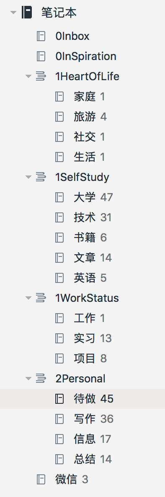
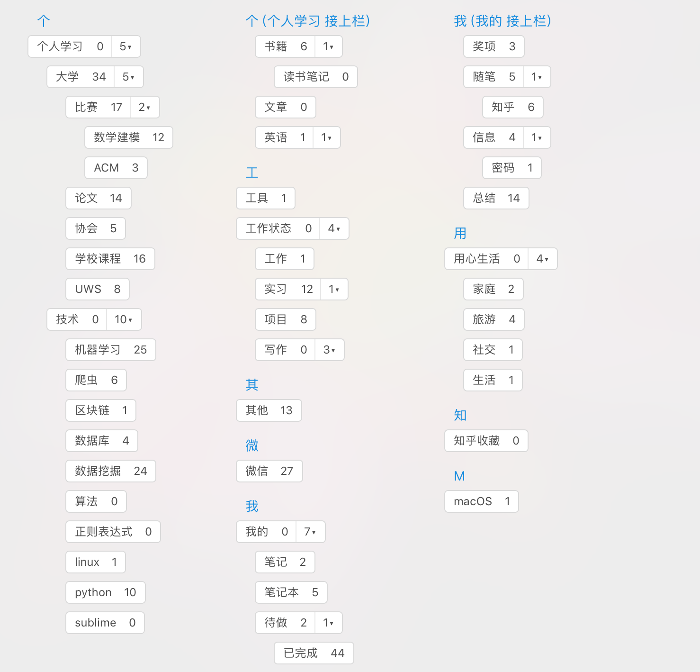
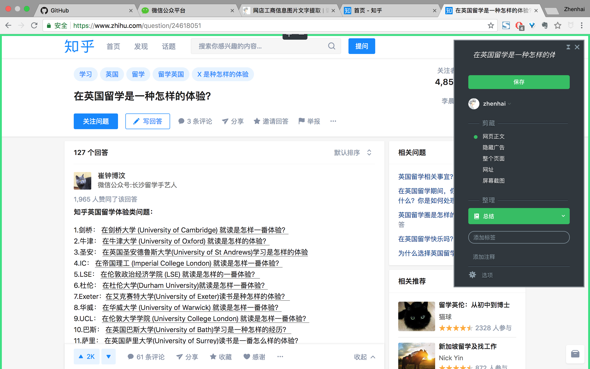
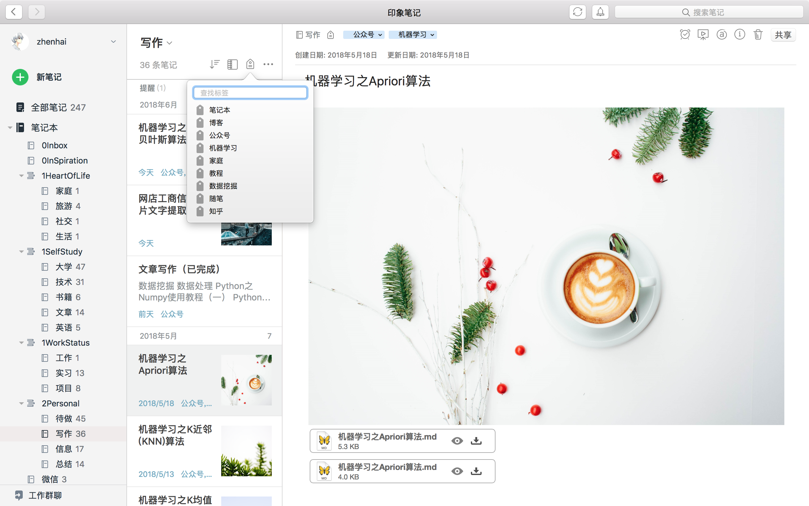
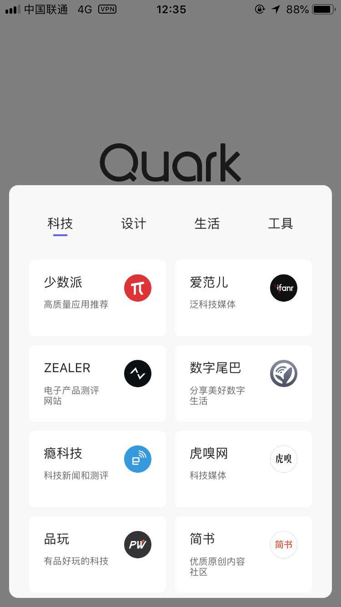

工欲善其事，必先利其器，为此给大家推荐几款效率软件，帮助你高效学习和工作。
+  滴答清单：解决拖延症&&健忘症，高效完成任务和规划时间。
+  印象笔记： 收集各类信息，捕捉灵感，做你的**第二大脑**。
+  夸克浏览器：极简风格，满足你对浏览器最本质的需求。

### 1.滴答清单
身边的人多多少都有点拖延症(包括我)，不到DeadLine的时候，都不会想到去解决问题。为此还耽误了几次事情，但被老师或同学批评几次之后，痛定思痛，决定认真改变拖延症的习惯。奈何自制力又不是太强，没监督或者提醒的话，不久之后又恢复到以前的状态。某天闲逛知乎中，发现滴答清单这款软件，真心不错，用一段时间之后，我多年的老(tuo)寒(yan)腿(zheng)也给治愈啦。另外，多逛知乎也是有用处的，硬是逛出来一篇中文核心论文《面向知乎的个性化推荐模型研究》，在知网现在也能检索到啦，大雾。

解决拖延症，首要具备的便是任务提醒功能，滴答清单默认每天9点通知该天内所有事项。另外，如果为某件事情设置了具体时间，滴答将会在该时间点时进行提醒。对于未完成的任务，滴答清单图标右上角会时刻显示通知，督促自己完成。

针对需要完成的每项任务，可增加标签和项目分组。通过标签和分组的结合，能够将任务具体到生活中的各个方面。对于不同的任务，可设置高、中、低、无优先级，优先完成最重要的事情，即使在有限的时间内，也能高效的完成工作。比如**文章写作**这项任务，我定义为中午12点之前完成，标签为公众号和博客，分组到写作模块。当然想要对某项任务添加更具体的描述时，滴答清单支持照片、位置、录音、附件等信息。当完成某项任务，消除待办事项时，发出滴答的声音，满满的自豪感。

滴答清单支持在日历上添加任务，当接到某项任务时，随手记下来，当作备忘录，以防忘记。如需回顾过去某天的任务，可根据日期进行查看具体事项。另外滴答清单内置番茄计时，让自己更加专注工作。

滴答清单风格偏于简约型，没有任何多余功能，看着就非常舒服。当然想要体验更多功能的话，可以升级到高级会员，但我也没有体验过，在此也就不再介绍，其实普通版足以满足个人需求。利用滴答清单设定任务提醒，能够有效督促自己，克服拖延症。对于生活中的日常事情，可随手添加到滴答之中，以防忘记。通过滴答清单，帮助你高效完成任务和规划时间，在滴答清单中记录和规划事情，用更少的时间达到目标。

### 2.印象笔记
学习和工作之中，必然包含着各种各样的信息，如果仅仅是通过大脑记忆的话，无法达到对信息的有效收集和整理。另外当需要寻找以往的知识或资料时，很难能够从大脑之中检索出来，当然学霸除外。因此，需要寻找**第二大脑**来帮助我们收集和整理信息，当需要利用以往知识点的时候，快速检索并加以利用。
好，主角也该上场啦，印象笔记。通过印象笔记在手机、平板、电脑上捕捉和共享灵感，跨平台的印象笔记帮助你永久保存所有信息，将想法转换为行动，做你的第二大脑。
先说一下我是怎么利用利用印象笔记的吧。印象笔记支持标签和笔记本两种分类模式，两种方式的结合能够覆盖到生活和学习之中的方方面面。信息对于我来说分为三个模式，分别为**信息输入**、**信息加工(学习)**、**信息输出**，所以我也就将笔记本分为三种模式，记为0、1、2。

信息输入模块包含两个笔记本，第一个笔记本为杂乱信息收集(0Inbox)，白天收集到的信息全部放在该笔记本之中，然后晚上将收集到的信息细分到信息加工模块。第二个笔记本为灵感收集(0InSpiration)，将突然想到的灵感记录到该笔记本之中，然后利用空闲时间进行扩充和整理。

信息加工(学习)模块用于记录生活、学习、工作之中的事情。生活(1HeartOfLife)、学习(1SelfStudy)、工作(1WorkStatus)笔记本组再分为相应笔记本，笔记本之中的每个笔记另外加上标签，当我们需要寻找过去的某条笔记或者知识点时，利用印象笔记的搜索功能能够秒搜索到所需要的信息。

信息输出模块是将以往所收集到的信息进行总结、深度加工整理到该笔记本之中，另外个人重要信息也会收集到之中。比如我在信息加工(学习)模块总结得到的经验和教训、所写的文章、项目规划等都会记录到信息输出模块。从杂乱的信息之中，经过上述三步便能进行结构化处理，方便自己学习，也方便以后利用。

印象笔记的笔记本只支持二级分组，如果想要覆盖生活中所有知识的话，创建很多笔记本，难免会冗余。此时我们可以利用印象笔记的分类标签，标签支持无限嵌套。写笔记时对每个笔记添加不同的标签，这样就可以覆盖各个方面的知识点。

另外印象笔记支持多种收集方式，比如在网页之中，如果看到有趣的信息，便可利用印象笔记剪辑功能，一步保存网页之中的信息。另外我个人也关注了很多公众号，对于有趣的信息，通常想要收藏到印象笔记之中。我们只需要预先关注**我的印象笔记**服务号，绑定个人信息之后，找到想要收藏的公众号文章，只需一键发送到公众号，便可收集到个人印象笔记之中。同时印象笔记支持添加语音，pdf文档等形式的信息。

印象笔记分为三种模式，分别为免费账户、标准账户、高级账户。免费账户功能较少，支持两台同步设备，每月上传流量为60M，支持搜索图片内的文字等功能。标准账户和高级账户功能差不多，但目前印象笔记高级账户在做活动，价格更便宜一些，年费价格大概是80左右。对于付费产品，我的看法是价格反映的是产品的品质，至于贵不贵，取决于它对人的价值。

印象笔记高级账户支持多平台登陆(无限制)、同步所有设备、每月10G上传流量、标注pdf功能、笔记演示、文档搜索等功能。说实话，印象笔记中的搜索功能非常强，图片和文档之中的信息能够轻松搜索出来。即使忘记笔记放在哪个笔记本分组里，也可以秒搜索到。最后还有个很惊艳的功能，文档扫描。大一时候记了很多高数笔记，但到大三之后，又不舍的扔，又没有空闲地方去放置。所以利用印象笔记文档扫描功能将所有的高数笔记扫描到印象笔记之中，扫描的内容非常清晰，而且还可以在扫描后的文档上进行编辑。笔记移动到印象笔记之后，想要找高数中知识点，只需搜索相应内容即可，基本上是秒找到高数内容。如果是纸质笔记本的话，还需要一页页去查询，很繁琐。利用印象笔记的话，节省了很大功夫，现在纸质笔记本也就可以直接扔啦。

利用印象笔记，记录生活、工作、学习中方方面面知识点，将所有信息保存到**第二大脑**之中，然后结构化管理，智能记录，有序生活。

### 3.夸克浏览器

电脑上浏览器我也就不推荐啦，多数用的都是Google Chrome浏览器，优点很多，大家慢慢探索就好。在这儿推荐下手机上的一个小众浏览器，**夸克**。

我也曾经用过iPhone版Chrome浏览器，但每次想要搜索东西的时候，打开软件的时间就需要5s，就算进入到搜索界面之后也会有一些杂乱信息，很容易让自己分心，影响工作效率。这里更别提手机版的百度首页了，信息杂乱程度惨不忍睹。而夸克浏览器就不一样了，打开软件时间基本上是在1s左右，进入软件之后，只留有一个搜索框，没必要做任何多余的事情，果然是够快、够简约。

简约并不意味着简单，夸克浏览器简约之中更是带着很多亮点功能。浏览器底部可以进入一些常用网站，比如少数派、爱范儿、简书等，在小程序出来之前，我经常用这种方式看资讯，使用体验相当不错。对于一些需要用到的网站，但是又不想去下载APP，这样倒是一个不错的解决方法。当然现在小程序出来之后，在小程序看资讯也是很好的方法。

总而言之、言而总之，夸克是一款以轻、快为核心，设计风格简约的浏览器，是一款专注用户浏览体验的信息获取工具。启动时无任何多余加载项，瞬间启动无需等待。利用极简思路解决信息冗余，满足用户对于浏览器最本质的需求。同时浏览器本身从底栏自动缩放、菜单分层设计、导航栏设置等方面，给用户带来沉浸式的浏览体验。

介于篇幅有限，这篇文章就介绍这么多，下篇文章将重点介绍YoMail、Kindle、Typora、Ulysse软件。

### 4.推广

更多内容请关注公众号’谓之小一’，若有疑问可在公众号后台提问，随时回答，欢迎关注，内容转载请注明出处。

