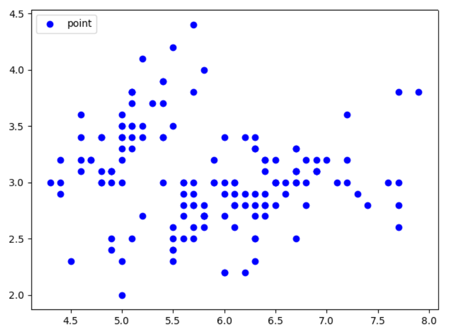
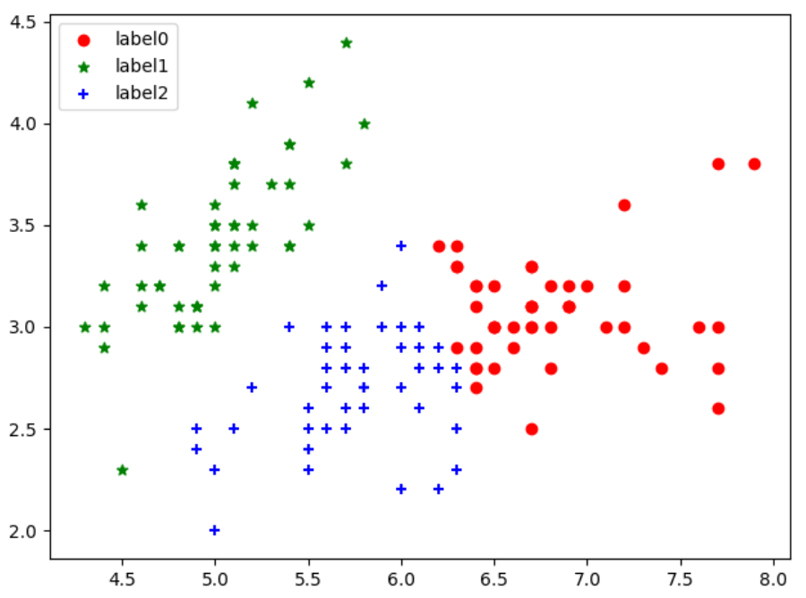

### 1.K-Means简介

**K均值(K-Means)**算法是无监督的聚类方法，实现起来比较简单，聚类效果也比较好，因此应用很广泛。K-Means算法针对不同应用场景，有不同方面的改进。我们从最传统的K-Means算法讲起，然后在此基础上介绍初始化质心优化**K-Means++**算法，距离计算优化**Elkan K-Means**算法和大样本情况下**Mini Batch K-Means**算法。

K-Means算法的思想很简单，对于给定的样本集，按照样本之间的距离大小，将样本集划分为K个簇。让簇内的点尽可能紧密的连在一起，而让簇间的距离尽量的大，下面我们引入K-Means目标函数。

假设样本集输入变量为(x1,x2,x3,…,xm)，样本集划分为K个簇(C1,C2,C3,…,Ck)，则我们的目标是最小化平方误差E。
$$
E=\sum _{i=1}^{k} \sum _{x \in C_i}||x-\mu _i||^2
$$
其中μi是簇Ci的均值向量，也可称作质心，表达式为
$$
\mu _i=\frac{1}{|C_i|}\sum _{x \in C_i}x
$$
如果直接求解上述最小值的话，那么为NP Hard问题，因此K-Means算法采用启发式的迭代方法。下面我们通过一个简单聚类来介绍K-Means算法迭代过程。

+ 如图(a)所示：表示初始化数据集。
+ 如图(b)所示：假设K=2，随机选择两个点作为类别质心，分别为图中的红色质心和蓝色质心。
+ 如图(c)所示：分别求样本点xi到这两个质心的距离，并标记每个样本点的类别为距离质心最近的类别。划分得到两个簇C1和C2，完成一次迭代。
+ 如图(d)所示：对标记为红色的点和蓝色的点分别求新的质心。
+ 如图(e)所示：重复图(c)(d)过程，标记每个样本点的类别为距离质心最近的类别，重新划分得到两个簇C1和C2。
+ 如图(f)所示：直到质心不再改变后完成迭代，最终得到两个簇C1和C2。


### 2.K-Means算法流程

假设输入样本集$D={x_1,x_2,…,x_m}$，聚类簇数为K，最大迭代次数为N。输出的簇划分为$C={C_1,C_2,…,C_m}$。

+ 从数据集D中随机选择K个样本作为初始的质心向量$ \mu=\{ \mu_1,\mu_2,\mu_3,...,\mu_k \}$。

+ 迭代$n=1,2,…,N$。

  + 划分初始化簇$C_t=\varnothing ;\ t=1,2,…,k$。
  + 对于$i=1,2,…,m$，计算样本$x_i$和各个质心向量$\mu_j(\ j=1,2,…,k)$的距离$d_{ij}$。将$x_i$标记为最小的$d_{ij}$所对应的类别$\lambda_i$，此时更新$C_{\lambda i}=C_{\lambda i} \cup{x_i}$。

  $$
  d_{ij}=||x_i-\mu_j||^2
  $$

  + 对于$j=1,2,…,k$，对$C_j$中所有样本点重新计算新的质心。

  $$
  \mu_j=\frac{1}{|C_j|}\sum_{x\in C_j}x
  $$

  + 如果K个质心向量都不再发生变化，则结束迭代。

+ 输出K个划分簇$C$，$C=\{C_1,C_2,C_3,…,C_k \}$。

对于K-Means算法，首先要注意K值的选择和K个初始化质心的选择。

+ **对于K值的选择:**我们可以通过对数据的先验经验选择合适的K值，如果没有先验条件的话，还可以通过交叉验证选择合适的K值。
+ **对于K个初始化质心:**由于我们采用启发式迭代方法，K个初始化质心的位置选择对最后的聚类结果和运行时间都有较大的影响，最好选择的K个质心不要离得太近。

### 3.初始化优化K-Means++

如果是完全随机的选择， 算法的收敛可能很慢。我们在此介绍K-Means++算法，针对随机初始化质心进行优化，具体算法流程如下所示。

+ 从输入的数据点集合中随机选择一个点作为第一个聚类中心μ1。
+ 对于数据集中的每个点xi，计算与他最近的聚类中心距离。

$$
D(x)=\arg \min_{r=1}^{k_{selected}}||x_i-\mu_r||^2
$$

+ 选择一个数据点作为新的聚类中心，其中D(x)较大的点被选作新的聚类中心的概率较大。
+ 重复上述两步，直到选择出K个聚类中心。然后利用这K个质心来作为初始化质心去运行传统K-Means算法。

### 4.距离计算优化Elkan K-Means算法

传统K-Means算法中，我们每次迭代时都要计算所有样本点到所有质心之间的距离，那么有没有什么方法来减少计算次数呢? Elkan K-Means算法提出利用两边之和大于第三边、两边之差小于第三边的三角形特性来减少距离的计算。

+ 对于一个样本点$x$和两个质心$\mu_{j1},\mu_{j2}$，如果我们预先计算出这两个质心之间的距离$D(j_1,j_2)$，如果发现$2D(x,j_1)≤D(j_1,j_2)$，那么我们便能得到$D(x,j_1)≤D(x,j_2)$。此时我们不再计算$D(x,j_2)$，也就节省了一步距离计算。
+ 对于一个样本点$x$和两个质心$μ_{j1},μ_{j2}$，我们能够得到$D(x,j_2)≥max{0,D(x,j_1)−D(j_1,j_2)}$。

Elkan K-Means迭代速度比传统K-Means算法迭代速度有较大提高，但如果我们的样本特征是稀疏的，或者有缺失值的话，此种方法便不再使用。

### 5.大样本优化Mini Batch K-Means算法

传统的K-Means算法中需要计算所有样本点到所有质心的距离，计算复杂度较高。如果样本量非常大的情况下，比如数据量达到10万，特征在100以上，此时用传统K-Means算法非常耗时。故此针对大样本情况下采用Mini Batch K-Means算法。

Mini Batch K-Means采用无放回随机采样的方法从样本集中选取部分数据，然后用选取的数据进行传统的K-Means算法训练。然后进行迭代并更新质心，直到质心稳定或达到指定的迭代次数。

Mini Batch K-Means可以避免样本量太大带来的计算问题，算法收敛速度也能够加快，当然带来的代价就是我们的聚类精确度降低。为增加算法的准确性，我们可以多训练几次Mini Batch K-Means算法，用不同的随机采样集来得到聚类簇，选择其中最优的聚类簇。

### 6.Sklearn实现K-Means算法

我们经常需要通过改变参数来让模型达到聚类结果，具体参数设置可参考[sklearn官方教程](http://scikit-learn.org/stable/modules/generated/sklearn.cluster.KMeans.html)。

```python
from sklearn.cluster import KMeans
from sklearn.datasets import load_iris
import matplotlib.pyplot as plt

#load iris
iris=load_iris()
X=iris.data[:,:2]
print(X.shape)
#150,2

#plot data
plt.figure()
plt.scatter(X[:,0],X[:,1],c='blue',
            marker='o',label='point')
plt.legend(loc=2)
plt.show()
```



```python
# fit data
kmeans=KMeans(n_clusters=3)
kmeans.fit(X)
label_pred=kmeans.labels_

#plot answer
plt.figure()
x0 = X[label_pred == 0]
x1 = X[label_pred == 1]
x2 = X[label_pred == 2]
plt.scatter(x0[:, 0], x0[:, 1], c = "red",
            marker='o', label='label0')
plt.scatter(x1[:, 0], x1[:, 1], c = "green",
            marker='*', label='label1')
plt.scatter(x2[:, 0], x2[:, 1], c = "blue",
            marker='+', label='label2')
plt.legend(loc=2)
plt.show()
```



### 7.K-Means算法优缺点

#### 7.1优点

+ 聚类效果较优。

+ 原理简单，实现容易，收敛速度快。
+ 需要调整的参数较少，通常只需要调整簇数K。

#### 7.2缺点

+ K值选取不好把握。
+ 对噪音和异常点比较敏感。
+ 采用迭代方法，得到的结果是局部最优。
+ 如果各隐含类别的数据不平衡，则聚类效果不佳。

### 8.推广

更多内容请关注公众号**谓之小一**，若有疑问可在公众号后台提问，随时回答，欢迎关注，内容转载请注明出处。


参考

+ [刘建平Pinard_K-Means聚类算法原理](http://www.cnblogs.com/pinard/p/6164214.html)