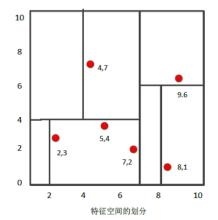

### 1.KNN简介

**K近邻(K-Nearest Neighbors, KNN)**算法既可处理分类问题，也可处理回归问题，其中分类和回归的主要区别在于最后做预测时的决策方式不同。KNN做**分类**预测时一般采用多数表决法，即训练集里和预测样本特征最近的K个样本，预测结果为里面有最多类别数的类别。KNN做**回归**预测时一般采用平均法，预测结果为最近的K个样本数据的平均值。其中KNN分类方法的思想对回归方法同样适用，因此本文主要讲解KNN分类问题，下面我们通过一个简单例子来了解下KNN算法流程。

如下图所示，我们想要知道绿色点要被决定赋予哪个类，是红色三角形还是蓝色正方形？我们利用KNN思想，如果假设**K=3**，选取三个距离最近的类别点，由于红色三角形所占比例为2/3，因此绿色点被赋予红色三角形类别。如果假设**K=5**，由于蓝色正方形所占比例为3/5，因此绿色点被赋予蓝色正方形类别。


从上面实例，我们可以总结下KNN算法过程

1. 计算测试数据与各个训练数据之间的距离。
2. 按照距离的递增关系进行排序，选取距离最小的K个点。
3. 确定前K个点所在类别的出现频率，返回前K个点中出现频率最高的类别作为测试数据的预测分类。

从KNN算法流程中，我们也能够看出KNN算法三个重要特征，即距离度量方式、K值的选取和分类决策规则。

+ **距离度量方式：**KNN算法常用欧式距离度量方式，当然我们也可以采用其他距离度量方式，比如曼哈顿距离，相应公式如下所示。

$$
D(x,y)=\sqrt{(x_1-y_1)^2+(x_2-y_2)^2+...+(x_n-y_n)^2}=\sqrt{\sum_{i=1}^{n}(x_i-y_i)^2}
$$

$$
D(x,y)={|x_1-y_1|+|x_2-y_2|+|x_3-y_3|...+|x_n-y_n|}={\sum_{i=1}^{n}|x_i-y_i|}
$$

+ **K值的选取：**KNN算法决策结果很大程度上取决于K值的选择。选择较小的K值相当于用较小领域中的训练实例进行预测，训练误差会减小，但同时整体模型变得复杂，容易过拟合。选择较大的K值相当于用较大领域中训练实例进行预测，可以减小泛化误差，但同时整体模型变得简单，预测误差会增大。
+ **分类决策规则：**KNN分类决策规则经常使用我们前面提到的多数表决法，在此不再赘述。

KNN要选取前K个最近的距离点，因此我们就要计算预测点与所有点之间的距离。但如果样本点达到几十万，样本特征有上千，那么KNN暴力计算距离的话，时间成本将会很高。因此暴力计算只适合少量样本的简单模型，那么有没有什么方法适用于大样本数据，有效降低距离计算成本呢？那是当然的，我们下面主要介绍KD树和球树方法。

### 2.KD树原理

KD树算法没有一开始就尝试对测试样本进行分类，而是先对训练集建模，建立的模型就是KD树，建立好模型之后再对测试集做预测。KD树就是K个特征维度的树，注意KD树中K和KNN中的K意思不同。KD树中的K代表样本特征的维数，为了防止混淆，后面我们称KD树中特征维数为n。KD树可以有效减少最近邻搜索次数，主要分为建树、搜索最近邻、预测步骤，下面我们对KD树进行详细讲解。

#### 2.1KD树建立

下述为KD树构建步骤，包括寻找划分特征、确定划分点、确定左子空间和右子空间、递归构建KD树。

1. **寻找划分特征：**KD树是从m个样本的n维特征中，分别计算n个特征取值的方差，用方差最大的第k维特征nk来作为根节点。
2. **确定划分点：**选择特征nk的中位数nkv所对应的样本作为划分点。
3. **确定左子空间和右子空间：**对于所有第k维特征取值小于nkv的样本划入左子树，所有第k维特征取值大于nkv的样本划入右子树。
4. **递归构建KD树：**对于左子树和右子树，采用和上述同样的方法来找方差最大的特征生成新节点，递归的构建KD树。

我们举例来说明KD树构建过程，假如有二维样本6个，分别为{(2,3)，(5,4)，(9,6)，(4,7)，(8,1)，(7,2)}，KD树过程构建过程如下

1. **寻找划分特征：**6个数据点在x,y维度上方差分别为6.97,5.37，x轴上方差更大，用第1维度特征建树。
2. **确定划分点：**根据x维度上的值将数据排序，6个数据中x的中值为7，所以划分点数据为(7,2)，该节点的分割超平面便是x=7直线。
3. **确定左子空间和右子空间：**分割超平面x=7将空间分为两部分。x<=7的部分为左子空间，包含节点为{(2,3)，(5,4)，(4,7)}。x>7的部分为右子空间，包含节点为{(9,6)，(8,1)}。
4. **递归构建KD树：**用同样的方法划分左子树{(2,3)，(5,4)，(4,7)}和右子树{(9,6)，(8,1)}，最终得到KD树。




#### 2.2KD树搜索最近邻

当我们生成KD树后，就可以预测测试样本集里面的样本目标点。

1. **二叉搜索：**对于目标点，通过二叉搜索，能够很快在KD树里面找到包含目标点的**叶子节点**。
2. **回溯：**为找到最近邻，还需要进行**回溯**操作，算法沿搜索路径反向查找是否有距离查询点更近的数据点。以目标点为圆心，目标点到叶子节点的距离为半径，得到一个超球体，最邻近点一定在这个超球体内部。
3. **更新最近邻：**返回叶子节点的父节点，检查另一叶子节点包含的超矩形体是否和超球体相交，如果相交就到这个子节点中寻找是否有更近的最近邻，有的话就更新最近邻。如果不相交就直接返回父节点的父节点，在另一子树继续搜索最近邻。当回溯到根节点时，算法结束，此时保存的最近邻节点就是最终的最近邻。

为方便理解上述过程，我们利用**2.1建立的KD树**来寻找(2,4.5)的最近邻。

1. **二叉搜索：**首先从(7,2)节点查找到(5,4)节点。由于目标点y=4.5，同时分割超平面为y=4，因此进入右子空间(4,7)进行查找，形成搜索路径{(7,2)->(5,4)->(4,7)}。
2. **回溯：**节点(4,7)与目标查找点距离为3.202，回溯到父节点(5,4)与目标查找点之间距离为3.041，所以(5,4)为查询点的最近邻。以目标点(2,4.5)为圆心，以3.041为半径作圆，最近邻一定在超球体内部。
3. **更新最近邻：**该圆和y = 4超平面交割，所以需要进入(5,4)左子空间进行查找，将(2,3)节点加入搜索路径{(7,2)->(2,3)}。回溯至(2,3)叶子节点，(2,4.5)到(2,3)的距离比到(5,4)要近，所以最近邻点更新为(2,3)，最近距离更新为1.5。回溯至(7,2)，以(2,4.5)为圆心，1.5为半径作圆，发现并不和x = 7分割超平面交割，至此搜索路径回溯完成，完成更新最近邻操作，返回最近邻点(2,3)。


#### 2.3KD树预测

根据KD树搜索最近邻的方法，我们能够得到第一个最近邻数据点，然后把它置为已选。然后忽略置为已选的样本，重新选择最近邻，这样运行K次，就能得到K个最近邻。如果是KNN分类，根据多数表决法，预测结果为K个最近邻类别中有最多类别数的类别。如果是KNN回归，根据平均法，预测结果为K个最近邻样本输出的平均值。

### 3.球树原理

KD树算法能够提高KNN搜索效率，但在某些时候效率并不高，比如处理不均匀分布的数据集时。如下图所示，如果黑色的实例点离目标点(星点)再远一点，那么虚线会像红线那样扩大，导致与左上方矩形的右下角相交。既然相交那就要检查左上方矩形，而实际上最近的点离目标点(星点)很近，检查左上方矩形区域已是多余。因此KD树把二维平面划分成矩形会带来无效搜索的问题。


为优化超矩形体带来的搜索效率问题，我们在此介绍球树算法来进一步提高最近邻搜索效率。

#### 3.1球树建立

球树的每个分割块都是超球体，而不像KD树中的超矩形体，这样在做最近邻搜索是可以避免无效搜索，下面我们介绍球树构建过程

1. **构建超球体：**超球体是可以包含所有样本的最小球体。
2. **划分子超球体：**从超球体中选择一个离超球体中心最远的点，然后选择第二个点离第一个点最远，将球中所有的点分配到离这两个聚类中心最近的一个。然后计算每个聚类的中心，以及聚类能够包含它所有数据点所需的最小半径，这样我们便得到两个子超球体，和KD树中的左右子树对应。
3. **递归：**对上述两个子超球体，递归执行步骤2，最终得到球树。


#### 3.2球树搜索最近邻

KD树在搜索路径优化时使用的是两点之间的距离来判断，而球树使用的是两边之和大于第三边来判断。相对来说球树的判断更加复杂，但却避免一些无效的搜索，下述为球树搜索最近邻过程。

1. 自上而下贯穿整棵树找出包含目标点所在的叶子，并在这个球里找出与目标点最邻近的点，这将确定目标点距离最邻近点的上限值。
2. 然后和KD树查找相同，检查兄弟结点，如果目标点到兄弟结点中心的距离超过兄弟结点的半径与当前的上限值之和，那么兄弟结点里不可能存在一个更近的点。否则进一步检查位于兄弟结点以下的子树。
3. 检查完兄弟节点后，向父节点回溯，继续搜索最小邻近值。当回溯到根节点时，此时的最小邻近值就是最终的搜索结果。

#### 3.3球树预测

根据球树搜索最近邻的方法，我们能够得到第一个最近邻数据点，然后把它置为已选。然后忽略置为已选的样本，重新选择最近邻，这样运行K次，就能得到K个最近邻。如果是KNN分类，根据多数表决法，预测结果为K个最近邻类别中有最多类别数的类别。如果是KNN回归，根据平均法，预测结果为K个最近邻样本输出的平均值。

### 4.KNN算法扩展

有时我们会遇到样本中某个类别数的样本非常少，甚至少于我们实现定义的K，这将导致稀有样本在找K个最近邻的时候会把距离较远的无关样本考虑进来，进而导致预测不准确。为解决此类问题，我们先设定最近邻的一个最大距离，也就是说，我们在一定范围内搜索最近邻，这个距离称为限定半径。

### 5.Sklearn实现KNN算法

下述代码是利用iris数据进行分类，我们经常需要通过改变参数来让模型达到分类结果，具体参数设置可参考[sklearn官方教程](http://scikit-learn.org/stable/modules/generated/sklearn.neighbors.KNeighborsClassifier.html)。

```python
from sklearn.neighbors import KNeighborsClassifier
from sklearn.datasets import load_iris
from sklearn.model_selection import train_test_split

#load iris data
iris=load_iris()
X=iris.data
y=iris.target
X_train,X_test,y_train,y_test=train_test_split(X,y,test_size=0.3,random_state=1)

knn=KNeighborsClassifier(algorithm='kd_tree')
knn.fit(X_train,y_train)
print(knn.predict(X_test))
# [0 1 1 0 2 1 2 0 0 2 1 0 2 1 1 0 1 1 0 0 1 1 1 0 2 1 0 0 1 2 1 2 1 2 2 0 1
#  0 1 2 2 0 1 2 1]
print(y_test)
# [0 1 1 0 2 1 2 0 0 2 1 0 2 1 1 0 1 1 0 0 1 1 1 0 2 1 0 0 1 2 1 2 1 2 2 0 1
#  0 1 2 2 0 2 2 1]
print(knn.score(X_test,y_test))
# 0.977777777778
```

### 6.KNN优缺点

#### 6.1优点

+ 即可处理分类也可处理回归问题。
+ 对数据没有假设，准确度高，对异常点不敏感。
+ 比较适合样本容量大的类域进行自动分类，对样本容量较小的类域容易产生误分。
+ 主要靠周围有限的邻近样本进行分类或回归，比较适合类域交叉或重叠较多的待分样本集。

#### 6.2缺点

+ 计算量大，尤其是特征维数较多时候。
+ 样本不平衡时，对稀有类别的预测准确率低。
+ KD树、球树之类的模型建立时需要大量的内存。
+ 使用懒惰学习方法，基本上不学习，导致预测时速度较慢。

### 7.推广

更多内容请关注公众号**谓之小一**，若有疑问可在公众号后台提问，随时回答，欢迎关注，内容转载请注明出处。


参考

>[刘建平Pinard_K近邻法(KNN)原理小结](http://www.cnblogs.com/pinard/p/6061661.html)
>
>[Yabea_K-近邻(KNN)算法](https://www.cnblogs.com/ybjourney/p/4702562.html)

