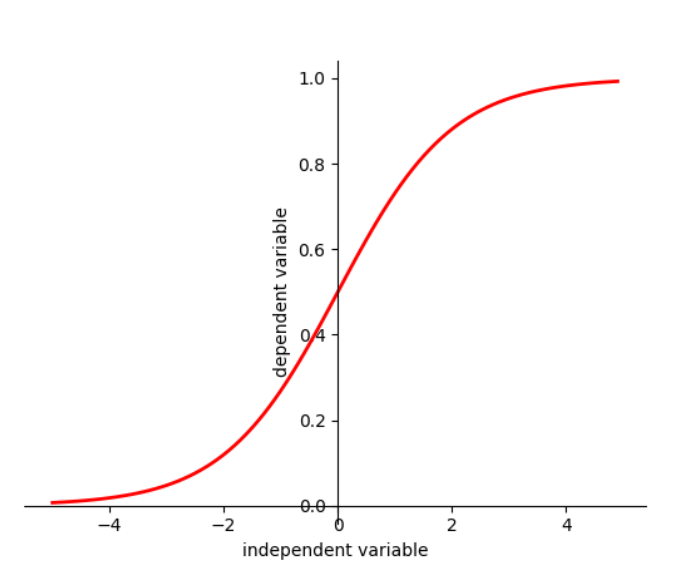
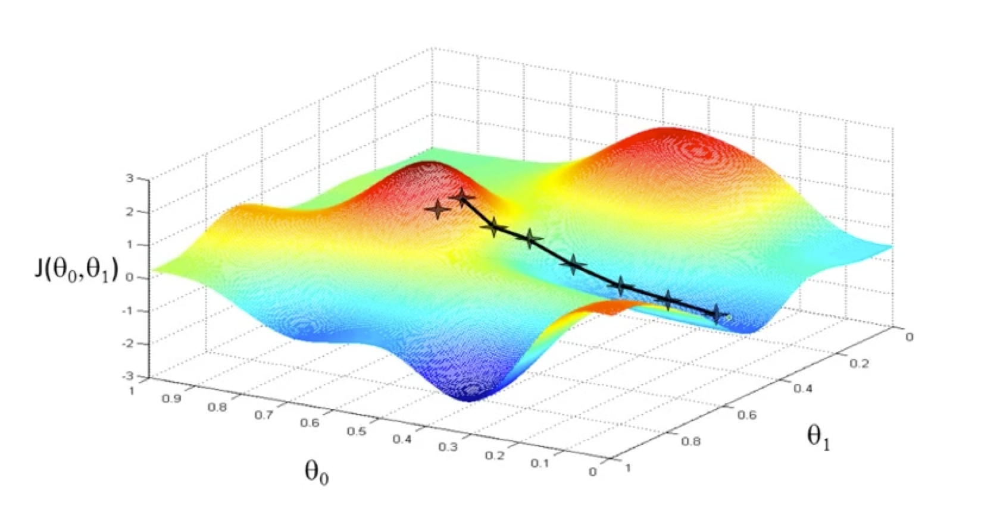
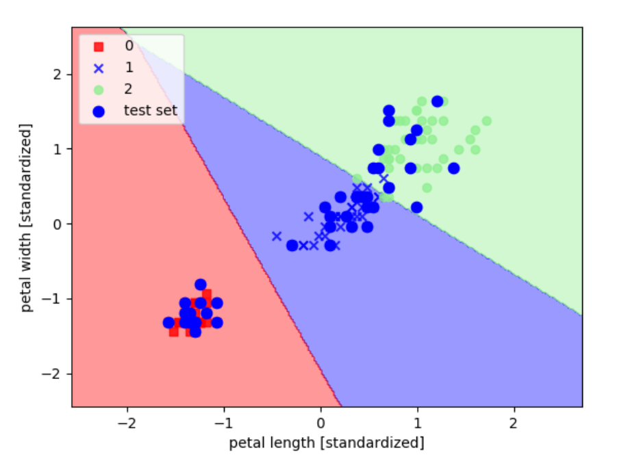

### 1.Logistic回归简介

线性回归能够找到一个假设函数来估计原函数，从而根据特征变量来得到假设值，但线性回归模型不能达到分类的效果。在线性回归的基础上，我们将假设值和概率结合得到分类器，达到分类的效果。虽然Logistic回归是回归模型，但在实际项目中我们经常用于分类问题。

### 2.Sigmoid函数

为什么选择Sigmoid函数呢？我们目标是寻找函数进行分类，首先假设任意多类的分类问题（不仅是两类）。Exponential假设第i个体征对第k类问题的贡献是$w_{ki}$，则数据点$(x_1,x_2,…,x_n)$属于第k类的概率正比于
$$
exp(w_{k1}x_1+…+w_{kn}x_n)。
$$
因为一个数据点属于各类的概率之和为1，所以可以得到
$$
P(y=k)=\frac{exp(\sum_{i=1}^{n}w_{ki}{x_i})}{\sum_{k'}exp(\sum_{i=1}^{n}w_{k'i}x_i)}
$$
现在回到两类（0,1）的情况，此时分母上只有两项
$$
P(y=1)=\frac{exp(\sum_{i=1}^{n}w_{1i}{x_i})}{exp(\sum_{i=1}^{n}w_{1i}x_i)+exp(\sum_{i=1}^{n}w_{0i}x_i)}
$$
公式分子、分母同时除以分子，并设$w_i=w_{1i}-w_{0i}$，则有
$$
P(y=1)=\frac{1}{1+exp(-\sum_{i=1}^{n}w_ix_i)}
$$
上述公式便是Logistic函数，参数$w_i$表示第i个特征对1类的贡献与0类的贡献的差值。
$$
Sigmoid Function: f(x)=\frac{1}{1+e^{-x}}
$$
Sigmoid函数具有如下性质

+ 函数连续且单调递增
+ 函数关于（0,0.5）对称
+ $x\in(-\infty,\infty)$时$y\in(0,1)$

```python
#plot sigmoid function 
import numpy as np
import matplotlib.pyplot as plt

##sigmoid function
x=np.arange(-5,5,0.1)
y=1/(1+np.exp(-x))

#plot
plt.figure()
plt.plot(x,y,color='red',linewidth='2')
ax=plt.gca()
ax.spines['right'].set_color('none')
ax.spines['top'].set_color('none')
ax.xaxis.set_ticks_position('bottom')
ax.spines['bottom'].set_position(('data',0))
ax.yaxis.set_ticks_position('left')
ax.spines['left'].set_position(('data',0))
plt.xlabel('independent variable')
plt.ylabel('dependent variable')
plt.show()
```



### 3.Logistic回归推导

+ 特征向量$X=(x_0,x_1,x_2…x_n)$，默认$x_0=1$。
+ $\theta=(\theta_0,\theta_1,\theta_2…\theta_n)$
+ $n$表示特征数量
+ $m$表示训练数据数量

线性回归函数为$z=\theta_0+\theta_1x_1+\theta_2x_2+…+\theta_nx_n=\theta^TX$。对于Logistic回归来说，其思想也基于线性回归（Logistic回归属于广义线性回归模型）。结合线性回归和Sigmoid函数，将线性回归得到的结果映射到Sigmoid函数之中，我们便得到目标函数。
$$
h(X)=\frac{1}{1+e^{-\theta^TX}}
$$
我们可以把$h(X)$看成样本数据的概率密度函数，当$h(X)<0.5$是判断当前数据属于A类，当$h(X)>0.5$判断当前数据属于B类。对于上述函数$h(X)$，接下来我们需要做的便是怎样去估计参数$\theta$。

条件概率$P(y=1|X)$为某事件发生的概率，Logistic回归模型可以表示为
$$
P(y=1|X)=\pi(X)=\frac{1}{1+e^{-\theta^TX}}
$$
条件概率$P(y=0|X)$为某事件不发生的概率，Logistic回归模型可以表示为
$$
P(y=0|X)=1-\pi(X)=\frac{1}{1+e^{\theta^TX}}
$$
因此我们可以得到事件的发生比为
$$
odds=\frac{P(y=1|X)}{P(y=0|X)}
$$
事件的发生和不发生为相互独立事件，样本数据结果记录为$(y_1,y_2…y_m)$。设$p_i=P(y_i=1|X_i)$为给定条件下得到$y_i=1$的概率，同样$1-p_i=P(y_i=0|X_i)$的概率，所以得到一个观测值的概率为$P(y_i)=p_i^{y_i}(1-p_i)^{1-y_i}$，最后参数估计时我们可以采用极大似然估计。

各个观测样本之间相互独立，那么它们的联合分布为各边缘分布的乘积，得到如下极大似然函数
$$
L(\theta)=\prod_{i=1}^{m}[\pi(X_i)]^{y_i}[1-\pi(X_i)]^{1-y_i}
$$
目标便是求得使这一似然函数值最大的参数估计，于是函数取对数得到
$$
lnL(\theta)=\sum_{i=1}^{m}\left \{ y_iln[\pi(X_i)] +(1-y_i)ln[1-\pi(X_i)] \right \}
$$

$$
=\sum_{i=1}^{m}ln[1-\pi(X_i)]+\sum_{i=1}^{m}y_iln\frac{\pi(X_i)}{1-\pi(X_i)}
$$

$$
=\sum_{i=1}^{m}ln[1-\pi(X_i)]+\sum_{i=1}^{m}y_i\theta^TX
$$

$$
=\sum_{i=1}^{m}-ln[1+e^{\theta^Tx}]+\sum_{i=1}^{m}y_i\theta^TX
$$

通过上面得到的结论来求解使得似然函数最大化的参数向量，此处我们利用梯度下降算法求$\theta$。首先在前面乘上负的系数$-\frac{1}{m}$，所以$J(\theta)$最小时的$\theta$为最佳参数。
$$
J(\theta)=-\frac{1}{m}lnL(\theta)
$$

$$
=-\frac{1}{m}\left \{\sum_{i=1}^{m}-ln[1+e^{\theta^Tx}]+\sum_{i=1}^{m}y_i\theta^TX \right\}
$$

### 4.梯度下降算法

#### 4.1梯度下降算法简述

实际生活中我们有时也利用梯度下降算法，比如我们处在一座山的某处位置，但我们并不知道如何下山，于是决定走一步算一步，但每次都沿着最陡峭的地点下山，也就是沿着梯度的负方向前进。但有事也会遇见问题，不能每次都到达山脚，可能到达山峰的某个局部最低点。



从上面解释可以看出，梯度下降不一定能够找到全局最优解，有可能是局部最优解，但此种方法已能帮助我们求解Logistic回归问题。另外如果求解的函数是凸函数，梯度下降法得到得解一定是全局最优解。

#### 4.2 梯度下降算法相关概念

求解梯度下降算法之前，我们先了解相关概念。

- **步长（Learning Rate）**：步长决定梯度下降算法过程中，每步沿梯度负方向前进的长度。
- **特征（Feature）**：即上述描述的$X$
- **假设函数（Hypothesis Function）**：监督学习中，为了拟合输入样本，而使用假设函数。
- **损失函数（Loss Function）**：为了评估模型拟合的好坏，通常用损失函数来度量拟合的程度。损失函数极小，意味着拟合的程度越好，对应的模型参数即为最优参数。Logistic损失函数为

$$
J(\theta)=-\frac{1}{m}\left \{\sum_{i=1}^{m}-ln[1+e^{\theta^Tx}]+\sum_{i=1}^{m}y_i\theta^TX \right\}
$$

我们利用梯度下降算法，目标便是找到一组$\theta$使得$J(\theta)$达到最小。

#### 4.3梯度下降算法过程

- 随机选取一组$\theta$。
- 不断变化$\theta$，让$J(\theta)$变小，$\alpha$为学习步长。

$$
\theta_j:=\theta_j-\alpha\frac{\partial}{\partial\theta_j}J(\theta)
$$

+ 直到$J(\theta)$得到最小值，$\frac{\partial}{\partial\theta_k}J(\theta)$为$J(\theta)$对$\theta_k$的偏导。

$$
\frac{\partial J(\theta)}{\partial\theta_j}=\frac{1}{m}\sum_{i=1}^{m}\frac{1}{1+e^{\theta^TX}}e^{\theta^TX}X_{ij}-\sum_{i=1}^{m}y_iX_{ij}
$$

$$
=\frac{1}{m}\sum_{i=1}^{m}X_{ij}[\frac{e^{\theta^TX}}{1+e^{\theta^Tx}}-y_i]
$$

$$
=\frac{1}{m}\sum_{i=1}^{m}X_{ij}[\pi(X_i)-y_i]
$$

因此梯度下降算法的迭代最终表述为
$$
\theta_j:=\theta_j-\alpha\frac{1}{m}\sum_{i=1}^{m}X_{ij}[\pi(X_i)-y_i]
$$
梯度下降算法需多次迭代、算法复杂度为$O(kn^2)$。当利用梯度下降算法求得一组$\theta$时我们便能得到Logistic函数。

### 5.Logistic回归实现

```python
import numpy as np
import matplotlib.pyplot as plt
from matplotlib.colors import ListedColormap
from sklearn import datasets
from sklearn.model_selection import train_test_split
from sklearn.linear_model import LogisticRegression
from sklearn.preprocessing import StandardScaler

def plot_decision_regions(X, y, classifier, test_idx=None, resolution=0.02):
    # setup marker generator and color map
    markers = ('s', 'x', 'o', '^', 'v')
    colors = ('red', 'blue', 'lightgreen', 'cyan', 'gray')
    cmap = ListedColormap(colors[:len(np.unique(y))])
    # plot the decision surface
    x1_min, x1_max = X[:, 0].min() - 1, X[:, 0].max() + 1
    x2_min, x2_max = X[:, 1].min() - 1, X[:, 1].max() + 1
    xx1, xx2 = np.meshgrid(np.arange(x1_min, x1_max, resolution), np.arange(x2_min, x2_max, resolution))
    Z = classifier.predict(np.array([xx1.ravel(), xx2.ravel()]).T)
    Z = Z.reshape(xx1.shape)
    plt.contourf(xx1, xx2, Z, alpha=0.4, cmap=cmap)
    plt.xlim(xx1.min(), xx1.max())
    plt.ylim(xx2.min(), xx2.max())
    # plot class samples
    for idx, cl in enumerate(np.unique(y)):
        plt.scatter(x=X[y == cl, 0], y=X[y == cl, 1],alpha=0.8, c=cmap(idx),marker=markers[idx], label=cl)
    # highlight test samples
    if test_idx:
        X_test, y_test = X[test_idx, :], y[test_idx]
        plt.scatter(X_test[:, 0], X_test[:, 1], c='blue', alpha=1.0, linewidth=1, marker='o', s=55, label='test set')

iris = datasets.load_iris()
X = iris.data[:, [2, 3]]
y = iris.target
X_train, X_test, y_train, y_test = train_test_split(X, y, test_size=0.3, random_state=0)
#为了追求机器学习的最佳性能，我们将特征缩放
sc = StandardScaler()
sc.fit(X_train)#估算每个特征的平均值和标准差
X_train_std=sc.transform(X_train)#用同样的参数来标准化测试集，使得测试集和训练集之间有可比性
X_test_std=sc.transform(X_test)
X_combined_std = np.vstack((X_train_std, X_test_std))
y_combined = np.hstack((y_train, y_test))

#训练感知机模型
lr = LogisticRegression(C=1000.0,random_state=0)#迭代次数为1000次,random_state设置随机种子，每次迭代都有相同的训练集顺序
lr.fit(X_train_std, y_train)
lr.predict_proba(X_test_std)

#绘图
plot_decision_regions(X_combined_std, y_combined, classifier=lr, test_idx=range(105,150))
plt.xlabel('petal length [standardized]')
plt.ylabel('petal width [standardized]')
plt.legend(loc='upper left')
plt.show()
```



### 6.推广

更多内容请关注公众号’谓之小一’，若有疑问可在公众号后台提问，随时回答，欢迎关注，内容转载请注明出处。


+ 参考

[^1]: https://www.zhihu.com/people/maigo/activities
[^2]: https://blog.csdn.net/programmer_wei/article/details/52072939
[^3]: https://blog.csdn.net/javaisnotgood/article/details/78873819

