我们思考这样一个问题，给两个标签，蓝色和红色点，数据有两个特征(x,y)。我们想要一个分类器，给定一对(x,y)，能找到很好的分类边界，判断是蓝色点还是红色点。对于下图的数据，我们如何解决呢。本文通过引入Support Vector Machine（SVM）算法来详解此类问题。

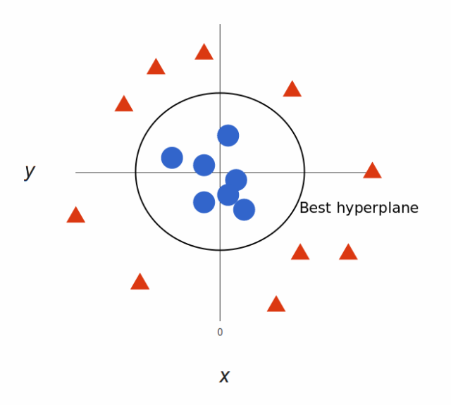

### 1.SVM损失函数

针对前面介绍的机器学习之线性回归、机器学习之Logistic回归，我们已经了解Cost Function的概念，这里我们利用Logistic Regression的损失函数来引入SVM损失函数。

首先我们先复习下Logistic Regression Function
$$
h_{\theta}=\frac{1}{1+e^{-\theta^Tx}}
$$
如果$y=1$，我们希望$h_{\theta}\approx1$，那么$\theta^Tx\gg0$。如果$y=0$，我们希望$h_{\theta}\approx0$，那么$\theta^Tx\ll0$。我们以Logistic Regression为例

$$
LR Cost Example=-\left( (ylogh_\theta(x))+(1-y)log(1-h_\theta(x))\right)
$$

$$
=-ylog\frac{1}{1+e^{-\theta^Tx}}-(1-y)log(1-\frac{1}{1+e^{-\theta^Tx}})
$$

+ 当$y=1$时，此时$\theta^Tx\gg0$，上述公式为$-ylog\frac{1}{1+e^{-\theta^Tx}}$，其中$z=\theta^Tx$。我们将曲线分为两段，下图中取$z=1$点，粉色线部分我们定义为$cost_1(z)$。
+ 当$y=0$时，此时$\theta^Tx\ll0$，上述公式为$-(1-y)log(1-\frac{1}{1+e^{-\theta^Tx}})$，其中$z=\theta^Tx$。我们将曲线分为两段，下图中取$z=-1$点，粉色线部分我们定义为$cost_0(z)$。
+ $cost_1(z)$与$cost_0(z)$便是我们希望的Cost Function曲线，和Logistic Function曲线非常接近，$cost_1(z)$与$cost_0(z)$分别代表y=1和y=0时的目标函数定义。

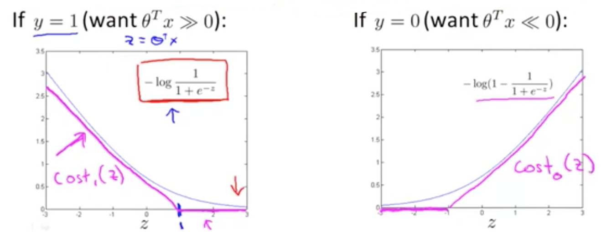

Logistic Regression的损失函数:
$$
min_{\theta}\frac{1}{m}[\sum_{i=1}^{m}y^{(i)}(-logh_{\theta}(x^{(i)}))+(1-y^{(i)})(-log(1-h_{\theta}(x^{(i)})))]+\frac{\lambda}{2m}\sum_{j=1}^{n}\theta_{j}^{2}
$$
因此对于SVM，我们得到:
$$
min_{\theta}\frac{1}{m}[\sum_{i=1}^{m}y^{(i)}cost_1(\theta^Tx^{(i)})+(1-y^{(i)})cost_0(\theta^Tx^{(i)})]+\frac{\lambda}{2m}\sum_{j=1}^{n}\theta_{j}^{2}
$$
因为常数项对我们结果没有影响，因此去掉上述方程式之中的m。Logstic Regression损失函数中包含两项，训练样本的代价项和正则项，形式类似于$A+\lambda B$，我们通过设置$\lambda$来平衡这两项。对于SVM来说，我们依照惯例设置损失函数为$CA+B$，利用C对两项进行平衡。其中C与Logistic Regression损失函数中的$\frac{1}{\lambda}$作用一致，因此我们便得到SVM的损失函数。
$$
min_{\theta}C\sum_{i=1}^{m}[y^{(i)}cost_1(\theta^Tx^{(i)})+(1-y^{(i)})cost_0(\theta^Tx^{(i)})]+\frac{1}{2}\sum_{j=1}^{n}\theta_{j}^{2}
$$

### 2.最大间隔分类

SVM希望最小化代价参数，应该如何做呢？我们现在来看当损失函数最小时，我们需要做什么。
$$
min_{\theta}C\sum_{i=1}^{m}[y^{(i)}cost_1(\theta^Tx^{(i)})+(1-y^{(i)})cost_0(\theta^Tx^{(i)})]+\frac{1}{2}\sum_{j=1}^{n}\theta_{j}^{2}
$$

+ 当为正样本时$y=1$，我们希望$\theta^Tx\ge1$，而不是 $\theta^Tx\ge0$。
+ 当为正样本时$y=0$，我们希望$\theta^Tx\le-1$，而不是$\theta^Tx\le0$。

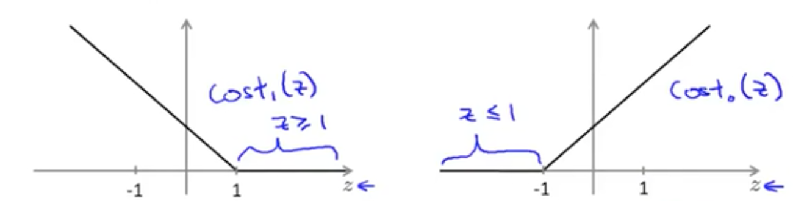

我们设**C为非常大的值**，例如1000000。

+ 当$y^{(i)}=1$时，$\theta^Tx^{(i)}\ge1$，此时SVM损失函数中第一项为0。
+ 当$y^{(i)}=0$时，$\theta^Tx^{(i)}\le-1$，此时SVM损失函数中第一项为0。

那么我们便得到:
$$
minC*0+\frac{1}{2}\sum_{i=1}^{m}\theta_j^2
$$

+ 约束条件1:如果$y^{(i)}=1$，$\theta^Tx^{(i)}\ge1$。
+ 约束条件2:如果$y^{(i)}=0$，$\theta^Tx^{(i)}\le-1$。

SVM是一个**最大间隔分类器**，如下图所示，我们可以把黑线、红线、蓝线中任意一条当作decision boundary，但重点是哪一条最好呢？我们将在**模块3**中详细介绍为什么SVM能形成最大间隔分类器和如何正确选择分类边界。

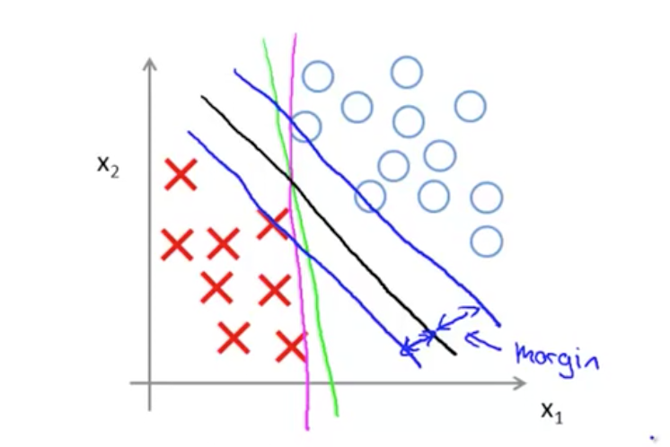

我们希望一条直线可以很好的分开正样本和负样本，但当有一个异常点时，我们需要很大范围的改变直线，当然这是不理智的。黑色线时C很大的情况，红色线时C不是非常大，C设置很大表示对分类错误的惩罚。

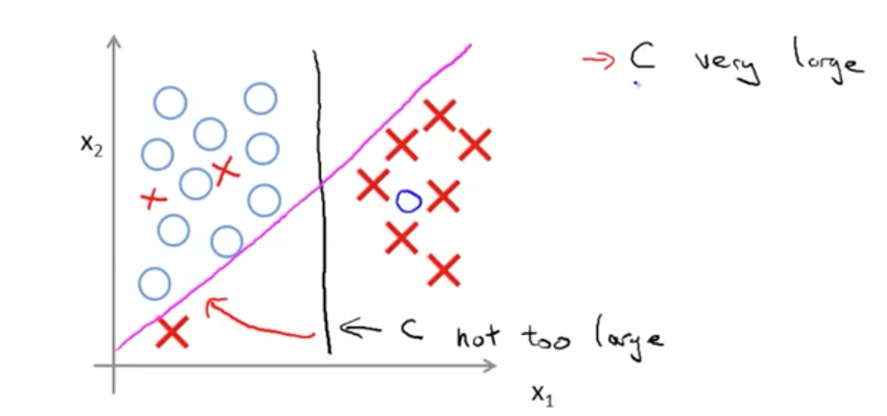

### 3.SVM最大间隔分类

首先我们来看两个向量内积的表现形式。假设向量u,v均为二维向量，我们知道u,v的内积为$u^Tv=u_1v_1+u_2v_2$，表现在坐标上便为下图所示。首先将v向量投影到u向量上，记长度为p。其中p值有正负，与u方向相同为正，方向相反为负。uv两向量内积可以表示为
$$
u^Tv=||u||\cdot||v||\cdot cos\theta=||u||\cdot p=u_1v_1+u_2v_2
$$
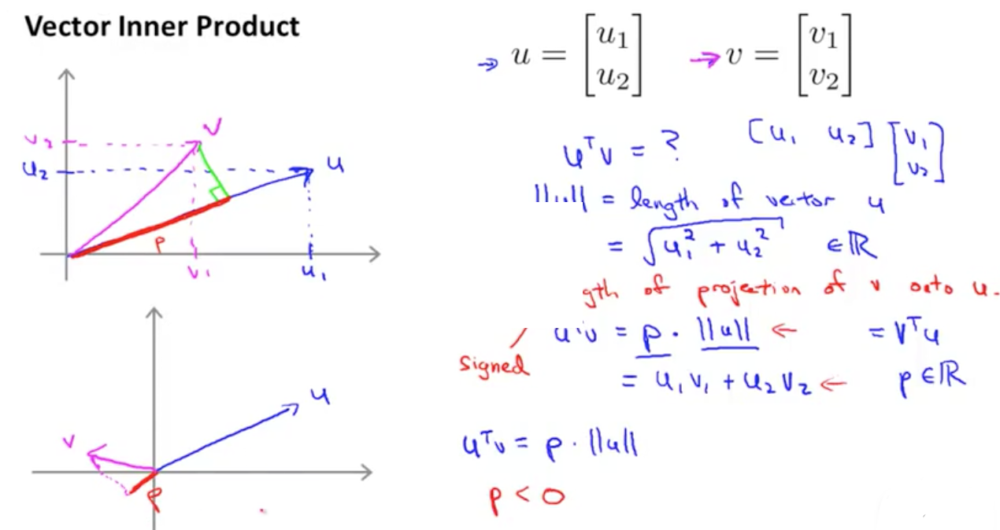

现在我们来看SVM损失函数:
$$
min_{\theta}C\sum_{i=1}^{m}[y^{(i)}cost_1(\theta^Tx^{(i)})+(1-y^{(i)})cost_0(\theta^Tx^{(i)})]+\frac{1}{2}\sum_{j=1}^{n}\theta_{j}^{2}
$$
由于C设置的非常大，那么SVM损失函数为:
$$
min_{\theta} \frac{1}{2}\sum_{j=1}^{n}\theta_j^2
$$

- 约束条件1:如果$y^{(i)}=1$，$\theta^Tx^{(i)}\ge1$。
- 约束条件2:如果$y^{(i)}=0$，$\theta^Tx^{(i)}\le-1$。

下面我们举例说明SVM，为了简化，假设n=2,$\theta_0=0$，我们得到
$$
min\frac{1}{2}\sum_{j=1}^{2}\theta_j^2=\frac{1}{2}{(\theta_1^2+\theta_2^2)}=\frac{1}{2}\left (\sqrt{\theta_1^2+\theta_2^2}  \right )^2=\frac{1}{2}||\theta||^2
$$
我们来更深层次的理解$\theta^Tx^{(i)}$，表现形式和上述$u^Tv$相同。利用坐标表示则为
$$
\theta^Tx^{(i)}=p^{(i)}\cdot||\theta||=\theta_1x_1^{(i)}+\theta_2x_1^{(2)}
$$
$\theta^Tx^{(i)}$我们可以利用$p^{(i)}\cdot||\theta||$表示，同时SVM随时函数目标是极小化$||\theta^2||$。

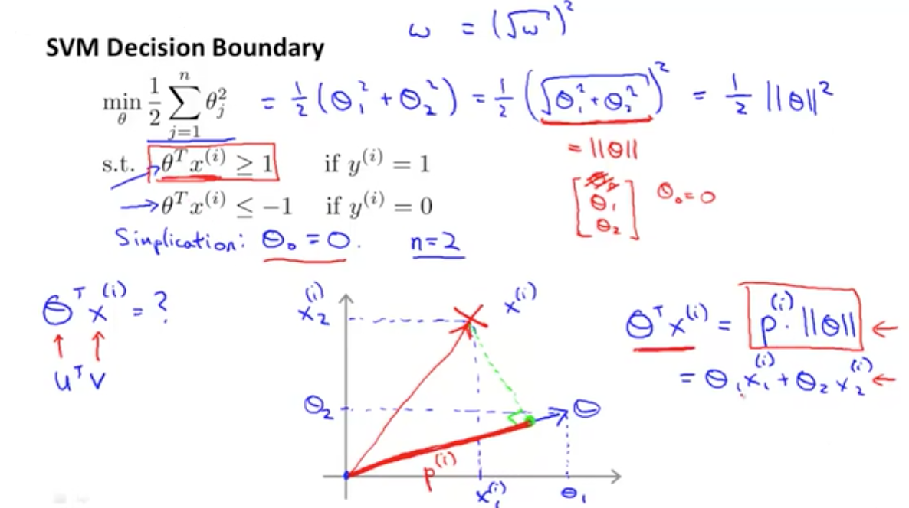

下面有两种分类方式，SVM为什么要选择第二种当作分类呢。我们想最小化$||\theta||$，并且要满足$p^{(i)}\cdot ||\theta||\ge1$，但左边坐标中$p^{(1)}$较小，那么我们便要让$||\theta||$更大，不满足最小化$||\theta||$的需求。坐标2中$p^{(1)}$更大，那么$||\theta||$便较小，满足最小化$||\theta||$的需求。SVM便是通过最大化分类间隔来让$||\theta||$更小，这便是SVM中为什么要最大化分类间隔。

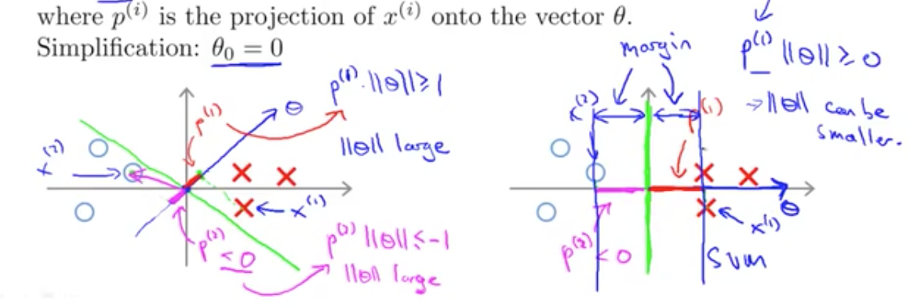

### 4.核函数

上述介绍线性分类，但对于非线性问题我们如何解决呢？对于非线性的决策边界，我们可以利用多项式拟合的方式进行预测。对于下面图片中的决策边界，我们令$f_1=x_1,f2=x_2,f3=x_1x_2,f4=x_1^2,f5=x_2^2,...$

+ $f_1,f_2,f_3…$为提取出来的特征。
+ 定义预测方程$h_{\theta}(x)$为多项式sigmoid函数。$h_{\theta}(x)=g(\theta_0f_0+\theta_1f_1+\theta_2f_2+…+\theta_nf_n)$，其中$f_n$为x的幂次项组合。
+ 当$\theta_0f_0+\theta_1f_1+\theta_2f_2+…+\theta_nf_n\ge0$时$h_{\theta}(x)=1$，否则$h_{\theta}(x)=0$。

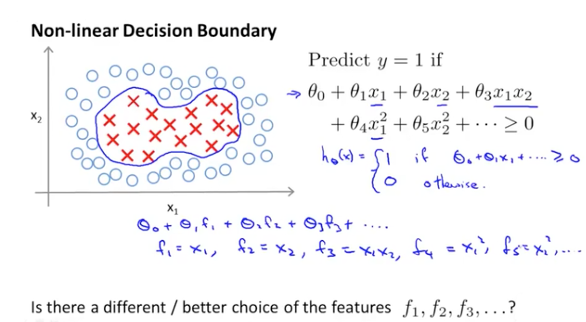

那么除了将fn定义为x的幂次项组合，还有其他方法表示f吗？此处我们引入核函数，对于非线性拟合，我们通过输入原始向量与landmark点之间的相似度来计算核值f，我们称相似度函数为核函数，下述核函数为高斯核函数。

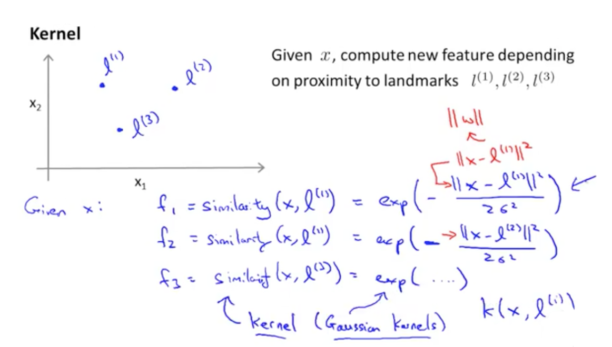

x和l越相似，f越接近于1。x和l相差越远，f越接近于0。

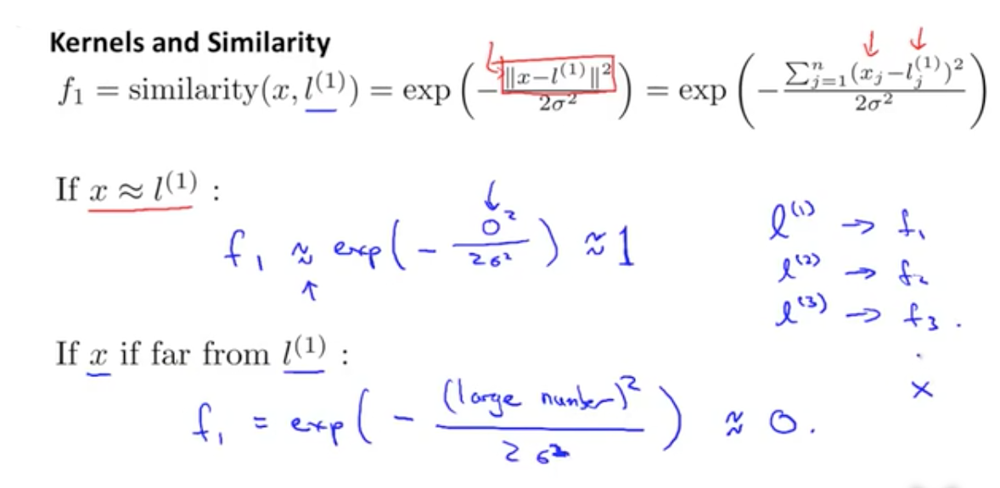

下图中横坐标为x的两个维度值，高为f。制高点为x=l的情况，此时f=1。随着x与l的远离，f逐渐下降，趋近于0。

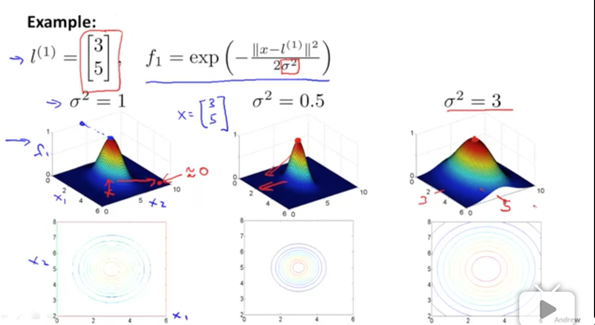

下面我们来看SVM核分类预测的结果。引入核函数后，代数上的区别在于f变了，原来的f是$x_1,x_1^2…$，即$x_i$的幂次项乘积，另外几何来说可以更直观的表示如何分类。

+ 假如我们将坐标上的所有数据点分为两类，红色圈内希望预测为y=1，圈外希望预测为y=0。通过训练数据集，我们得到一组$\theta(\theta_0,\theta_1,\theta_2,\theta_3)$值为$(-0.5,1,1,0)$以及三个landmark点(L1,L2,L3)。具体如何选取landmark点和训练生成$\theta$值在下面会详细介绍。
+ 对于每个数据集内的点，我们首先计算它到(L1,L2,L3)各自的相似度，也就是核函数的值$f_1,f_2,f_3$，然后带入多项式$\theta_0f_0+\theta_1f_1+\theta_2f_2+…+\theta_nf_n$，当多项式大于0时预测结果为类内点，表示为正样本，y=1。否则预测为负样本，y=0。

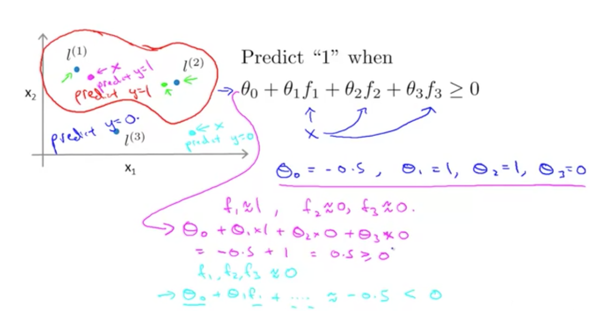

### 5.SVM中Gaussian Kernel的使用

上述中我们利用到$l^{(1)},l^{(2)},l^{(3)}$，但是我们如何达到这些landmark呢。首先我们来看L点的选取，上述提到Gaussian kernel $f_i$的计算。
$$
f_i=similarity(x,l^{(i)})=exp\left ( -\frac{||x-l^{(i)}||^2}{2\sigma^2}\right)
$$
我们选择m个训练数据，并取这m个训练数据为m个landmark点（不考虑正样本还是负样本）。

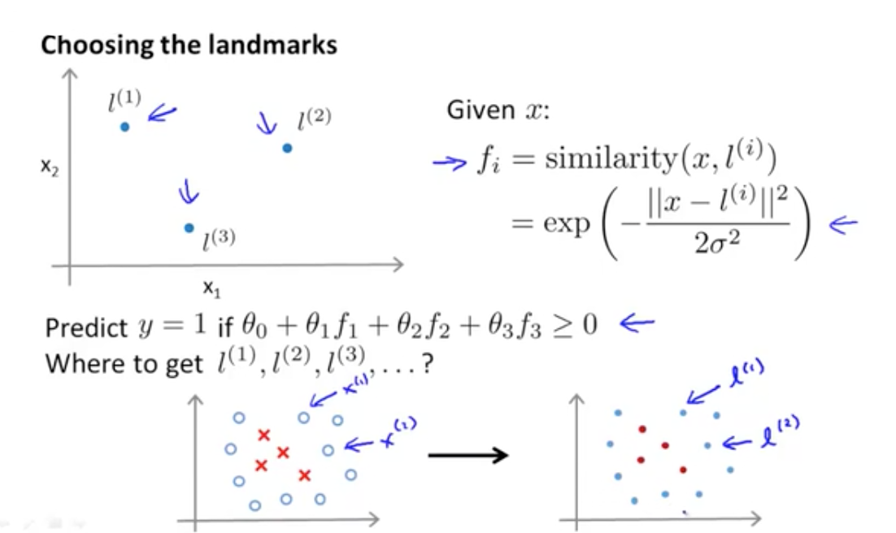

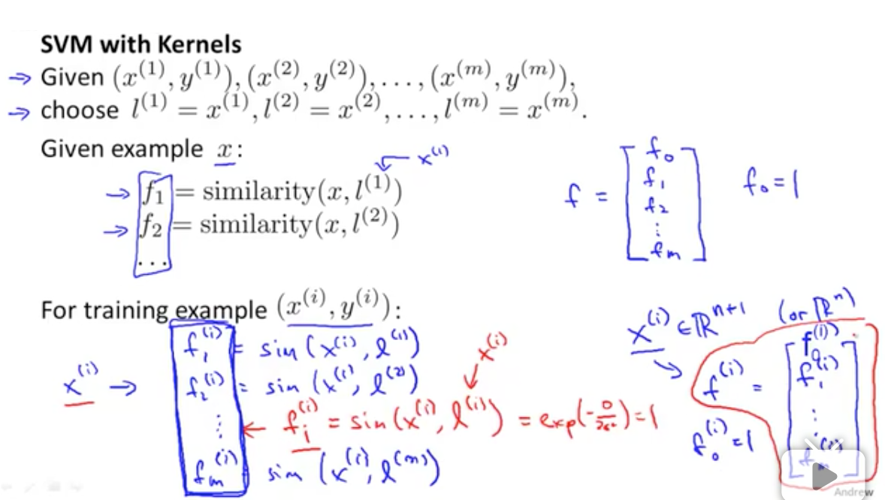

那么在这m个训练数据中，每一个训练数据$x^{(i)}$所得的特征向量（核函数）f中，总有一维向量的值为1（因为$x^{(i)}=l^{(i)}$）。于是每个特征向量f有m+1为维度，在SVM训练中，将Gaussian Kernel带入SVM损失函数，通过最小化该函数就可于得到参数$\theta$，并根据该参数$\theta$进行预测。

+ $\theta^Tf\ge0$，预测 y=1。
+ $\theta^Tf\le0$，预测y=0。

如下图所示，这里与之前的损失函数区别在于用kernel f代替了x。

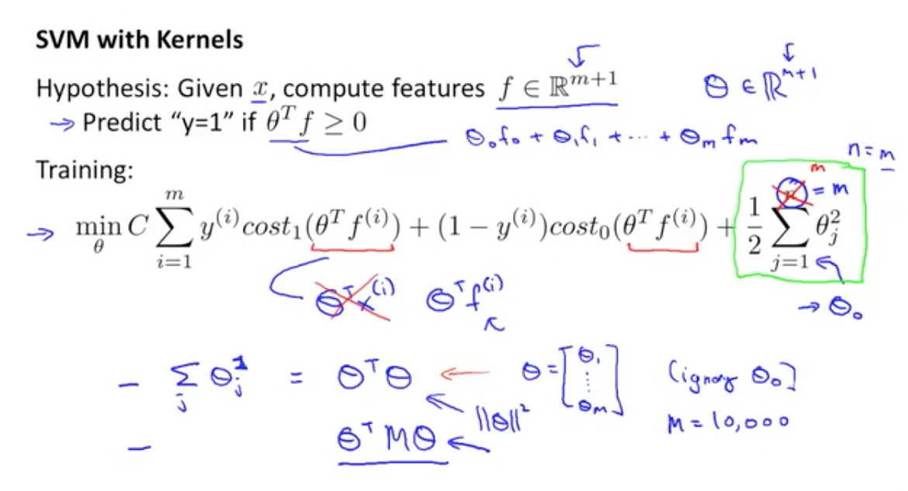

最后我们介绍下如何选取C和$\sigma^2$。由于$C=\frac{1}{\lambda}$，所以

+ C大，$\lambda$小，overfit，产生low bias，high variance。
+ C小，$\lambda$大，underfoot，underfoot，产生high bias，low variance。

对于方差$\sigma^2$

+ $\sigma^2$大，x-f相似性图像较为扁平。
+ $\sigma^2小$，x-f相似性图像较为窄尖。

通常我们会从一些常用的核函数中选择，根据问题数据的不同，选择不同的参数，实际上就是得到不同的核函数。经常用到的核函数包括线性核、多项式核、高斯核。

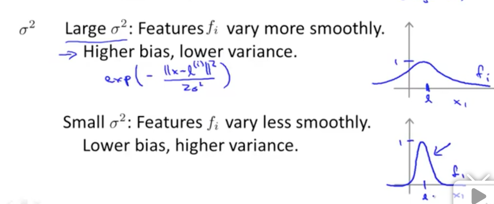

由于本篇幅文章过长，我们将在下篇文章内详细介绍SVM算法中对偶问题的求解、C为何设置非常大、几种不同的核函数、SVM应用。如你在文中发现错误，欢迎指出，我会尽快更正。

### 5.推广

更多内容请关注公众号’谓之小一’，若有疑问可在公众号后台提问，随时回答，欢迎关注，内容转载请注明出处。

