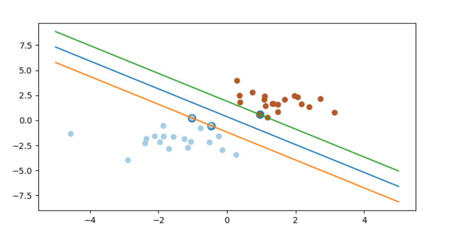
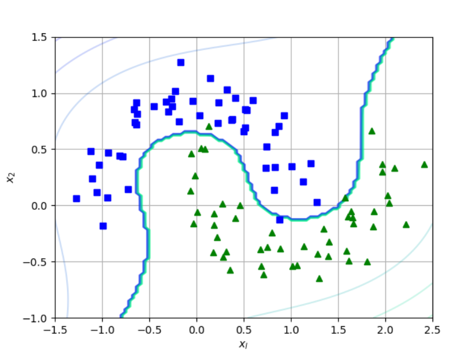

### 1.知识回顾

[机器学习之SVM支持向量机（一）](https://mp.weixin.qq.com/s?__biz=MzU3MjA2NTQzMw==&mid=2247483818&idx=1&sn=50c634d8b00877134558125c4a718fd7&chksm=fcd7d25ccba05b4a62adfb2717650441f30d636056fcb37529ef34a51b94e453a534b7ca0a48#rd)中我们介绍了**SVM损失函数**、**最大间隔分类**、**为什么SVM能形成最大间隔分类器**、**核函数**、**SVM中Gaussian Kernel的使用**知识点。上文我们从Logistic Regression损失函数中推出SVM损失函数，本篇文章我们将更加直观的分析得到SVM损失函数、如何求解SVM对偶问题、如何解决outliers点，并且最终利用sklearn实现SVM。

### 2.函数间隔和几何间隔

上文我们从logistic Regression损失函数推导出SVM损失函数，本文我们采用另一种方法得到SVM损失函数。首先定义超平面可以用分类函数$f(x)=w^Tx+b$表示，当$f(x)$等于0的时候，$x$便是位于超平面上的点，而$f(x)$大于0对应$y=1$的数据点，$f(x)$小于0对应于$y=-1$的点，如下图所示：


在超平面$w^Tx+b=0$确定的情况下，$|w^Tx+b|$能够表示点$x$到超平面的远近，而通过观察$w^Tx+b$的符号与类标记$y$的符号是否一致可判断分类是否正确。因此我们用$y*(w^Tx+b)$的正负性来判定分类的正确性，于是引出函数间隔的概念。

定义函数间隔$\hat{\gamma}$：
$$
\hat{\gamma}=y(w^Tx+b)=yf(x)
$$
而超平面$(w,b)$关于训练数据集T中所有样本点$(x_i,y_i)$的函数间隔最小值，便为超平面$(w,b)$关于训练数据集T的函数间隔：
$$
\hat{\gamma}=min\hat{\gamma} 
$$
但这样定义的函数间隔有问题，即如果成比例的改变$w$和$b$，则函数间隔的值$f(x)$却变成了原来的2倍(虽然此时超平面没有改变)，所以只有函数间隔还是不够的。

但我们可以对法向量$w$增加些约束条件，从而引出真正定义点到超平面的距离。假设对于一点$x$，令其垂直投影到超平面上的点对应为$x_0$，$w$是垂直于超平面的一个向量，$r$为样本$x$到分类间隔的距离，如下图所示。


$$
x=x_0+\gamma\frac{w}{||w||}
$$
其中$||w||$表示范数，又由于$x_0$是超平面上的点，满足$f(x_0)=0$，代入超平面的方程$w^Tx+b=0$，我们得到：
$$
\gamma=\frac{w^T+b}{||w||}=\frac{f(x)}{||w||}
$$
为了得到$\gamma$绝对值，将$\gamma$乘上相应类别$y$，即可得到几何间隔：
$$
\tilde{r}=yr=\frac{\hat{\gamma}}{||w||}
$$
从上述定义我们能够看到，几何间隔就是函数间隔除以$||w||$，而且函数间隔$y*(w^Tx+b)=y*f(x)$，实际上就是$|f(x)|$，几何间隔$\frac{f(x)}{||w||}$才是直观上的点到超平面的距离。

对一个数据点进行分类，当超平面离数据点的间隔越大，分类的确信度也越大。所以，为了使得分类的确信度尽量高，需要让所选择的超平面能够最大化间隔值。于是最大间隔分类器的目标函数定义为$max\tilde{\gamma}$。同时需满足如下条件
$$
y_i(w^Tx_i+b)=\hat{\gamma_i}\ge\hat{\gamma},i=1,2,3,...,n
$$
此处令函数间隔$\hat{\gamma}$等于1（之所以令$\hat{\gamma}=1$是为了方便推导，且这样做对目标函数的优化没有影响）。则上述目标函数转换成：
$$
max\frac{1}{||w||},s.t.,y_i(w^Tx_i+b)\ge1,i=1,2,3,...,n
$$

### 3.原始问题到对偶问题的求解

接着考虑我们之前的目标函数，由于求$\frac{1}{||w||}$的最大值相当于求$\frac{1}{2}||w||^2$的最小值，所以目标函数转换为
$$
min\frac{1}{2}||w||^2 ,s.t.,y_i(w^Tx_i+b)\ge1,i=1,2,3,...,n
$$
现在目标函数是二次的，约束条件是线性的，所以它是一个凸二次规划问题。由于此问题的特殊结构，我们可以通过拉格朗日对偶性变换到对偶变量的优化问题，即通过求解与原问题等价的对偶问题得到原始问题的最优解。

那什么是拉格朗日对偶性呢？简单来说就是通过给每一个约束条件加上一个拉格朗日乘子$\alpha$，定义拉格朗日函数为：
$$
L(w,b,\alpha)=\frac{1}{2}||w||^2-\sum_{i=1}^{n}\alpha_i(y_i(w^Tx_i+b)-1)
$$
然后令：
$$
\theta(w)=\max_{\alpha_i\ge0}L(w,b,\alpha)
$$
当某个条件不满足时，例如$y_i(w^Tx+b)<1$，那么有$\theta(w)=\infty$。而当所有约束条件都满足时，则有$\theta(w)=\frac{1}{2}||w||^2$，亦即最初要最小化的量。目标函数则转换为：
$$
\min_{w,b}\theta(w)=\min_{w,b}\max_{\alpha_i\ge0}L(w,b,\alpha)=p^*
$$
这里用$p^*$表示这个问题的最优值，和最初的问题是等价的。如果直接求解那么我们将面对$w,b$两个参数，而$\alpha_i$又是不等式约束，这个求解过程不好做，我们把最小和最大的位置交换一下：
$$
\max_{\alpha_i\ge0}\min_{w,b}L(w,b,\alpha)=d^*
$$
交换以后的新问题就是原始问题的对偶问题，新问题的最优值用$d^*$表示，而且有$d^*\le p^*$，在**满足某些条件**的情况下，这两者相等，此时便可以通过求解对偶问题来间接的求解原始问题。

此处**满足某些条件**的情况下，两者等价，此处的**满足某些条件**便是满足KKT条件。KKT最优化数学模型表示成下列标准形式:
$$
\min f(x)
$$

$$
s.t. h_j(x)=0,j=1,2,3,...,p
$$

$$
g_k(x)\le0,k=1,2,3,...,q
$$

$$
x\in X\subset R^n
$$

其中$f(x)$是需要最小化的函数，$h(x)$是等式约束，$g(x)$是不等式约束，$p,q$分别为等式约束和不等式约束的数量。

> 凸优化概念:$X\subset R^n$为一凸集，$f:X->R$为一凸函数。凸优化便是寻找一点$x^*\in X$，是的每一$x\in X$满足$f(x^*)\le f(x)$。
>
> KKT条件意义是非线性规划问题能有最优化解法的必要和充分条件。

KKT条件就是上面最优化数学模型的标准形式中的最小点$x^*$必须满足下面的条件:
$$
h_j(x^*)=0,j=1,2,3,...,p
$$

$$
g_k(x^*)\le 0,k=1,2,3,...,q
$$

$$
\nabla f(x^*)+\sum_{j=1}^{p}\lambda_j\nabla h_j(x^*)+\sum_{k=1}^{q}\mu_k \nabla g_k(x^*)=0
$$

$$
\lambda_j \neq0,\mu \ge0,\mu_k g_k(x^*)=0
$$

此处我们不做详细证明为什么满足KKT条件。原始问题通过满足KKT条件，已经转换成对偶问题。求解对偶问题首先要让$L(w,b,\alpha)$关于$w,b$的最小化，然后求对$\alpha$的极大，最后利用SMO算法求解对偶问题中的拉格朗日乘子。下面为具体求解过程。

首先固定$\alpha$，要让L关于$w,b$最小化，我们分别对$w,b$求偏导数。
$$
\frac{\partial L}{\partial w}=0 \Rightarrow w= \sum_{i=1}^{n}\alpha_iy_ix_i
$$

$$
\frac{\partial L}{\partial b}=0 \Rightarrow \sum_{i=1}^{n}\alpha_iy_i=0
$$

将上述结果代入到之前的L得到：
$$
L(w,b,\alpha)=\frac{1}{2}||w||^2-\sum_{i=1}^{n}\alpha_i(y_i(w^Tx_i+b)-1)
$$

$$
=\frac{1}{2}w^Tw-\sum_{i=1}^{n}\alpha_iy_iw^Tx_i-\sum_{i=1}^{n}\alpha_iy_ib+\sum_{i=1}^{n}\alpha_i
$$

$$
=\frac{1}{2}w^T\sum_{i=1}^{n}\alpha_iy_ix_i-\sum_{i=1}^{n}\alpha_iy_iw^Tx_i-\sum_{i=1}^{n}\alpha_iy_ib+\sum_{i=1}^{n}\alpha_i
$$

$$
=\frac{1}{2}w^T\sum_{i=1}^{n}\alpha_iy_ix_i-w^T\sum_{i=1}^{n}\alpha_iy_ix_i-\sum_{i=1}^{n}\alpha_iy_ib+\sum_{i=1}^{n}\alpha_i
$$

$$
=-\frac{1}{2}w^T\sum_{i=1}^{n}\alpha_iy_ix_i-\sum_{i=1}^{n}\alpha_iy_ib+\sum_{i=1}^{n}\alpha_i
$$

$$
=-\frac{1}{2}w^T\sum_{i=1}^{n}\alpha_iy_ix_i-b\sum_{i=1}^{n}\alpha_iy_i+\sum_{i=1}^{n}\alpha_i
$$

$$
=-\frac{1}{2}(\sum_{i=1}^{n}\alpha_iy_ix_i)^T\sum_{i=1}^{n}\alpha_iy_ix_i-b\sum_{i=1}^{n}\alpha_iy_i+\sum_{i=1}^{n}\alpha_i
$$

$$
=-\frac{1}{2}\sum_{i=1}^{n}\alpha_iy_ix_i^T\sum_{i=1}^{n}\alpha_iy_ix_i-b\sum_{i=1}^{n}\alpha_iy_i+\sum_{i=1}^{n}\alpha_i
$$

$$
=-\frac{1}{2}\sum_{i=1,j=1}^{n}\alpha_iy_ix_i^T\alpha_jy_jx_j-b\sum_{i=1}^{n}\alpha_iy_i+\sum_{i=1}^{n}\alpha_i
$$

$$
=\sum_{i=1}^{n}\alpha_i-\frac{1}{2}\sum_{i=1,j=1}^{n}\alpha_i\alpha_jy_iy_jx_i^Tx_j
$$

然后求对$\alpha$的极大，即是关于对偶问题的最优化问题。
$$
\max_{\alpha}\sum_{i=1}^{n}\alpha_i-\frac{1}{2}\sum_{i=1,j=1}^{n}\alpha_iy_ix_i^T\alpha_jy_jx_j
$$

$$
s.t.,\alpha_i\ge0,i=1,2,3,...,n
$$

$$
\sum_{i=1}^{n}\alpha_iy_i=0
$$

我们已经知道$x_i,x_j$的值，便可利用**SMO算法**求解$\alpha_i$，此处不详细介绍SMO算法。同时根据$w=\sum_{i=1}^{n}\alpha_iy_ix_i$我们便可求出$w$，然后通过下式得到$b$。
$$
b^*=-\frac{\max_{i:y(i)=-1}w^Tx_i+\min_{i:y(i)=1}w^Tx_i}{2}
$$
至此我们便可得出分类超平面和分类决策函数。

### 4.松弛变量处理outliers方法

实际项目中会有数据点含有噪音，即偏离正常位置很远的数据点，我们称之为outlier。


为了处理这种情况，SVM允许在一定程度上偏离一下超平面。为此我们稍加改变以前的约束条件，即
$$
y_i(w^Tx_i+b)\ge1-\varepsilon_i,i=1,2,3,...,n
$$
其中$\varepsilon$称为松弛变量，对应数据点$x_i$允许偏离分类决策函数的量。当然如果我们允许$\varepsilon_i$任意大的话，那任意的超平面都是符合条件的。所以我们在原来的目标函数后面再加上一项，使得这些$\varepsilon_i$的总和也要尽量小。
$$
\min\frac{1}{2}||w||^2+C\sum_{i=1}^{n}\varepsilon_i
$$

$$
s.t.,y_i(w^Tx_i+b)\ge1-\varepsilon_i,i=1,2,3,...,n
$$

$$
\varepsilon_i\ge0,i=1,2,3,...,n
$$

此处和[机器学习之SVM支持向量机（一）](https://weizhixiaoyi.com/2018/03/29/%E6%9C%BA%E5%99%A8%E5%AD%A6%E4%B9%A0%E4%B9%8BSVM%E6%94%AF%E6%8C%81%E5%90%91%E9%87%8F%E6%9C%BA%EF%BC%88%E4%B8%80%EF%BC%89/)中的损失函数不同的是加入$\varepsilon_i$后损失函数第一项便不为0。下述目标函数中第一项相当于现在的$\varepsilon_i$。
$$
min_{\theta}C\sum_{i=1}^{m}[y^{(i)}cost_1(\theta^Tx^{(i)})+(1-y^{(i)})cost_0(\theta^Tx^{(i)})]+\frac{1}{2}\sum_{j=1}^{n}\theta_{j}^{2}
$$
那么现在用之前的方法将限制或约束条件加入到目标函数中，得到新的拉格朗日函数，如下所示:
$$
L(w,b,\varepsilon,\alpha,r)=\frac{1}{2}||w||^2+C\sum_{i=1}^{n}\varepsilon_i-\sum_{i=1}^{n}\alpha_i(y_i(w^Tx_i+b)-1+\varepsilon_i)-\sum_{i=1}^{n}r_i\varepsilon_i
$$
分析方法和前面相同，此处不再赘述。结合机器学习之SVM支持向量机（一）中的描述我们便能更好的理解C的作用和为什么C通常设置的都较大。

### 5.Sklearn实现SVM支持向量机

我们常用到的核函数包括线性核、多项式核、高斯核、sigmoid核。在**机器学习之SVM支持向量机（一）**中我们已经利用高斯核详细介绍了核函数的意义，所以不再利用其他核函数举例，有兴趣的同学可以去（一）中看详细内容。此处我们给出线性核和多项式核函数的代码，并使用了少量数据绘制出图形。因SVM选取核函数会涉及到较多内容，介于篇幅有限，不再这篇文章中解释，后续会详细写篇**SVM核函数的应用**。

#### 5.1线性

```Python
from sklearn import svm
import numpy as np
import matplotlib.pyplot as plt

np.random.seed(0)
x=np.r_[np.random.randn(20,2)-[2,2],np.random.randn(20,2)+[2,2]]#正态分布产生数字20行2列
y=[0]*20+[1]*20#20个class0,20个class1
clf=svm.SVC(kernel='linear')#使用线性核
clf.fit(x,y)
w=clf.coef_[0]#获取w
a=-w[0]/w[1]#斜率

#画图
xx=np.linspace(-5,5)
yy=a*xx-(clf.intercept_[0])/w[1]
b=clf.support_vectors_[0]
yy_down=a*xx+(b[1]-a*b[0])
b=clf.support_vectors_[-1]
yy_up=a*xx+(b[1]-a*b[0])
plt.figure(figsize=(8,4))
plt.plot(xx,yy)
plt.plot(xx,yy_down)
plt.plot(xx,yy_up)
plt.scatter(clf.support_vectors_[:,0],clf.support_vectors_[:,1],s=80)
plt.scatter(x[:,0],x[:,1],c=y,cmap=plt.cm.Paired)
plt.axis('tight')
plt.show()
```



#### 5.2非线性

```python
import numpy as np
import matplotlib.pyplot as plt
from sklearn.datasets import make_moons
from sklearn.preprocessing import PolynomialFeatures
from sklearn.pipeline import  Pipeline
from sklearn.preprocessing import StandardScaler
from sklearn.svm import LinearSVC
X, y = make_moons( n_samples=100, noise=0.15, random_state=42 )

def plot_dataset(X, y, axes):
    plt.plot( X[:,0][y==0], X[:,1][y==0], "bs" )
    plt.plot( X[:,0][y==1], X[:,1][y==1], "g^" )
    plt.axis( axes )
    plt.grid( True, which="both" )
    plt.xlabel(r"$x_l$")
    plt.ylabel(r"$x_2$")

# contour函数是画出轮廓，需要给出X和Y的网格，以及对应的Z，它会画出Z的边界（相当于边缘检测及可视化）
def plot_predict(clf, axes):
    x0s = np.linspace(axes[0], axes[1], 100)
    x1s = np.linspace(axes[2], axes[3], 100)
    x0, x1 = np.meshgrid( x0s, x1s )
    X = np.c_[x0.ravel(), x1.ravel()]
    y_pred = clf.predict( X ).reshape( x0.shape )
    y_decision = clf.decision_function( X ).reshape( x0.shape )
    plt.contour( x0, x1, y_pred, cmap=plt.cm.winter, alpha=0.5 )
    plt.contour( x0, x1, y_decision, cmap=plt.cm.winter, alpha=0.2 )

polynomial_svm_clf = Pipeline([ ("poly_featutres", PolynomialFeatures(degree=3)),
                                ("scaler", StandardScaler()),
                                ("svm_clf", LinearSVC(C=10, loss="hinge", random_state=42)  )
                            ])#多项式核函数
polynomial_svm_clf.fit( X, y )
plot_dataset( X, y, [-1.5, 2.5, -1, 1.5] )
plot_predict( polynomial_svm_clf, [-1.5, 2.5, -1, 1.5] )
plt.show()
```



### 6.推广

更多内容请关注公众号’谓之小一’，若有疑问可在公众号后台提问，随时回答，欢迎关注，内容转载请注明出处。


