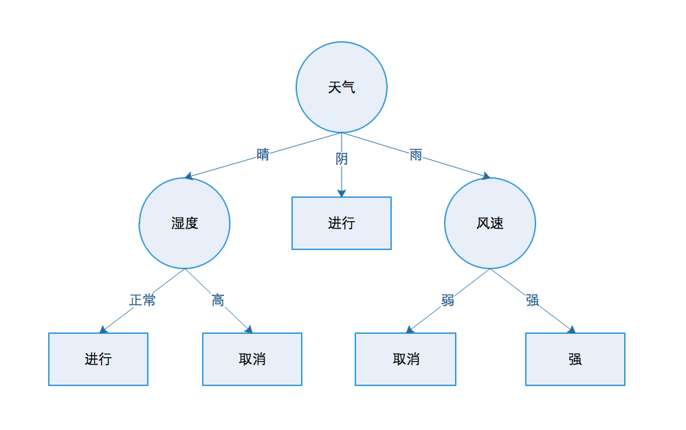
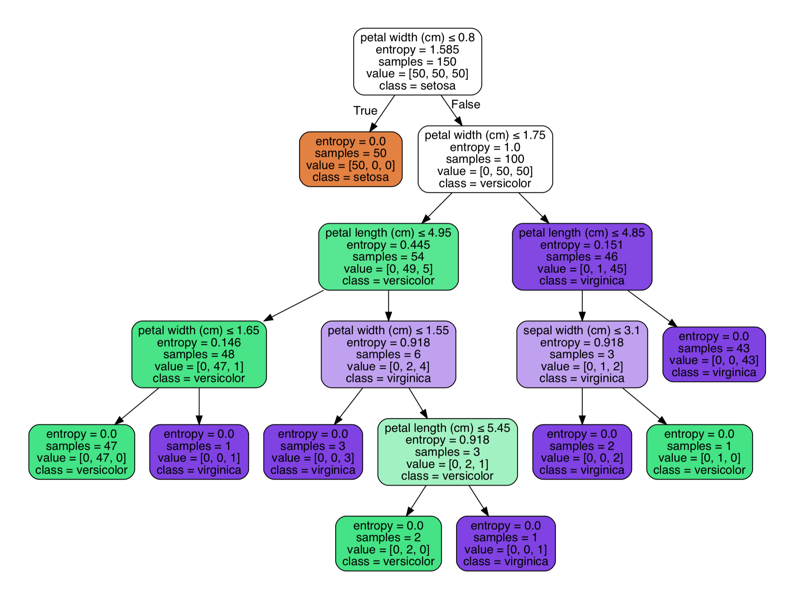

### 1.决策树简介

我们已有如下所示数据集，特征属性包含天气、温度、湿度、风速，然后根据这些数据去分类或预测能否去打高尔夫球，针对此类问题你会怎么解决呢。

| 序号 | 天气 | 温度 | 湿度 | 风速 | 高尔夫 |
| ---- | :--: | :--: | :--: | :--: | :----: |
| 1    |  晴  | 炎热 |  高  |  弱  |  进行  |
| 2    |  晴  | 炎热 |  高  |  强  |  进行  |
| 3    |  阴  | 炎热 |  高  |  弱  |  取消  |
| 4    |  雨  | 适中 |  高  |  弱  |  取消  |
| 5    |  雨  | 寒冷 | 正常 |  弱  |  取消  |
| 6    |  雨  | 寒冷 | 正常 |  强  |  进行  |
| 7    |  阴  | 寒冷 | 正常 |  强  |  进行  |
| 8    |  晴  | 适中 |  高  |  弱  |  进行  |
| 9    |  晴  | 寒冷 | 正常 |  弱  |  进行  |
| 10   |  雨  | 适中 | 正常 |  弱  |  进行  |
| 11   |  晴  | 适中 | 正常 |  强  |  进行  |
| 12   |  阴  | 适中 |  高  |  强  |  进行  |
| 13   |  阴  | 炎热 | 正常 |  弱  |  取消  |
| 14   |  雨  | 适中 |  高  |  强  |  取消  |

正当你苦思冥想之时，天空之中突然飘来一张决策图，发现这图好像一张倒着的树啊，于是你命名为决策树。你发现可直接根据决策树得到相应结果，高兴的像个300斤的孩子。但下次再面临这样的问题时，还能够那么好运嘛？于是你陷入苦苦思考之中，怎样才能得到分类决策树呢。



### 2.C4.5算法

**上古之神赐予你智慧**：C4.5是一系列用在机器学习和数据挖掘中分类问题的算法，它的目标是监督学习。即给定一个数据集，其中的每一个元组都能用一组属性值描述，每一个元组属于一个互斥的类别中的某一类。C4.5的目标是通过学习，找到一个从属性值到类别的映射关系，并且这个映射能够用于对新的类别未知的实体进行分类。

C4.5是在ID3的基础上提出的。ID3算法用来构造决策树。决策树是一种类似流程图的树结构，其中每个内部节点（非树叶节点）表示在一个属性上的测试，每个分枝代表一个测试输出，而每个树叶节点存放一个类标号。一旦建立好决策树，对于一个未给定类标号的元组，跟踪一条有根节点到叶节点的路径，该叶节点就存放着该元组的预测。上述数据集有4个属性，属性集合A={天气、温度、湿度、风速}，类别集合D={进行、取消}。我们先做一些假设

+ 类标记元组训练集记为$D$，$|D|$表示元组个数，例如上述数据$|D|=14$。
+ 类标号记为$m$，例如上述数据$m=2$，分别为进行、取消。
+ 属性集合记为为$C$，例如$C_1$为天气情况，$C_iD$是$D$中$C_i$类元组的集合，$|C_iD|$为$C_iD$中元组个数。
+ 属性标号记为$n$，例如上述数据$n=2$，分别为天气、温度、湿度、风速。
+ $p_i$表示类别$i$的概率，比如$p(进行)=\frac{9}{14}$。

#### 2.1信息增益

信息增益实际上是ID3算法中用来进行属性选择度量的，具有较高信息增益的属性来作为节点N的分裂属性。该属性使结果划分中的元组分类所需信息量最小。

**计算类别信息熵**:类别信息熵表示的是所有样本中各种类别出现的不确定之和。根据熵的概念，熵越大，不确定性就越大，把事情理解清楚所需要的信息量就越多。对D中的元组分类所需的期望信息表达式如下，同时计算出上述数据的期望信息
$$
Info(D)=-\sum_{i=1}^{m}p_ilog_2(p_i)
$$

$$
Info(D)=-\frac{9}{14}log_2\frac{9}{14}-\frac{5}{14}log_2\frac{5}{14}=0.940
$$

**计算每个属性的信息熵**:每个属性的信息熵相当于条件熵。表示的是在某种属性的条件下，各种类别出现的不确定之和。属性的信息熵越大，表示这个属性中拥有的样本类别越乱。现在假定按照属性集合C划分D中的元组，且属性Ci将D划分成v个不同的类。在该划分之后，为了得到准确的分类还需要下式进行度量。
$$
Info_A(D)=\sum_{j=1}^{v}\frac{|D_j|}{|D|}*Info(D_j)
$$

$$
Info(天气)=\frac{5}{14}*[-\frac{2}{5}log_2\frac{2}{5}-\frac{3}{5}log_2\frac{3}{5}]+\frac{4}{14}*[-\frac{4}{4}log_2\frac{4}{4}]+\frac{5}{14}*[-\frac{3}{5}log_2\frac{3}{5}-\frac{2}{5}log_2\frac{2}{5}]=0.694
$$

$$
Info(温度)=0.911,Info(湿度)=0.739,Info(风速)=0.892
$$

**计算信息增益**:信息增益=熵-条件熵，在这里表示为类别信息熵-属性信息熵。它表示的是信息不确定性减少的程度。如果一个属性的信息增益越大，就表示用这个属性进行样本划分可以更好的减少划分后样本的不确定性，选择该属性就可以更快更好的完成我们的分类目标。
$$
Gain(A)=Info(D)-Info_A(D)
$$

$$
Gain(天气)=Info(D)-Info(天气)=0.940-0.694=0.246
$$

$$
Gain(温度)=0.029,Gain(湿度)=0.15,Gain(风速)=0.048
$$

但是我们假设这种情况，每个属性中每个类别都只有一个样本，那这样属性信息熵就等于0，根据信息增益就无法选择出有效分类特征，所以C4.5算法选择使用信息增益率对ID3进行改进。

#### 2.2信息增益率

**计算属性分裂信息度量**:用分裂信息度量来考虑某种属性进行分裂时分支的数量信息和尺寸信息，我们把这些信息称为属性的内在信息。信息增益率用**信息增益 / 内在信息**表示，信息增益率会导致属性的重要性随着内在信息的增大而减小**（也就是说，如果这个属性本身不确定性就很大，那我就越不倾向于选取它）**，这样算是对单纯用信息增益有所补偿。信息增益率定义如下
$$
SplitInfo_A(D)=-\sum_{j=1}^{v}\frac{|D_j|}{|D|}*log_2\frac{|D_j|}{|D|}
$$

$$
SplitInfo(天气)=-\frac{5}{14}*log_2\frac{5}{14}-\frac{5}{14}*log_2\frac{5}{14}-\frac{4}{14}*log_2\frac{4}{14}=1.577
$$

$$
SplitInfo(温度)=1.556,SplitInfo(湿度)=1.0,SplitInfo(风速)=0.985
$$

$$
GainRatio(A)=\frac{Gain(A)}{SplitInfo(A)}
$$

$$
GainRatio(天气)=\frac{Gain(天气)}{SplitInfo(天气)}=\frac{0.246}{1.577}=0.155
$$

$$
GainRatio(温度)=0.0186,GainRatio(湿度)=0.151,GainRatio(风速)=0.048
$$

天气的信息增益率最高，选择天气为分裂属性。分裂之后，天气是“阴”的条件下无其他分裂点，所以把它定义为叶子节点，选择较乱的结点继续分裂。重复上述过程，直到算法完成，我们便可得到决策树。

### 3.树剪枝

决策树创建过程中，由于数据中的噪声和离群点，许多分支反应的是训练数据中的异常。剪枝方法是用来处理这种过分拟合的问题，通常剪枝方法都是使用统计度量，减去最不可靠的分支。减枝方法分为先减枝和后剪枝。

#### 3.1先剪枝

先剪枝方法通过提前停止树的构造(比如决定在某个节点不再分裂或划分训练元组的自己)。但先剪枝有个视野效果缺点问题，也就是说在相同的标准下，也许当前扩展不能满足要求，但更进一步又能满足要求，这样会过早停止树的生长。先剪枝可通过以下方法

+ 当决策树达到一定的高度就停止决策树的生长。
+ 到达节点的实例个数小于某个阈值的时候也可以停止树的生长，不足之处是不能处理那些数量比较小的特殊情况。
+ 计算每次扩展对系统性能的增益，如果小于某个阈值就可以停止树的生长。

#### 3.2后剪枝

后剪枝是由完全生长的树剪去子树而形成，通过删除节点的分支并用树叶来替换它，树叶一般用子树中最频繁的类别来标记。C4.5采用悲观剪枝法，它使用训练集生成决策树，然后对生成的决策树进行剪枝，通过对比剪枝前后分类错误率来验证是否进行剪枝。

把一颗子树的分类(具有多个叶子结点)的分类用一个叶子节点替换的话，在训练集上的误判率肯定是上升的，但是在新数据上则不一定，于是我们需要把子树的误判计算加上一个经验性的惩罚因子。对于一颗叶子节点，它覆盖了N个样本，其中有E个错误，那么该叶子节点的错误率为(E+0.5)/N。这个0.5就是惩罚因子，那么一颗子树，他有L个叶子节点，那么该子树的误判率为
$$
\frac{\sum (E_i+0.5*L)}{\sum N_i}
$$
这样的话我们可以看到一颗子树虽然有多个子节点，但由于加上惩罚因子，所以子树的误判率未必占到便宜。剪枝后内部节点变成叶子节点，其误判个数J也需要加上一个惩罚因子，变成J+0.5。那么子树是否可以被剪枝就取决于剪枝后的错误J+0.5的标准范围内。对于样本的误差率e，我们可以根据经验把它估计成各种各样的分布模型，比如二项式分布或正态分布。

假如决策树正确分类的样本值为1，错误分类的样本值为0，该树错误分类的概率(误判率)为e(**e为分布的固有属性，可以统计出来**)，那么树的误判次数就是伯努利分布，我们可以估计出概述的误差次数均值和标准值。
$$
E(subtree\_err\_count)=N*e
$$

$$
var(subtree\_err\_count)=\sqrt{N*e*(1-e)}
$$

把子树替换成叶子节点后，该叶子的误判次数也是伯努利分布，其概率误判率为(E+0.5)/N，因此叶子节点的误判次数均值为
$$
E(leaf\_err\_count)=N*e
$$
使用训练数据时，子树总是比替换为一个叶节点后产生的误差小，但是使用校正后有误差计算方法却并非如此，当子树的误判个数减去标准差后大于对应叶节点的误判个数，就决定剪枝
$$
E(subtree\_err\_count)-var(subtree\_err\_count)>E(leaf\_err\_count)
$$
上述条件就是剪枝的标准。当然并不一定非要减去标准差，可以给定任意的置信区间，我们设定一定的显著性因子，就可以估算出误判次数的上下界。

### 4.Sklearn实现决策树

我们以sklearn中iris数据作为训练集，iris属性特征包括花萼长度、花萼宽度、花瓣长度、花瓣宽度，类别共三类，分别为Setosa、Versicolour、Virginca。

```python
from sklearn.datasets import load_iris
from sklearn import tree

#引入数据
iris=load_iris()
X=iris.data
y=iris.target

#训练数据和模型,采用ID3或C4.5训练
clf=tree.DecisionTreeClassifier(criterion='entropy')
clf=clf.fit(X,y)


#引入graphviz模块用来导出图,结果图如下所示
import graphviz
dot_data=tree.export_graphviz(clf,out_file=None,
                              feature_names=iris.feature_names,
                              class_names=iris.target_names,
                              filled=True,rounded=True,
                              special_characters=True)

graph=graphviz.Source(dot_data)
graph.view()
```



### 5.实际使用技巧

- 对于拥有大量特征的数据决策树会出现过拟合的现象。获得一个合适的样本比例和特征数量十分重要，因为在高维空间中只有少量的样本的树是十分容易过拟合的。
- 训练之前平衡数据集，以防止决策树偏向于主导类。可以通过从每个类中抽取相等数量的样本来进行类平衡，或者优选地通过将每个类的样本权重 (`sample_weight`) 的和归一化为相同的值。
- 考虑实现进行降维(PCA、ICA)，使决策树能够更好地找到具有分辨性的特征。
- 通过 `export` 功能可以可视化您的决策树。使用 `max_depth=3`作为初始树深度，让决策树知道如何适应您的数据，然后再增加树的深度。
- 填充树的样本数量会增加树的每个附加级别。使用 `max_depth` 来控制树的大小防止过拟合。
- 通过使用 `min_samples_split` 和 `min_samples_leaf` 来控制叶节点上的样本数量。当这个值很小时意味着生成的决策树将会过拟合，然而当这个值很大时将会不利于决策树的对样本的学习。

### 6.推广

更多内容请关注公众号’谓之小一’，若有疑问可在公众号后台提问，随时回答，欢迎关注，内容转载请注明出处。

