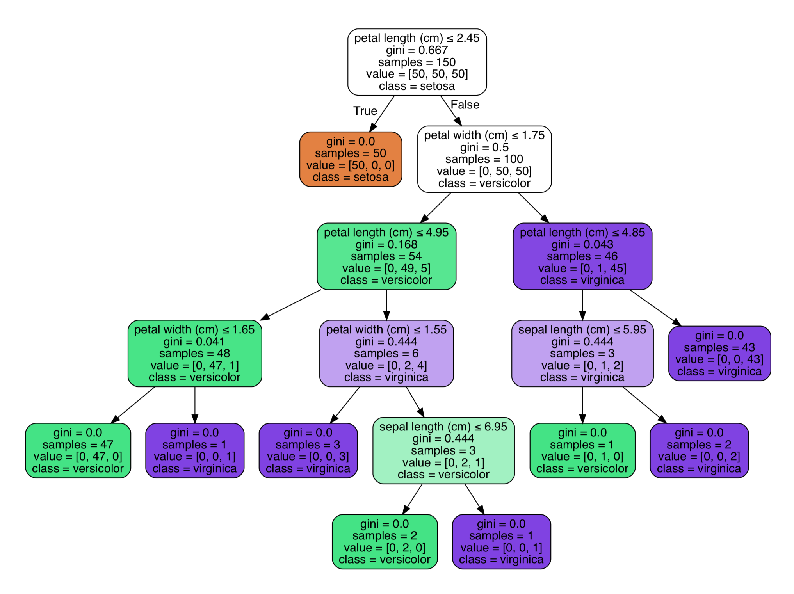

### 1.分类与回归树简介

分类与回归树的英文是*Classfication And Regression Tree*，缩写为CART。CART算法采用**二分递归分割的技术**将当前样本集分为两个子样本集，使得生成的每个非叶子节点都有两个分支。非叶子节点的特征取值为**True**和**False**，左分支取值为**True**，右分支取值为**False**，因此CART算法生成的决策树是结构简洁的二叉树。CART可以处理连续型变量和离散型变量，利用训练数据递归的划分特征空间进行建树，用验证数据进行剪枝。

+ 如果待预测分类是离散型数据，则CART生成分类决策树。
+ 如果待预测分类是连续性数据，则CART生成回归决策树。

### 2.CART分类树

#### 2.1算法详解

CART分类树预测分类离散型数据，采用基尼指数选择最优特征，同时决定该特征的最优二值切分点。分类过程中，假设有K个类，样本点属于第k个类的概率为Pk，则概率分布的基尼指数定义为

$$
Gini(p)=\sum_{k=1}^{m}p_k(1-p_k)=1-\sum_{k=1}^{K}p_{k}^{2}
$$
根据基尼指数定义，可以得到样本集合D的基尼指数，其中Ck表示数据集D中属于第k类的样本子集。
$$
Gini(D)=1-\sum_{k=1}^{K}\left(\frac{|C_k|}{|D|} \right)^2
$$
如果数据集D根据特征A在某一取值a上进行分割，得到D1,D2两部分后，那么在特征A下集合D的基尼系数如下所示。其中基尼系数Gini(D)表示集合D的不确定性，基尼系数Gini(D,A)表示A=a分割后集合D的不确定性。基尼指数越大，样本集合的不确定性越大。
$$
Gain\_Gini(D,A)=\frac{|D1|}{|D|}Gini(D_1)+\frac{|D1|}{|D|}Gini(D_2)
$$
对于属性A，分别计算任意属性值将数据集划分为两部分之后的Gain_Gini，选取其中的最小值，作为属性A得到的最优二分方案。然后对于训练集S，计算所有属性的最优二分方案，选取其中的最小值，作为样本及S的最优二分方案。
$$
\min_{i\epsilon A}(Gain\_Gini(D,A))
$$
$$
\min_{A\epsilon Attribute}(\min_{i\epsilon A}(Gain\_Gini(D,A)))
$$
#### 2.2实例详解

|  名称  | 体温 | 胎生 | 水生 | 类标记 |
| :----: | :--: | :--: | :--: | :----: |
|   人   | 恒温 |  是  |  否  | 哺乳类 |
|  巨蟒  | 冷血 |  否  |  否  | 爬行类 |
|  鲑鱼  | 冷血 |  否  |  是  |  鱼类  |
|   鲸   | 恒温 |  是  |  是  | 哺乳类 |
|   蛙   | 冷血 |  否  | 有时 |  鱼类  |
|  巨蜥  | 冷血 |  否  |  否  | 爬行类 |
|  蝙蝠  | 恒温 |  是  |  否  | 哺乳类 |
|   猫   | 恒温 |  是  |  否  | 哺乳类 |
| 豹纹鲨 | 冷血 |  是  |  是  |  鱼类  |
|  海龟  | 冷血 |  否  | 有时 | 爬行类 |
|  豪猪  | 恒温 |  是  |  否  | 哺乳类 |
|   鳗   | 冷血 |  否  |  是  |  鱼类  |
|  蝾螈  | 冷血 |  否  | 有时 | 两栖类 |

针对上述离散型数据，按照**体温为恒温和非恒温**进行划分。其中恒温时包括哺乳类5个、鸟类2个，非恒温时包括爬行类3个、鱼类3个、两栖类2个，如下所示我们计算D1,D2的基尼指数。

$$
Gini(D_1)=1-[ (\frac{5}{7})^2+(\frac{2}{7})^2]=\frac{20}{49}
$$
$$
Gini(D_2)=1-[ (\frac{3}{8})^2+(\frac{3}{8})^2+(\frac{2}{8})^2]=\frac{42}{64}
$$
然后计算得到特征**体温**下数据集的Gini指数，最后我们选择Gain_Gini最小的特征和相应的划分。
$$
Gain\_Gini(D,体温)=\frac{7}{15}*\frac{20}{49}+\frac{8}{15}*\frac{42}{64}
$$
### 3.CART回归树

#### 3.1算法详解

CART回归树预测回归连续型数据，假设X与Y分别是输入和输出变量，并且Y是连续变量。在训练数据集所在的输入空间中，递归的将每个区域划分为两个子区域并决定每个子区域上的输出值，构建二叉决策树。
$$
D=\{(x_1,y_1),(x_2,y_2),(x_3,y_3),...(x_n,y_n)\}
$$
**选择最优切分变量j与切分点s**：遍历变量j，对规定的切分变量j扫描切分点s，选择使下式得到最小值时的(j,s)对。其中Rm是被划分的输入空间，cm是空间Rm对应的固定输出值。

$$
\min_{j,s}[\min_{c_1}\sum _{x_i\epsilon R_i(j,s)}(y_i-c_1)^2+\min_{c_2}\sum _{x_i\epsilon R_i(j,s)}(y_i-c_1)^2]
$$
**用选定的(j,s)对，划分区域并决定相应的输出值**
$$
R_1(j,s)=\{x|x^{(j)}\le s\},R_2(j,s)=\{x|x^{(j)} >  s\}
$$

$$
\hat{c}_m=\frac{1}{N_m}\sum_{x_i\epsilon R_m(j,s)}y_i
$$

$$
x\epsilon R_m,m=1,2
$$

**继续对两个子区域调用上述步骤**，**将输入空间划分为M个区域R1,R2,…,Rm，生成决策树。**

$$
f(x)=\sum_{m=1}^{M}\hat{c}_mI(x\epsilon R_m)
$$
当输入空间划分确定时，可以用**平方误差**来表示回归树对于训练数据的预测方法，用平方误差最小的准则求解每个单元上的最优输出值。
$$
\sum_{x_i\epsilon R_m}(y_i-f(x_i))^2
$$

#### 3.2实例详解

| $x_i$ |  1   |  2   |  3   |  4   |  5   |  6   |  7   |  8   |  9   |  10  |
| :---: | :--: | :--: | :--: | :--: | :--: | :--: | :--: | :--: | :--: | :--: |
| $y_i$ | 5.56 | 5.70 | 5.91 | 6.40 | 6.80 | 7.05 | 8.90 | 8.70 | 9.00 | 9.05 |

考虑如上所示的连续性变量，根据给定的数据点，考虑**1.5,2.5,3.5,4.5,5.5,6.5,7.5,8.5,9.5**切分点。对各切分点依次求出**R1,R2,c1,c2及m(s)**，例如当切分点s=1.5时，得到R1={1},R2={2,3,4,5,6,7,8,9,10}，其中c1,c2,m(s)如下所示。

$$
c_1=\frac{1}{N_m}\sum_{x_i\epsilon R_m(j,s)}y_i=\frac{1}{1}\sum_{x_i\epsilon R_1(1,1.5)}5.56=5.56
$$

$$
c_2=\frac{1}{N_m}\sum_{x_i\epsilon R_m(j,s)}y_i=\frac{1}{9}\sum_{x_i\epsilon R_2(1,1.5)}(5.70+5.91+...+9.05)=7.50
$$

$$
m(s)=\min_{j,s}[\min_{c_1}\sum _{x_i\epsilon R_i(j,s)}(y_i-c_1)^2+\min_{c_2}\sum _{x_i\epsilon R_i(j,s)}(y_i-c_1)^2]=0+15.72=15.72
$$

**依次改变(j,s)对，可以得到s及m(s)的计算结果**，如下表所示。

|  $s$   |  1.5  |  2.5  | 3.5  | 4.5  | 5.5  | 6.5  | 7.5  |  8.5  |  9.5  |
| :----: | :---: | :---: | :--: | :--: | :--: | :--: | :--: | :---: | :---: |
| $m(s)$ | 15.72 | 12.07 | 8.36 | 5.78 | 3.91 | 1.93 | 8.01 | 11.73 | 15.74 |

当x=6.5时，此时R1={1,2,3,4,5,6},R2={7,8,9,10},c1=6.24,c2=8.9。**回归树T1(x)**为
$$
T_1(x)=\begin{cases}
 & 6.24,x<6.5 \\ 
 & 8.91,x\ge 6.5
\end{cases}
$$

$$
f_1(x)=T_1(x)
$$

**然后我们利用f1(x)拟合训练数据的残差**，如下表所示

| $x_i$ |   1   |   2   |   3   |  4   |  5   |  6   |   7   |   8   |  9   |  10  |
| :---: | :---: | :---: | :---: | :--: | :--: | :--: | :---: | :---: | :--: | :--: |
| $y_i$ | -0.68 | -0.54 | -0.33 | 0.16 | 0.56 | 0.81 | -0.01 | -0.21 | 0.09 | 0.14 |

**用f1(x)拟合训练数据得到平方误差**
$$
L(y,f_1(x))=\sum_{i=1}^{10}(y_i-f_1(x_i))^2=1.93
$$
第二步求T2(x)与求T1(x)方法相同，只是拟合的数据是上表的残差。可以得到
$$
T_2(x)=\begin{cases}
 & -0.52,x<3.5 \\ 
 & 0.22,x\ge 3.5
\end{cases}
$$

$$
f_2(x)=f_1(x)+T_2(x)=
\begin{cases}
 & 5.72,x<3.5 \\ 
 & 6.46,3.5\le x \le 6.5 \\
 & 9.13,x\ge 6.5
\end{cases}
$$

用f2(x)拟合训练数据的平方误差
$$
L(y,f_2(x))=\sum_{i=1}^{10}(y_i-f_2(x_i))^2=0.79
$$
继续求得T3(x)、T4(x)、T5(x)、T6(x)，如下所示
$$
T_3(x)=\begin{cases}
 & 0.15,x<6.5 \\ 
 & -0.22,x\ge 6.5
\end{cases}
L(y,f_3(x))=0.47
$$

$$
T_4(x)=\begin{cases}
 & -0.16,x<4.5 \\ 
 & 0.11,x\ge 4.5
\end{cases}
L(y,f_4(x))=0.30
$$

$$
T_5(x)=\begin{cases}
 & 0.07,x<6.5 \\ 
 & -0.11,x\ge 6.5
\end{cases}
L(y,f_5(x))=0.23
$$

$$
T_6(x)=\begin{cases}
 & -0.15,x<2.5 \\ 
 & 0.04,x\ge 2.5
\end{cases}
$$

$$
f_6(x)=f_5(x)+T_6(x)=T_1(x)+...+T_6(x)=
\begin{cases}
 & 5.63,x<2.5 \\ 
 & 5.82,2.5\le x \le 3.5 \\
  & 6.56,3.5\le x \le 4.5 \\
 & 6.83,4.5\le x \le 6.5 \\
  & 8.95,x\ge 6.5 
\end{cases}
$$

用f6(x)拟合训练数据的平方损失误差如下所示，假设此时已经满足误差要求，那么f(x)=f6(x)便是所求的回归树。
$$
L(y,f_6(x))=\sum_{i=1}^{10}(y_i-f_6(x_i))^2=0.71
$$
### 4.CART剪枝

> 此处我们介绍代价复杂度剪枝算法

我们将一颗充分生长的树称为**T0** ，希望减少树的大小来防止过拟化。但同时去掉一些节点后预测的误差可能会增大，那么如何达到这两个变量之间的平衡则是问题的关键。因此我们用一个变量α 来平衡，定义损失函数如下
$$
C_\alpha(T)=C(T)+\alpha|T|
$$
+ T为任意子树，|T|为子树T的叶子节点个数。
+ α是参数，权衡拟合程度与树的复杂度。
+ C(T)为预测误差，可以是平方误差也可以是基尼指数，C(T)衡量训练数据的拟合程度。

**那么我们如何找到这个合适的α来使拟合程度与复杂度之间达到最好的平衡呢？**准确的方法就是将α从0取到正无穷，对于每一个固定的α，我们都可以找到使得Cα(T)最小的最优子树T(α)。

+ 当α很小的时候，T0 是这样的最优子树.
+ 当α很大的时候，单独一个根节点就是最优子树。

尽管α的取值无限多，但是T0的子树是有限个。Tn是最后剩下的根结点，子树生成是根据前一个子树Ti，剪掉某个内部节点后，生成Ti+1。然后对这样的子树序列分别用测试集进行**交叉验证**，找到最优的那个子树作为我们的决策树。子树序列如下
$$
T_0>T_1>T_2>T_3>...>T_n
$$
**因此CART剪枝分为两部分，分别是生成子树序列和交叉验证，**在此不再详细介绍。

### 5.Sklearn实现

我们以sklearn中iris数据作为训练集，iris属性特征包括花萼长度、花萼宽度、花瓣长度、花瓣宽度，类别共三类，分别为Setosa、Versicolour、Virginca。

```python
from sklearn.datasets import load_iris
from sklearn import tree

#load data
iris=load_iris()
X=iris.data
y=iris.target
clf=tree.DecisionTreeClassifier()
clf=clf.fit(X,y)

#export the decision tree
import graphviz
#export_graphviz support a variety of aesthetic options
dot_data=tree.export_graphviz(clf,out_file=None,
                              feature_names=iris.feature_names,
                              class_names=iris.target_names,
                              filled=True,rounded=True,
                              special_characters=True)

graph=graphviz.Source(dot_data)
graph.view()
```



### 6.推广

更多内容请关注公众号**谓之小一**，若有疑问可在公众号后台提问，随时回答，欢迎关注，内容转载请注明出处。

