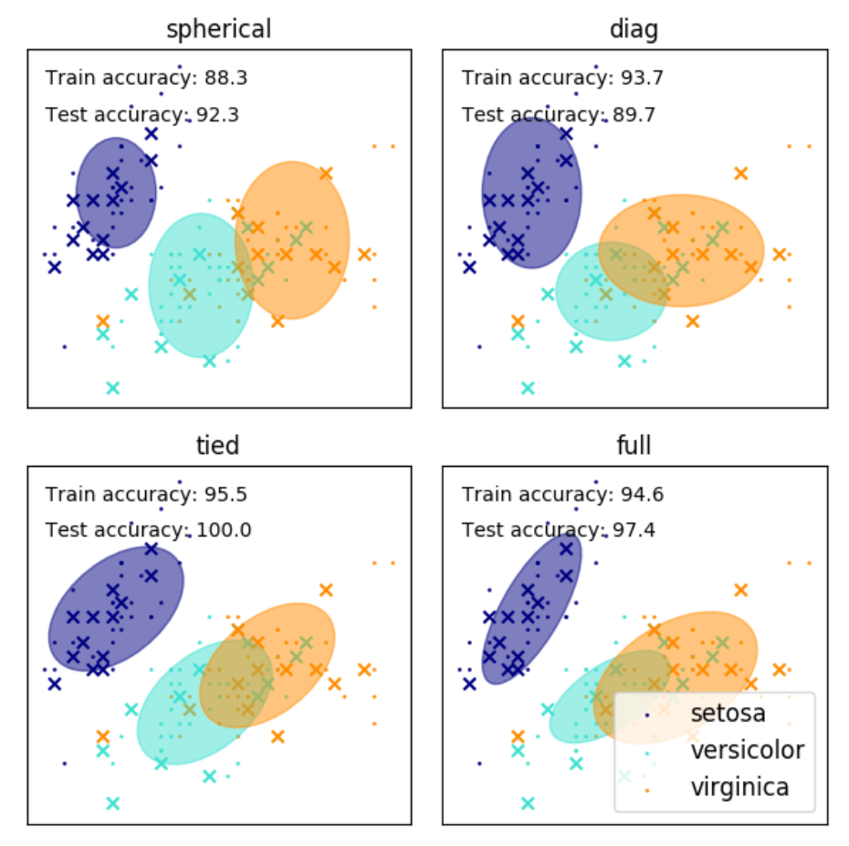

### 1.EM算法简介

**最大期望(Expectation Maximum)算法**是一种迭代优化算法，其计算方法是每次迭代分为**期望(E)步**和**最大(M)步**。我们先看下最大期望算法能够解决什么样的问题。

假如班级里有50个男生和50个女生，且男生站左，女生站右。我们假定男生和女生的身高分布分别服从正态分布。这时我们用极大似然法，分别通过这50个男生和50个女生的样本来估计这两个正态分布的参数，便可知道男女身高分布的情况。
$$
N_1(\mu_1,\sigma_1^2)\ ; N_2(\mu_2,\sigma_2^2)
$$
但我们面对下类问题如何解决呢？就是这50个男生和50个女生混在一起，我们拥有100个人的身高数据，但却不知道这100个同学中的每个人是男生还是女生。通常来说，我们只有知道了精确的男女身高的正态分布参数才能知道每位同学更有可能是男生还是女生，从另一方面来说我们只有知道每个人是男生还是女生才能尽可能准确的估计男女生各自身高的正态分布参数。但现在两者都不知道，如何去估计呢？ 

EM算法表示我们可以用迭代的方法来解决问题。我们先假设男生身高和女生身高分布的参数(初始值)，然后根据这些参数去判断每个人是男生还是女生，之后根据标注后的样本反过来重新估计这些参数。多次重复上述过程，直到稳定。这样说还是有点抽象，我们先从抛硬币实例来讲解EM算法流程，然后再讲解具体数学推导和原理。

### 2.EM算法实例

假如现在我们有两枚硬币1和2，随机抛掷后面朝上概率分别为P1，P2。为了估计两硬币概率，我们做如下实验，每次取一枚硬币，连掷5次后得到如下结果。

| 硬币 |    结果    |  统计   |
| :--: | :--------: | :-----: |
|  1   | 正正反正反 | 3正-2反 |
|  2   | 反反正正反 | 2正-3反 |
|  1   | 正反反反反 | 1正-4反 |
|  2   | 正反反正正 | 3正-2反 |
|  1   | 反正正反反 | 2正-3反 |

我们可以很方便的估计出硬币1概率P1=0.4，硬币2概率P2=0.5。
$$
P1=\frac{3+1+2}{15}=0.4
$$

$$
P2=\frac{2+3}{10}=0.5
$$

下面我们增加问题难度。如果并不知道每次投掷时所使用的硬币标记，那么如何估计P1和P2呢?

|  硬币   |    结果    |  统计   |
| :-----: | :--------: | :-----: |
| Unknown | 正正反正反 | 3正-2反 |
| Unknown | 反反正正反 | 2正-3反 |
| Unknown | 正反反反反 | 1正-4反 |
| Unknown | 正反反正正 | 3正-2反 |
| Unknown | 反正正反反 | 2正-3反 |

此时我们加入**隐含变量z**，可以把它认为是一个5维的向量(z1,z2,z3,z4,z5)，代表每次投掷时所使用的硬币。比如z1就代表第一轮投掷时所使用的是硬币1还是2，我们必须先估计出z，然后才能进一步估计P1和P2。

我们先随机初始化一个P1和P2，用它来估计z，然后基于z按照最大似然概率方法去估计新的P1和P2。如果估计出的P1和P2与我们初始化的P1和P2一样，说明P1和P2很有可能就是真实的值。如果新估计出来的P1和P2和我们初始化时的值差别很大，那么我们继续用新的P1和P2迭代，直到收敛。

例如假设P1=0.2和P2=0.7，然后我们看看第一轮投掷的最可能是哪个硬币。如果是硬币1，得出3正2反的概率为0.2\*0.2\*0.2\*0.8\*0.8=0.00512，如果是硬币2，得出3正2反的概率为0.7\*0.7\*0.7\*0.3\*0.3=0.03087。然后依次求出其他4轮中的相应概率，接下来便可根据最大似然方法得到每轮中最有可能的硬币。

| 轮数 | 若是硬币1 | 若是硬币2 | 最有可能硬币 |
| :--: | :-------: | :-------: | :----------: |
|  1   |  0.00512  |  0.03087  |    硬币2     |
|  2   |  0.02048  |  0.01323  |    硬币1     |
|  3   |  0.08192  |  0.00567  |    硬币1     |
|  4   |  0.00512  |  0.03087  |    硬币2     |
|  5   |  0.02048  |  0.01323  |    硬币1     |

我们把上面的值作为z的估计值(2,1,1,2,1)，然后按照最大似然概率方法来估计新的P1和P2。得到
$$
P1=\frac{2+1+2}{15}=0.33
$$

$$
P2=\frac{3+3}{10}=0.6
$$

P1和P2的最大似然估计是0.4和0.5，那么对比下我们初识化时的P1和P2。

| 初始化的P1 | 估计的P1 | 真实的P1 | 初始化的P2 | 估计的P2 | 真实的P2 |
| :--------: | :------: | :------: | :--------: | :------: | :------: |
|    0.2     |   0.33   |   0.4    |    0.7     |   0.6    |   0.5    |

可以预估，我们继续按照上面思路，用估计出的P1和P2再来估计z，再用z来估计新的P1和P2，反复迭代下去，可以最终得到P1=0.4，P2=0.5。然后无论怎样迭代，P1和P2的值都会保持0.4和0.5不变，于是我们就找到P1和P2的最大似然估计。

上面我们用最大似然方法估计出z值，然后再用z值按照最大似然概率方法估计新的P1和P2。也就是说，我们使用了最有可能的z值，而不是所有的z值。如果考虑所有可能的z值，对每一个z值都估计出新的P1和P2，将每一个z值概率大小作为权重，将所有新的P1和P2分别加权相加，这样估计出的P1和P2是否会更优呢?

但所有的z值共有2^5=32种，我们是否进行32次估计呢？当然不是，我们利用期望来简化运算。

| 轮数 | 若是硬币1 | 若是硬币2 |
| :--: | :-------: | :-------: |
|  1   |  0.00512  |  0.03087  |
|  2   |  0.02048  |  0.01323  |
|  3   |  0.08192  |  0.00567  |
|  4   |  0.00512  |  0.03087  |
|  5   |  0.02048  |  0.01323  |

利用上面表格，我们可以算出每轮投掷种使用硬币1或者使用硬币2的概率。比如第一轮使用硬币1的概率
$$
z_1=\frac{0.00512}{0.00512+0.03087}=0.14
$$
相应的算出其他4轮的概率。

| 轮数 | z_i=硬币1 | z_i=硬币2 |
| :--: | :-------: | :-------: |
|  1   |   0.14    |   0.86    |
|  2   |   0.61    |   0.39    |
|  3   |   0.94    |   0.06    |
|  4   |   0.14    |   0.86    |
|  5   |   0.61    |   0.39    |

上表中表示期望值，例如0.86表示此轮中使用硬币2的概率是0.86。前面方法我们按照最大似然概率直接将第一轮估计为硬币2，此时我们更加严谨，只说有0.14的概率是硬币1，有0.86的概率是硬币2。这样我们在估计P1或者P2时，就可以用上全部的数据，而不是部分的数据。此步我们实际上是估计出z的概率分布，称为**E步**。

按照期望最大似然概率的法则来估计出新的P1和P2。以P1估计为例，第一轮的3正2反相当于有0.14\*3=0.42的概率为正，有0.14\*2的概率为反。然后依次计算出其他四轮。那么我们可以得到P1概率，可以看到改变了z的估计方法后，新估计出的P1要更加接近0.4，原因是我们使用了所有抛掷的数据，而不是部分的数据。此步中我们根据E步中求出z的概率分布，依据最大似然概率法则去估计P1和P2，称为**M步**。

| 轮数 | 正面 | 反面 |
| :--: | :--: | :--: |
|  1   | 0.42 | 0.28 |
|  2   | 1.22 | 1.83 |
|  3   | 0.94 | 3.76 |
|  4   | 0.42 | 0.28 |
|  5   | 1.22 | 1.93 |
| 总计 | 4.22 | 7.98 |

$$
P1=\frac{4.22}{4.22+7.98}=0.35
$$
上面我们是通过迭代来得到P1和P2。但是我们同时想要知道，新估计出的P1和P2一定会更接近真实的P1和P2吗，能够收敛吗？迭代一定会收敛到真实的P1和P2吗？下面我们将从数学推导方法详解EM算法。

### 3.EM算法推导

对于m个样本观察数据$x=(x^{(1)},x^{(2)},x^{(3)},…,x^{(m)})$，找出样本的模型参数$\theta$，极大化模型分布的对数似然函数如下所示
$$
\theta =\arg \max_{\theta} \sum _{i=1}^{m}logP(x^{(i)};\theta)
$$


如果我们得到的观察数据有未观察到的隐含数据$z=(z^{(1)},z^{(2)},z^{(3)},…,z^{(m)})$，此时我们极大化模型分布的对数似然函数如下
$$
\theta =\arg \max_{\theta} \sum _{i=1}^{m}logP(x^{(i)};\theta)
$$

$$
=\arg \max_{\theta} \sum _{i=1}^{m}log\sum _{z^{(i)}}P(x^{(i)},z^{(i)};\theta)
$$

上面方程是无法直接求出θ的，因此需要一些特殊技巧，在此我们引入**Jensen不等式**。

> 设f是定义域为实数的函数，如果对于所有的实数X，f(X)的二次导数大于等于0，那么f是凸函数。相反，f(X)的二次导数小于0，那么f是凹函数。
>
> **Jensen不等式定义：**如果f是凸函数,X是随机变量，那么E[f(X)]≥f(E(X))。相反，如果f式凹函数，X是随机变量，那么E[f(X)]≤f(E[X])。当且仅当X是常量时，上式取等号，其中E[X]表示X的期望。

我们再回到上述推导过程，得到如下方程式。
$$
\sum _{i=1}^{m}log\sum _{z^{(i)}}P(x^{(i)},z^{(i)};\theta) 
$$

$$
=\sum _{i=1}^{m}log\sum _{z^{(i)}}Q_i(z^{(i)})\frac{P(x^{(i)},z^{(i)};\theta) }{Q_i(z^{(i)})}\ \ \ \ \ \ \ (1)
$$

$$
\ge \sum _{i=1}^{m}\sum _{z^{(i)}}Q_i(z^{(i)})log\frac{P(x^{(i)},z^{(i)};\theta) }{Q_i(z^{(i)})} \ \ \ \ \ \ \ (2)
$$

我们来解释下怎样得到的方程式(1)和方程式(2)，上面(1)式中引入一个未知的新的分布$Q_i(z^{(i)})$，第二式用到Jensen不等式。

首先log函数是凹函数，那么E[f(X)]≤f(E[X])，也就是f(E(X))≥E(f(X))。其中$\sum _{z^{(i)}}Q_i(z^{(i)})\frac{P(x^{(i)},z^{(i)};\theta) }{Q_i(z^{(i)})}$是$\frac{P(x^{(i)},z^{(i);\theta})}{Q_i(z^{(i)})}$的数学期望，那么$log\sum _{z^{(i)}}Q_i(z^{(i)})\frac{P(x^{(i)},z^{(i)};\theta) }{Q_i(z^{(i)})}$便相当于f(E(X))，同时$\sum _{z^{(i)}}Q_i(z^{(i)})log\frac{P(x^{(i)},z^{(i)};\theta) }{Q_i(z^{(i)})}$相当于E(f(X))，因此我们便得到上述方程式(1)(2)。

如果要满足Jensen不等式的等号，那么需要满足X为常量，即为
$$
\frac{P(x^{(i)},z^{(i)};\theta)}{Q_i(z^{(i)})}=c,\ c为常量
$$
那么稍加改变能够得到
$$
c Q_i(z^{(i)})=P(x^{(i)},z^{(i)};\theta)\ ,c为常量
$$

$$
\sum_z c\  Q_i(z^{(i)})= \sum _z P(x^{(i)},z^{(i)};\theta),\ c为常量
$$

其中c是不依赖于$z^{(i)}$的常量，由于$Q_i(z^{(i)})$是一个分布，所以满足
$$
\sum_{z}Q_i(z^{(i)})=1
$$

$$
\sum_z c\  Q_i(z^{(i)})= \sum _z P(x^{(i)},z^{(i)};\theta)= c
$$

因此得到下列方程，其中方程(3)利用到条件概率公式。
$$
Q_i(z^{(i)})=\frac{P(x^{(i)},z^{(i)};\theta)}{c}=\frac{P(x^{(i)},z^{(i)};\theta)}{\sum _z P(x^{(i)},z^{(i)};\theta)}\ \ \ \ \ \ \ \ \ \ \ \ \ \ \ \ \ \ \ \ \ \ \ \ \ 
$$
$$
=\frac{P(x^{(i)},z^{(i)};\theta)}{ P(x^{(i)};\theta)}=P(z^{(i)}|x^{(i)};\theta)  \ \ \ \ \ \ \ \  \ \ \ \ \ \   (3)
$$


如果$Q_i(z^{(i)})=P(z^{(i)}|x^{(i)};\theta)$，那么第(2)式就是我们隐藏数据的对数似然的下界。如果我们能极大化方程式(2)的下界，则也在尝试极大化我们的方程式(1)。即我们需要最大化下式
$$
\arg \max _{\theta} \sum _{i=1}^{m}\sum _{z^{(i)}}Q_i(z^{(i)})log\frac{P(x^{(i)},z^{(i)};\theta) }{Q_i(z^{(i)})}
$$
去掉上式中常数部分，则我们需要极大化的对数似然下界为
$$
\arg \max _{\theta} \sum _{i=1}^{m}\sum _{z^{(i)}}Q_i(z^{(i)})[log P(x^{(i)},z^{(i)};\theta)-log {Q_i(z^{(i)})}]
$$
$$
=\arg \max _{\theta} \sum _{i=1}^{m}\sum _{z^{(i)}}Q_i(z^{(i)})log P(x^{(i)},z^{(i)};\theta)\ \ \ \ \ \ \ \ \ \ \ \ \ \ \ \ \ \ (4)
$$

注意到上式中$Q_i(z^{(i)})$是一个分布，因此$\sum _{z^{(i)}}Q_i(z^{(i)})log P(x^{(i)},z^{(i)};\theta)$可以理解为$logP(x^{(i)},z^{(i)};\theta)$基于条件概率分布$Q_i(z^{(i)})$的期望，也就是我们EM算法中**E步**。极大化方程式(4)也就是我们EM算法中的**M步**。

### 4.EM算法流程

现在我们总结下EM算法流程。

输入：观察数据$x=(x^{(1)},x^{(2)},x^{(3)},…,x^{(m)})$，联合分布$P(x^{(i)},z^{(i)};\theta)$，条件分布$P(z^{(i)}|x^{(i)};\theta)$，最大迭代次数$J$。

+ 随机初始化模型参数$\theta$的初始值$\theta^0$。

+ $for\  j\  from \ 1\  to \ J$开始EM算法迭代。

  + E步:计算联合分布的条件概率期望

  $$
  Q_i(z^{(i)})=P(z^{(i)}|x^{(i)};\theta)
  $$

  $$
  L(\theta,\theta^j)=\sum _{i=1}^{m}\sum _{z^{(i)}}Q_i(z^{(i)})log P(x^{(i)},z^{(i)};\theta)
  $$

  + M步:极大化$L(\theta,\theta^j)$，得到$\theta^{j+1}$

  $$
  \theta^{j+1}=\arg \max _{x} L(\theta,\theta^j)
  $$

  + 如果$\theta^{j+1}$收敛，则算法结束，否则继续迭代。

+ 输出模型参数$\theta$。

### 5.EM算法的收敛性

我们现在来解答下**2.EM算法实例**中问题，即EM算法能够保证收敛吗？如果EM算法收敛，那么能够保证收敛到全局最大值吗？

首先我们来看下第一个问题，EM算法能够保证收敛吗?要证明EM算法收敛，则我们需要证明对数似然函数的值在迭代的过程中一直增大。即
$$
\sum _{i=1}^{m}log P(x^{(i)};\theta^{j+1})\ge \sum _{i=1}^{m}log P(x^{(i)};\theta^{j})
$$
由于
$$
L(\theta,\theta^j)=\sum _{i=1}^{m}\sum _{z^{(i)}}P(z^{(i)}|x^{(i)};\theta^j)log P(x^{(i)},z^{(i)};\theta)
$$
令


$$
H(\theta,\theta^j)=\sum _{i=1}^{m}\sum _{z^{(i)}}P(z^{(i)}|x^{(i)};\theta^j)log P(z^{(i)}|x^{(i)};\theta)
$$
上两式相减得到


$$
\sum_{i=1}^{m}log P(x^{(i)};\theta)=L(\theta,\theta^j)-H(\theta,\theta^j)
$$
在上式中分别取$\theta$为$\theta^j$和$\theta^{j+1}$，并相减得到


$$
\sum_{i=1}^{m}log P(x^{(i)};\theta^{j+1})-\sum_{i=1}^{m}log P(x^{(i)};\theta^j)=[L(\theta^{j+1},\theta^j)-L(\theta^j,\theta^j)]-[H(\theta^{j+1},\theta^j)-H(\theta^j,\theta^j)]
$$
要证明EM算法的收敛性，我们只要证明上式的右边是非负即可。由于$\theta^{j+1}$使得$L(\theta,\theta^j)$极大，因此有


$$
L(\theta^{j+1},\theta^j)-L(\theta^j,\theta^j)\ge 0
$$
而对于第二部分，我们有


$$
H(\theta^{j+1},\theta^j)-H(\theta^j,\theta^j)=\sum _{i=1}^{m}\sum _{z^{(i)}}P(z^{(i)}|x^{(i)};\theta^j)log \frac{P(z^{(i)}|x^{(i)};\theta^{j+1})}{P(z^{(i)}|x^{(i)};\theta^{j})} \ \ \ \ \ \ \ \ \ (5)
$$
$$
\le \sum _{i=1}^{m}log \{ \sum _{z^{(i)}}P(z^{(i)}|x^{(i)};\theta^j)\frac{P(z^{(i)}|x^{(i)};\theta^{j+1})}{P(z^{(i)}|x^{(i)};\theta^{j})} \}\ \ \ \ \ \ \ \ \ (6)
$$

$$
= \sum _{i=1}^{m}log (\sum _{z^{(i)}}P(z^{(i)}|x^{(i)};\theta^{j+1}))=0 \ \ \ \ \ \ \ \ \ \ (7)
$$

其中第(6)式用到了Jensen不等式，只不过和第**3.EM算法推导**中使用相反，第(7)式用到了概率分布累计为1的性质。至此我们得到
$$
\sum _{i=1}^{m}log P(x^{(i)};\theta^{j+1})- \sum _{i=1}^{m}log P(x^{(i)};\theta^{j}) \ge 0
$$
证明了EM算法的收敛性。

从上面的推导可以看出，EM算法可以保证收敛到一个稳定点，但是却不能保证收敛到全局的极大值点，因此它是局部最优的算法。当然，如果我们的优化目标L(θ,θj)是凸的，则EM算法可以保证收敛到全局最大值，这点和梯度下降法中迭代算法相同。

### 6.Sklearn实现EM算法

高斯混合模型(GMM)使用高斯分布作为参数模型，利用期望最大(EM)算法进行训练，有兴趣了解高斯混合模型的同学可以去[这儿](https://mp.weixin.qq.com/s?src=11&timestamp=1525932817&ver=867&signature=U4UxviydVELD71Ju*bRWvh0ziFU57aNoPTZkVu5ShBEH7lxe1PLqxQnZ-xVSFgXdw5GcsWcYF5W1llR4dQ2yrsj0t2syeXgEggjm*budZlpZdMQMLOcXB-FnvKKlkV2H&new=1)。下列代码来自于[Sklearn官网GMM模块](http://scikit-learn.org/stable/auto_examples/mixture/plot_gmm_covariances.html#sphx-glr-auto-examples-mixture-plot-gmm-covariances-py)，利用高斯混合模型确定iris聚类。

```python
import matplotlib as mpl
import matplotlib.pyplot as plt

import numpy as np

from sklearn import datasets
from sklearn.mixture import GaussianMixture
from sklearn.model_selection import StratifiedKFold

colors = ['navy', 'turquoise', 'darkorange']

def make_ellipses(gmm, ax):
    for n, color in enumerate(colors):
        if gmm.covariance_type == 'full':
            covariances = gmm.covariances_[n][:2, :2]
        elif gmm.covariance_type == 'tied':
            covariances = gmm.covariances_[:2, :2]
        elif gmm.covariance_type == 'diag':
            covariances = np.diag(gmm.covariances_[n][:2])
        elif gmm.covariance_type == 'spherical':
            covariances = np.eye(gmm.means_.shape[1]) * gmm.covariances_[n]
        v, w = np.linalg.eigh(covariances)
        u = w[0] / np.linalg.norm(w[0])
        angle = np.arctan2(u[1], u[0])
        angle = 180 * angle / np.pi  # convert to degrees
        v = 2. * np.sqrt(2.) * np.sqrt(v)
        ell = mpl.patches.Ellipse(gmm.means_[n, :2], v[0], v[1],
                                  180 + angle, color=color)
        ell.set_clip_box(ax.bbox)
        ell.set_alpha(0.5)
        ax.add_artist(ell)

iris = datasets.load_iris()

# Break up the dataset into non-overlapping training (75%)
# and testing (25%) sets.
skf = StratifiedKFold(n_splits=4)
# Only take the first fold.
train_index, test_index = next(iter(skf.split(iris.data, iris.target)))


X_train = iris.data[train_index]
y_train = iris.target[train_index]
X_test = iris.data[test_index]
y_test = iris.target[test_index]

n_classes = len(np.unique(y_train))

# Try GMMs using different types of covariances.
estimators = dict((cov_type, GaussianMixture(n_components=n_classes,
                   covariance_type=cov_type, max_iter=20, random_state=0))
                  for cov_type in ['spherical', 'diag', 'tied', 'full'])

n_estimators = len(estimators)

plt.figure(figsize=(3 * n_estimators // 2, 6))
plt.subplots_adjust(bottom=.01, top=0.95, hspace=.15, wspace=.05,
                    left=.01, right=.99)


for index, (name, estimator) in enumerate(estimators.items()):
    # Since we have class labels for the training data, we can
    # initialize the GMM parameters in a supervised manner.
    estimator.means_init = np.array([X_train[y_train == i].mean(axis=0)
                                    for i in range(n_classes)])

    # Train the other parameters using the EM algorithm.
    estimator.fit(X_train)

    h = plt.subplot(2, n_estimators // 2, index + 1)
    make_ellipses(estimator, h)

    for n, color in enumerate(colors):
        data = iris.data[iris.target == n]
        plt.scatter(data[:, 0], data[:, 1], s=0.8, color=color,
                    label=iris.target_names[n])
    # Plot the test data with crosses
    for n, color in enumerate(colors):
        data = X_test[y_test == n]
        plt.scatter(data[:, 0], data[:, 1], marker='x', color=color)

    y_train_pred = estimator.predict(X_train)
    train_accuracy = np.mean(y_train_pred.ravel() == y_train.ravel()) * 100
    plt.text(0.05, 0.9, 'Train accuracy: %.1f' % train_accuracy,
             transform=h.transAxes)

    y_test_pred = estimator.predict(X_test)
    test_accuracy = np.mean(y_test_pred.ravel() == y_test.ravel()) * 100
    plt.text(0.05, 0.8, 'Test accuracy: %.1f' % test_accuracy,
             transform=h.transAxes)

    plt.xticks(())
    plt.yticks(())
    plt.title(name)

plt.legend(scatterpoints=1, loc='lower right', prop=dict(size=12))
plt.show()
```



### 7.EM算法优缺点

#### 7.1优点

+ 聚类。

+ 算法计算结果稳定、准确。

+ EM算法自收敛，既不需要事先设定类别，也不需要数据间的两两比较合并等操作。

#### 7.2缺点

+ 对初始化数据敏感。

+ EM算法计算复杂，收敛较慢，不适于大规模数据集和高维数据。

+ 当所要优化的函数不是凸函数时，EM算法容易给出局部最优解，而不是全局最优解。

### 8.推广

更多内容请关注公众号**谓之小一**，若有疑问可在公众号后台提问，随时回答，欢迎关注，内容转载请注明出处。


参考

+ [milter_如何感性地理解EM算法](https://www.jianshu.com/p/1121509ac1dc)
+ [刘建平Pinard_EM算法原理总结](https://www.cnblogs.com/pinard/p/6912636.html)
+ [Gaussian mixture models](http://scikit-learn.org/stable/modules/mixture.html)

