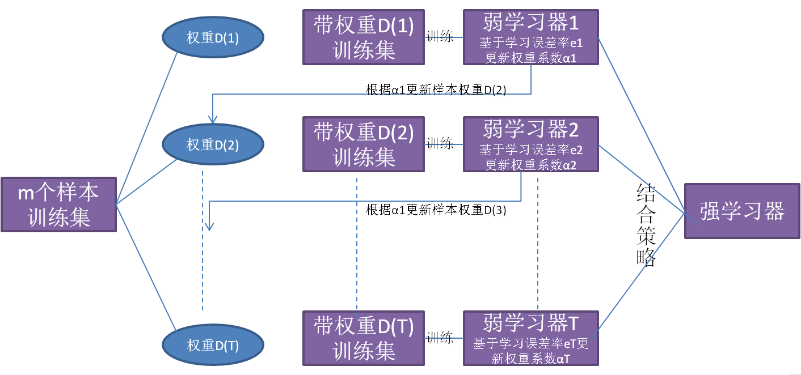

### 1.GBDT算法简介

**GBDT(Gradient Boosting Decision Tree)**是一种迭代的决策树算法，由多棵决策树组成，所有树的结论累加起来作为最终答案，我们根据其名字(**Gradient Boosting Decision Tree**)来展开推导过程。决策树(**Decision Tree**)我们已经不再陌生，在之前介绍到的[机器学习之决策树(C4.5算法)](https://mp.weixin.qq.com/s?__biz=MzU3MjA2NTQzMw==&mid=2247483837&idx=1&sn=f73ca53c5d50f7cd090ba3bc0e17c56b&chksm=fcd7d24bcba05b5d157f93577bc7d41856dc4e19374c20f30167e9bfd9dc0956ed09d28431f3#rd)、[机器学习之分类与回归树(CART)](https://mp.weixin.qq.com/s?__biz=MzU3MjA2NTQzMw==&mid=2247483841&idx=1&sn=b67c59dc4284f0b363b2de881c5da729&chksm=fcd7d237cba05b21d80927e03e8b875e080cd0722496a5779eb3c8d285ea520902e813252ce0#rd)、[机器学习之随机森林](https://mp.weixin.qq.com/s?__biz=MzU3MjA2NTQzMw==&mid=2247483845&idx=1&sn=5484385408d694ba03a8bdc3a03c2263&chksm=fcd7d233cba05b25b0f65289f8416466df9124b019b60704b4e3875d9864ff90e3388c666f66#rd)中已经多次接触，在此不再赘述。但**Boosting**和**Gradient**方法是什么含义呢，又如何跟Decision Tree相结合?首先我们来了解集成学习中的Boosting概念。

#### 1.1集成学习之Boosting

集成学习不是单独的机器学习方法，而是通过构建并结合多个机器学习器来完成任务，集成学习可以用于分类问题集成、回归问题集成、特征选取集成、异常点检测集成等方面。其思想是对于训练数据集，我们通过训练若干个个体学习器，通过一定的结合策略形成一个强学习器，以达到博采众长的目的。在[机器学习之随机森林](https://mp.weixin.qq.com/s?__biz=MzU3MjA2NTQzMw==&mid=2247483845&idx=1&sn=5484385408d694ba03a8bdc3a03c2263&chksm=fcd7d233cba05b25b0f65289f8416466df9124b019b60704b4e3875d9864ff90e3388c666f66#rd)中我们已经用到集成学习中的bagging方法，此处我们详细介绍集成学习中的Boosting方法。



从上图可以看出，Boosting算法的工作机制是从训练集用初始权重训练出一个弱学习器1，根据弱学习器的学习误差率来更新训练样本的权重，使得之前弱学习器1中学习误差率高的训练样本点权重变高。然后这些误差率高的点在弱学习器2中得到更高的重视，利用调整权重后的训练集来训练弱学习器2。如此重复进行，直到弱学习器数达到事先指定的数目T，最终将这T个弱学习器通过集合策略进行整合，得到最终的强学习器。了解Boosting方法后，我们便可将Boosting方法和Decision Tree相结合便可得到**Boosting Decision Tree**。

#### 1.2 Boosting Decision Tree

**提升树(Boosting Decision Tree)**由于输出样本是连续值，因此我们通过迭代多棵回归树来共同决策。在[机器学习之分类与回归树(CART)](https://mp.weixin.qq.com/s?__biz=MzU3MjA2NTQzMw==&mid=2247483841&idx=1&sn=b67c59dc4284f0b363b2de881c5da729&chksm=fcd7d237cba05b21d80927e03e8b875e080cd0722496a5779eb3c8d285ea520902e813252ce0#rd)中我们已经详细推导分类树与回归树的构建过程，在此不再赘述。

我们利用平方误差来表示损失函数，其中每一棵回归树学习的是之前所有树的结论和残差，拟合得到一个当前的残差回归树。其中残差=真实值-预测值，提升树即是整个迭代过程生成的回归树的累加。

我们通过以下例子来详解算法过程，希望通过训练提升树来预测年龄。训练集是4个人，A、B、C、D年龄分别是14、16、24、26。样本中有购物金额、上网时长、经常到百度知道提问等特征。提升树的过程如下


我们能够直观的看到，预测值等于所有树值的累加，如**A的预测值=树1左节点(15)+树2左节点(-1)=14**。因此给定当前决策树模型ft-1(x)，只需拟合决策树的残差，便可迭代得到提升树，算法过程如下

+ 初始化$f_0(x)=0$
+ 对$t=1,2,3,…,T$
  + 计算残差$r_{ti}=y_i-f_{t-1}(x_i),i=1,2,3,…,m$。
  + 拟合残差$r_{ti}$学习得到回归树$h_t(x)$
  + 更新$f_t(x)=f_{t-1}(x)+h_t(x)$
+ 得到回归问题提升树$f_T(x)=f_0(x)+\sum_{t=1}^{T}h_t(x)$

我们介绍了**Boosting Decision Tree**的基本思路，但是没有解决损失函数拟合方法的问题。针对这个问题，Freidman提出用损失函数的负梯度来拟合本轮损失的近似值，进而拟合一个CART回归树。了解Boosting Decision Tree方法后，我们便可将Gradient与Boosting Decision Tree相结合得到**Gradient Boosting Decision Tree的负梯度拟合**。

#### 1.3GBDT负梯度拟合

Boosting Decision Tree迭代过程中，假设我们前一轮迭代得到的强学习器是$f_{t-1}(x)$，损失函数是$L(y,f_{t-1}(x))$，我们本轮迭代的目标是找到一个回归树模型的弱学习器$h_t(x)$，让本轮的损失$L(y,f_t(x))=L(y,f_{t-1}(x)+h_t(x))$最小。也就是说，本轮迭代找到的决策树，要让样本的损失函数尽量变得更小。

我们利用损失函数$L(y_i,f(x_i))$的负梯度来拟合本轮损失函数的近似值，进而拟合一个CART回归树。其中第t轮的第i个样本的损失函数的负梯度表示为
$$
r_{ti}=-\left[\frac{\partial L(y_i,f(x_i))}{\partial f(x_i)} \right]_{f(x)=f_{t-1}(x)}
$$
利用$(x_i,r_{ti})i=1,2,3,…,m$，我们可以拟合一棵CART回归树，得到第t棵回归树，其对应的叶节点区域为$R_{tj},j=1,2,3,…,J$，其中$J$为叶子节点的个数。

针对每一个叶子节点中的样本，我们求出使损失函数最小，也就是拟合叶子节点最好的输出值$c_{tj}$。其中决策树中叶节点值已经生成一遍，此步目的是稍加改变决策树中叶节点值，希望拟合的误差越来越小。
$$
c_{tj}=\underset{c}{\underbrace{\arg\min}} \sum_{x_i \in R_{tj}}L(y_i,f_{t-1}(x_i)+c)
$$
这样我们便得到本轮的决策树拟合函数
$$
h_t(x)=\sum _{j=1} ^{J} c_{tj},I(x \in R_{tj})
$$
从而本轮最终得到的强学习器表达式如下
$$
f_t(x)=f_{t-1}(x)+\sum_{j=1}^{J}c_{tj},I(x\in R_{tj})
$$
通过损失函数的负梯度拟合，我们找到一种通用的拟合损失函数的方法，这样无论是分类问题还是回归问题，我们通过其损失函数的负梯度拟合，就可以用GBDT来解决我们的分类回归问题。

### 2.GBDT回归算法

通过上述GBDT负梯度拟合我们来总结下GBDT的回归算法，为什么没有加上分类算法是因为分类算法的输出是不连续的类别值，需要一些处理才能使用负梯度，我们将在下一节详细介绍GBDT分类算法。

假设训练集样本$T=\{ (x,y_1),(x,y_2),…,(x,y_m)\}$，最大迭代次数为$T$，损失函数$L$，输出是强学习器$f(x)$。回归算法过程如下所示

+ 初始化弱学习器，c的均值可设置为样本y的均值。

$$
f_0(x)=\underset{c}{\underbrace{\arg\min}} \sum_{i=1}^{m}L(y_i,c)
$$

+ 对迭代次数$t=1,2,3,…,T$有

  + 对样本$i=1,2,3,…,m$，计算负梯度

  $$
  r_{ti}=-\left[\frac{\partial L(y_i,f(x_i))}{\partial f(x_i)} \right]_{f(x)=f_{t-1}(x)}
  $$

  + 利用$(x_i,r_{ti})i=1,2,3,…,m$，拟合一棵CART回归树，得到第t棵回归树，其对应的叶子节点区域为$R_{tj},j=1,2,3,…,J$。其中$J$为回归树$t$的叶子节点个数。
  + 对叶子区域$j=1,2,3,…,J$，计算最佳拟合值

  $$
  c_{tj}=\underset{c}{\underbrace{\arg\min}} \sum_{x_i \in R_{tj}}L(y_i,f_{t-1}(x_i)+c)
  $$

  + 更新强学习器

  $$
  f_t(x)=f_{t-1}(x)+\sum_{j=1}^{J}c_{tj},I(x\in R_{tj})
  $$

+ 得到强学习器$f(x)$表达式
  $$
  f(x)=f_T(x)=f_0(x)+\sum_{t=1}^{T}\sum_{j=1}^{J}c_{tj},I(x\in R_{tj})
  $$


### 3.GBDT分类算法

GBDT分类算法在思想上和回归算法没有区别，但是由于样本输出不是连续的值，而是离散的类别，导致我们无法直接从输出类别去拟合类别输出的误差。为解决此问题，我们尝试用类似于逻辑回归的对数似然损失函数的方法,也就是说我们用的是类别的预测概率值和真实概率值来拟合损失函数。对于对数似然损失函数，我们有二元分类和多元分类的区别。

#### 3.1二元GBDT分类算法

对于二元GBDT，如果用类似于逻辑回归的对数似然损失函数，则损失函数表示为
$$
L(y,f(x))=log(1+exp(-yf(x)))
$$
其中$y \in \{ -1,1\}$。则此时的负梯度误差为
$$
r_{ti}=-\left[\frac{\partial L(y_i,f(x_i))}{\partial f(x_i)} \right]_{f(x)=f_{t-1}(x)}=\frac{y_i}{1+exp(y_if(x_i))}
$$
对于生成的决策树，我们各个叶子节点的最佳残差拟合值为
$$
c_{tj}=\underset{c}{\underbrace{\arg\min}} \sum _{x_i\in R_{tj}}log(1+exp(-y_i(f_{t-1}(x_i)+c)))
$$
由于上式比较难优化，我们一般使用近似值代替
$$
c_{tj}=\frac{\sum _{x_i\in R_{tj}}r_{ti}}{\sum _{x_i \in R_{tj}}|r_{ti}|(1-|r_{ti}|)}
$$
除了负梯度计算和叶子节点的最佳残差拟合的线性搜索外，二元GBDT分类和GBDT回归算法过程相同。

#### 3.2多元GBDT分类算法

多元GBDT要比二元GBDT复杂一些，对应的是多元逻辑回归和二元逻辑回归的复杂度差别。假如类别数为K，则我们的对数似然函数为
$$
L(y,f(x))=-\sum_{k=1}^{K}y_k log(p_k(x))
$$
其中如果样本输出类别为k，则$y_k=1$。第k类的概率$p_k(x)$的表达式为
$$
p_k(x)=\frac {exp(f_k(x))}{\sum _{l=1}^{K}exp(f_l(x))}
$$
集合上两式，我们可以计算出第t轮的第i个样本对应类别l的负梯度误差为
$$
r_{til}=-\left[\frac{\partial L(y_i,f(x_i))}{\partial f(x_i)} \right]_{f_k(x)=f_{t-1,l}(x)}=y_{il}-p_{t-1,l}(x_i)
$$
其实这里的误差就是样本i对应类别l的真实概率和t-1轮预测概率的差值。对于生成的决策树，我们各个叶子节点的最佳残差拟合值为
$$
c_{tjl}=\underset{cjl}{\underbrace{\arg\min}} \sum_{i=1}^{m} \sum_{k=1}^{K}L(y_k,f_{t-1,l}(x))+\sum _{j=1}^{J}c_{jl},I(x_i\in R_{tj})
$$
由于上式比较难优化，我们用近似值代替
$$
c_{tjl}=\frac{K-1}{K}=\frac{\sum_{x_i\in R_{tjl}}r_{til}}{\sum _{x_i\in R_{til}}|r_{til}|(1-|r_{til}|)}
$$
除了负梯度计算和叶子节点的最佳残差拟合的线性搜索，多元GBDT分类和二元GBDT分类以及GBDT回归算法过程相同。

### 4.GBDT损失函数

对于**回归算法**，常用损失函数有均方差、绝对损失、Huber损失和分位数损失。

+ 均方差损失。

$$
L(y,f(x))=(y-f(x))^2
$$

+ 绝对损失和对应的负梯度误差。

$$
L(y,f(x))=|y-f(x)|
$$

$$
sign(y_i-f(x_i))
$$

+ Huber损失是均方差和绝对损失的折衷产物，对于远离中心的异常点，采用绝对损失，而中心点附近采用均方差。这个界限一般用分位数点来度量，损失函数和对应的负梯度误差如下

$$
L(y,f(x))=\left\{\begin{matrix}
\frac{1}{2}(y-f(x))^2 &|y-f(x)|\le \delta \\ 
 \delta (|y-f(x)|-\frac{\delta}{2})&|y-f(x)|> \delta 
\end{matrix}\right.
$$

$$
r(y_i,f(x_i))=\left\{\begin{matrix}
y_i-f(x_i) &|y_i-f(x_i)|\le \delta \\ 
\delta sign(y_i-f(x_i))&|y_i-f(x_i)|> \delta 
\end{matrix}\right.
$$

+ 分位数损失和负梯度误差如下所示。其中其中$\theta$为分位数，需要我们在回归前指定。

$$
L(y,f(x))=\sum _{y\ge f(x)} \theta|y-f(x)|+\sum _{y<f(x)}(1-\theta)|y-f(x)|
$$

$$
r(y_i,f(x_i))=\left\{\begin{matrix}
\theta &y_i\ge f(x_i) \\ 
\theta -1 &y_i<f(x_i)
\end{matrix}\right.
$$

对于Huber损失和分位数损失，主要用于健壮回归，也就是减少异常点对损失函数的影响。

对于分类算法，常用损失函数有指数损失函数和对数损失函数。

+ 对数损失函数，分为二元分类和多元分类两种，我们已在上述3.1和3.2节进行介绍。


+ 指数损失函数
  $$
  L(y,f(x))=exp(-yf(x))
  $$


### 5.GBDT正则化

针对GBDT正则化，我们通过子采样比例方法和定义步长v方法来防止过拟合。

+ **子采样比例:**通过不放回抽样的子采样比例（subsample），取值为(0,1]。如果取值为1，则全部样本都使用。如果取值小于1，利用部分样本去做GBDT的决策树拟合。选择小于1的比例可以减少方差，防止过拟合，但是会增加样本拟合的偏差。因此取值不能太低，推荐在[0.5, 0.8]之间。


+ **定义步长v:**针对弱学习器的迭代，我们定义步长v，取值为(0,1]。对于同样的训练集学习效果，较小的v意味着我们需要更多的弱学习器的迭代次数。通常我们用步长和迭代最大次数一起来决定算法的拟合效果。
  $$
  f_k(x)=f_{k-1}(x)+vh_k(x)
  $$


### 6.Sklearn实现GBDT算法

我们经常需要通过改变参数来让模型达到更好的分类或回归结果，具体参数设置可参考[sklearn官方教程](http://scikit-learn.org/stable/modules/generated/sklearn.ensemble.GradientBoostingRegressor.html)。

```python
from sklearn.ensemble import GradientBoostingRegressor
from sklearn.datasets import make_regression

X,y=make_regression(n_samples=1000,n_features=4,
                    n_informative=2,random_state=0)

print(X[0:10],y[0:10])
### X Number
# [[-0.34323505  0.73129362  0.07077408 -0.78422138]
#  [-0.02852887 -0.30937759 -0.32473027  0.2847906 ]
#  [ 2.00921856  0.42218461 -0.48981473 -0.85152258]
#  [ 0.15081821  0.54565732 -0.25547079 -0.35687153]
#  [-0.97240289  1.49613964  1.34622107 -1.49026539]
#  [ 1.00610171  1.42889242  0.02479266 -0.69043143]
#  [ 0.77083696  0.96234174  0.24316822  0.45730965]
#  [ 0.8717585  -0.6374392   0.37450029  0.74681383]
#  [ 0.69178453 -0.23550331  0.56438821  2.01124319]
#  [ 0.52904524  0.14844958  0.42262862  0.47689837]]

### Y Number
# [ -12.63291254    2.12821377  -34.59433043    6.2021494   -18.03000376
#    32.9524098    85.33550027   15.3410771   124.47105816   40.98334709]


clf=GradientBoostingRegressor(n_estimators=150,learning_rate=0.6,
                              max_depth=15,random_state=0,loss='ls')
clf.fit(X,y)

print(clf.predict([[1,-1,-1,1]]))
# [ 25.62761791]
print(clf.score(X,y))
# 0.999999999987
```

### 7.GBDT优缺点

#### 7.1优点

+ 相对少的调参时间情况下可以得到较高的准确率。


+ 可灵活处理各种类型数据，包括连续值和离散值，使用范围广。
+ 可使用一些健壮的损失函数，对异常值的鲁棒性较强，比如Huber损失函数。

#### 7.2缺点

+ 弱学习器之间存在依赖关系，难以并行训练数据。

### 8.推广

更多内容请关注公众号**谓之小一**，若有疑问可在公众号后台提问，随时回答，欢迎关注，内容转载请注明出处。


文章参考

+ [刘建平Pinard_梯度提升树(GBDT)原理小结](https://www.cnblogs.com/pinard/p/6140514.html#!comments)
+ [taotick_GBDT梯度提升决策树](https://blog.csdn.net/taoqick/article/details/72822727)