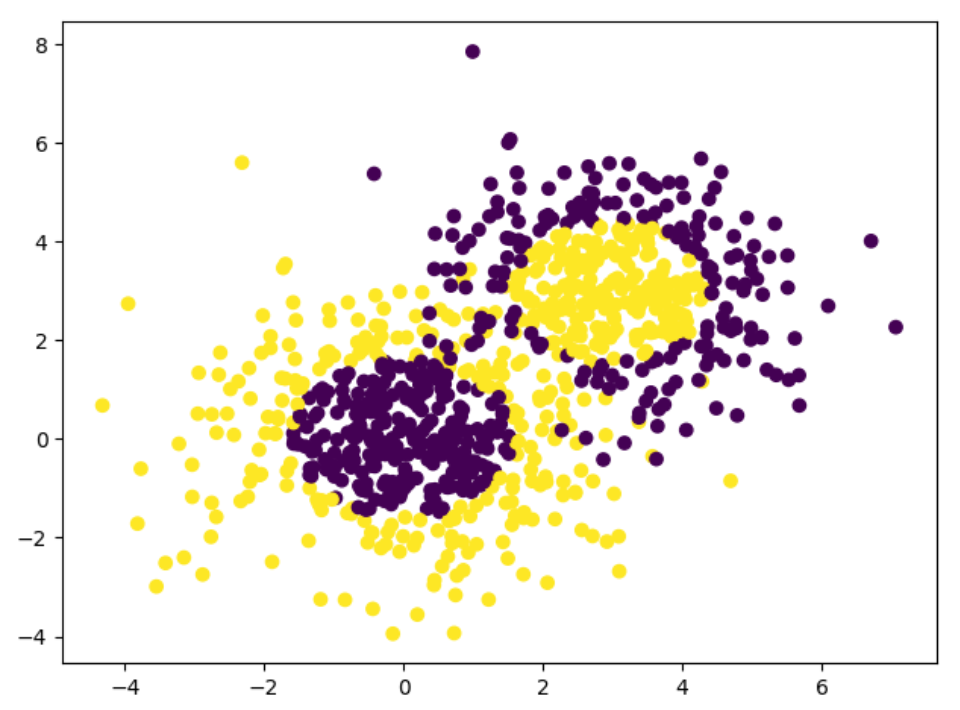
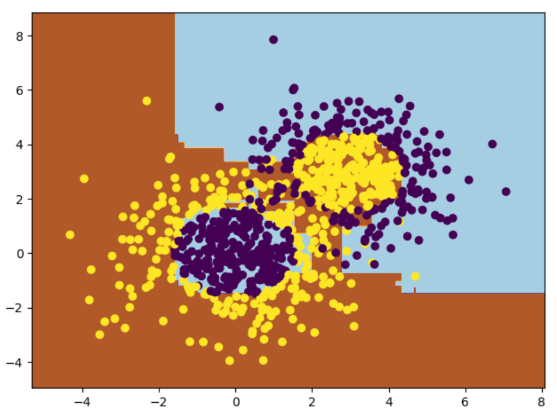

### 1.Adaboost简介

**Adaptive boosting(自适应增强)**是一种迭代算法，其核心思想是针对同一个训练集训练不同的弱分类器，然后把这些弱分类器集合起来，构成一个强分类器，Adaboost可处理分类和回归问题。了解Adaboost算法之前，我们先学习下**Boost(增强)**和**Adaptive(自适应)**的概念。

#### 1.1集成学习之Boosting

集成学习不是单独的机器学习方法，而是通过构建并结合多个机器学习器来完成任务，集成学习可以用于分类问题集成、回归问题集成、特征选取集成、异常点检测集成等方面。其思想是对于训练数据集，我们通过训练若干个个体学习器，通过一定的结合策略形成一个强学习器，以达到博采众长的目的。在[机器学习之随机森林](https://mp.weixin.qq.com/s?__biz=MzU3MjA2NTQzMw==&mid=2247483845&idx=1&sn=5484385408d694ba03a8bdc3a03c2263&chksm=fcd7d233cba05b25b0f65289f8416466df9124b019b60704b4e3875d9864ff90e3388c666f66#rd)中我们已经用到集成学习中的bagging方法，此处我们详细介绍集成学习中的Boosting方法。


从上图可以看出，Boosting算法的工作机制是从训练集用初始权重训练出一个弱学习器1，根据弱学习器的学习误差率来更新训练样本的权重，使得之前弱学习器1中学习误差率高的训练样本点权重变高。然后这些误差率高的点在弱学习器2中得到更高的重视，利用调整权重后的训练集来训练弱学习器2。如此重复进行，直到弱学习器数达到事先指定的数目T，最终将这T个弱学习器通过集合策略进行整合，得到最终的强学习器。

#### 1.2Adaptive自适应

**Adaptive(自适应)**体现在前一个基本分类器分错的样本会得到加强，加权后的全体样本再次被用来训练下一个基本分类器。同时在每一轮中加入一个新的弱分类器，直到得到某个预定的足够小的错误率或达到预定的最大迭代次数。

#### 1.3Adaboost流程

结合**Adaptive(自适应)**和**Boost(增强)**概念，我们来具体介绍下**Adaboost**迭代算法流程。

+ 初始化训练数据的权值分布。如果有N个样本，则每一个训练样本最开始都被赋予相同的权值1/N。
+ 训练弱分类器。训练过程中，如果某个样本点已经被准确的分类，那么在构造下一个训练集中，他的权值会被降低。相反，如果某个样本点没有被准确分类，那么它的权值就会得到提高。权值更新过的样本集会被用于训练下一个分类器，整个训练过程如此迭代的进行下去。
+ 多个弱分类器组合成强分类器。各个弱分类器的训练过程结束后，增加分类误差率小的弱分类器的权重，使其在最终的分类函数中起着较大的决定作用；而降低分类误差率大的弱分类器的权重，使其在最终的分类函数中起着较小的决定作用。

那么我们便要思考，**如何计算学习误差率e？**,**如何得到弱学习器权重系数α?** ,**如何更新样本权重D？**,**使用哪种结合策略？**我们将在Adaboost分类和回归算法中给出详细解答。

### 2.Adaboost分类算法

假设我们的训练样本为
$$
T=\{ (x_1,y_1) , (x_2,y_2),…, (x_m,y_m)\}
$$
训练集在第k个弱学习器的输出权重为
$$
D(k)=(w_{k1},w_{k2},w_{k3},...,w_{km});\ w_{1i}=\frac{1}{m};\ i=1,2,3,...,m
$$
Adaboost分类算法中包含二元分类和多元分类问题，多元分类问题为二元分类的推广。为方便推导，此处我们假设是二元分类问题，输出类别为{-1,1}。那么第k个弱分类器Gk(x)在训练集上的**学习误差率**为
$$
e_k=P(G_k(x_i)\neq y_i)=\sum_{i=1}^{m}w_{ki},I(G_k(x_i)\neq y_i)
$$
对于二元分类问题，第k个**弱分类器Gk(x)的权重系数**为
$$
\alpha_k=\frac{1}{2}log\frac{1-e_k}{e_k}
$$
从上式可以看出，如果分类误差率ek越大，则对应的弱分类器权重系数αk越小。也就是说，误差率越大的弱分类器权重系数越小。

假设第k个弱分类器的样本集权重系数为D(k)=(wk1,wk2,…,wkm)，则**更新后的第k+1个弱分类器的样本集权重系数**如下所示，此处Zk是规范化因子。
$$
w_{k+1,i}=\frac{w_{ki}}{Z_k}exp(-\alpha_k y_i G_k(x_i))
$$

$$
Z_k=\sum_{i=1}^{m}w_{ki}exp(-\alpha_ky_iG_k(x_i))
$$

从wk+1,i计算公式可以看出，如果第i个样本分类错误，则yiGk(xi)<0，导致样本的权重在第k+1个弱分类器中增大。如果分类正确，则权重在第k+1个弱分类器中减少。具体为什么选择上述**权重系数**和**样本权重更新**公式，我们在下面讲**Adaboost损失函数**时会详细介绍。

最后Adaboost分类问题采用**加权平均法结合策略**，最终的强分类器为
$$
f(x)=sign(\sum_{k=1}^{K}\alpha_k G_k(x))
$$
对于**Adaboost多元分类算法**，其实原理和二元分类类似，最主要区别在弱分类器的系数上。比如Adaboost SAMME算法，它的弱分类器的系数如下所示，其中R为类别数。从下式可以看出，如果是二元分类(R=2)，则下式和上述二元分类算法中的弱分类器的系数一致。
$$
\alpha_k=\frac{1}{2}log\frac{1-e_k}{e_k}+log(R-1)
$$

### 3.Adaboost回归算法

假设我们的训练样本为
$$
T=\{ (x_1,y_1) , (x_2,y_2),…, (x_m,y_m)\}
$$
训练集在第k个弱学习器的输出权重为
$$
D(k)=(w_{k1},w_{k2},w_{k3},...,w_{km});\ w_{1i}=\frac{1}{m};\ i=1,2,3,...,m
$$
我们先看回归问题中的误差率。对于第k个弱学习器，计算他在训练集上的最大误差
$$
E_k=max|y_i-G_k(x_i)|\ i=1,2,3,...,m
$$
然后计算每个样本的相对误差
$$
e_{ki}=\frac{|y_i-G_k(x_i)|}{E_k}
$$
上述公式是损失为线性的情况，如果我们采用平方误差或指数误差，则相对误差如下所示。
$$
e_{ki}=\frac{(y_i-G_k(x_i))^2}{E_k^2}
$$

$$
e_{ki}=1-exp(\frac{-y_i+G_k(x_i)}{E_k})
$$

最终得到第k个弱学习器的**学习误差率**
$$
e_k=\sum_{i=1}^{m}w_{ki}e_{ki}
$$
那么**弱学习器的权重系数**为
$$
\alpha_k=\frac{e_k}{1-e_k}
$$
然后**更新样本权重D**，第k+1个弱分类器的样本集权重系数如下所示，其中Zk为规范化因子。

$$
w_{k+1,i}=\frac{w_{ki}}{Z_k}\alpha _k^{1-e_ { ki } }
$$

$$
Z_k=\sum _{i=1}^{m}w_{ki}\alpha _k^{1-e_{ki}}
$$


最后Adaboost回归问题采用**加权平均法结合策略**，最终的强回归器为


$$
f(x)=\sum_{k=1}^{K}(ln\frac{1}{\alpha_k})G_k(x)
$$

### 4.Adaboost损失函数

上述我们介绍了Adaboost分类的弱学习器权重系数公式和样本权重更新公式，但并没具体解释公式来源，此处我们通过Adaboost损失函数来进行推导。Adaboost模型是**加法模型**，学习算法为**前向分布学习算法**，损失函数为指数函数。

+ **加法模型：**最终强分类器是若干个弱分类器加权平均得到。
+ **前向分布算法：**算法是通过一轮轮弱学习器得到，利用前一轮弱学习器的结果来更新后一个弱学习器的训练权重。

假设第k-1轮和第k轮强学习器为
$$
f_{k-1}(x)=\sum_{i=1}^{k-1}\alpha_i G_i(x)
$$

$$
f_k(x)=\sum_{i=1}^{k}\alpha_i G_i(x)
$$

因此我们可以得到
$$
f_k(x)=f_{k-1}(x)+\alpha_k G_k(x)
$$
可见强学习器是通过前向分布算法一步步得到。Adaboost损失函数为指数函数，即定义损失函数为
$$
\underset{\alpha ,G}{\underbrace{\arg\min}} \sum_{i=1}^{m}exp(-y_if_k(x))
$$
利用前向分布学习算法的关系可以得到损失函数为
$$
(\alpha_k,G_k(x))=\underset{\alpha ,G}{\underbrace{\arg\min}} \sum_{i=1}^{m}exp[(-y_i)(f_{k-1}(x)+\alpha_k G_k(x))]
$$
令${w}'_{ki}=exp(-y_if_{k-1}(x))$，它的值不依赖于$\alpha,G$而改变，仅仅依赖于$f_{k-1}(x)$，因此${w}'_{ki}$与最小化无关。将此式代入损失函数，损失函数转化为

$$
(\alpha_k,G_k(x))=\underset{\alpha ,G}{\underbrace{\arg\min}} \sum_{i=1}^{m}{w}'_{ki}exp[-y_i\alpha_k G_k(x))]
$$
首先我们求Gk(x)可以得到
$$
G_k(x)=\underset{G}{\underbrace{\arg\min}} \sum_{i=1}^{m}{w}'_{ki},I(y_i\neq G(x_i))
$$
将Gk(x)代入损失函数，并对α进行求导，使其等于0，于是我们得到
$$
\alpha_k=\frac{1}{2}log\frac{1-e_k}{e_k}\
$$
其中ek为我们前面介绍的**分类误差率**


$$
e_k=\frac{\sum_{i=1}^{m}{w}'_{ki},I(y_i\neq G(x_i))}{\sum_{i=1}^{m}{w}'_{ki}} \ \ \ \ \
$$
$$
=\sum_{i=1}^{m}w_{ki},I(y_i\neq G(x_i))
$$


最后利用$f_k(x)=f_{k-1}(x)+\alpha_k G_k(x)$、${w}'_{k,i}=exp(-y_if_{k-1}(x))$、${w}'_{k+1,i}=exp(-y_if_{k}(x))$，我们即可得到**样本权重的更新**。


$$
{w}'_{k+1,i}={w}'_{k,i}exp[-y_i\alpha_kG_k(x_i)]
$$

$$
{w}'_{k+1,i}=\frac{w_{k,i}}{Z_k}exp[-y_i\alpha_kG_k(x_i)]
$$

$$
Z_k=\sum_{i=1}^{m}w_{ki}exp(-\alpha_ky_iG_k(x_i))
$$

### 5.Adaboost算法正则化

为了防止Adaboost过拟合，通常也会加入正则化项，这个正则化项通常称为步长(learning rate)。定义为ν,对于前面的弱学习器的迭代
$$
f_k(x)=f_{k-1}(x)+\alpha_kG_k(x)
$$
如果我们加上正则化项，则有
$$
f_k(x)=f_{k-1}(x)+v\alpha_kG_k(x)
$$
v的取值为(0,1]。对于同样的训练集，较小的ν意味着我们需要更多的弱学习器的迭代次数。通常我们用步长和迭代最大次数一起来决定算法的拟合效果。

### 6.Sklearn实现Adaboost算法

我们经常需要通过改变参数来让模型达到更好的分类或回归结果，具体参数设置可参考[sklearn官方教程](http://scikit-learn.org/stable/modules/generated/sklearn.ensemble.AdaBoostClassifier.html)。

```python
import numpy as np
import matplotlib.pyplot as plt
from sklearn.ensemble import AdaBoostClassifier
from sklearn.tree import DecisionTreeClassifier
from sklearn.datasets import make_gaussian_quantiles

#生成二维正态分布，生成的数据分为两类，500个样本，2个样本特征，协方差系数为2
X1,y1=make_gaussian_quantiles(cov=2.0,n_samples=500,
                              n_features=2,n_classes=2,
                              random_state=1)
#生成二维正态分布，生成的数据分为两类，500个样本，2个样本特征，协方差系数为1.5
X2,y2=make_gaussian_quantiles(mean=(3,3),cov=1.5,
                              n_samples=400,n_features=2,
                              n_classes=2,random_state=1)
#将两组数据合为一组
X=np.concatenate((X1,X2))
y=np.concatenate((y1,-y2+1))

#绘画生成的数据点
plt.figure()
plt.scatter(X[:,0],X[:,1],marker='o',c=y)
plt.show()
```



```python
# 训练数据
clf=AdaBoostClassifier(DecisionTreeClassifier(
                       max_depth=2,min_samples_split=20,
                       min_samples_leaf=5),algorithm="SAMME",
                       n_estimators=200,learning_rate=0.8)
clf.fit(X,y)

#将训练结果绘画出来
plt.figure()
x_min, x_max = X[:, 0].min() - 1, X[:, 0].max() + 1
y_min, y_max = X[:, 1].min() - 1, X[:, 1].max() + 1
xx, yy = np.meshgrid(np.arange(x_min, x_max, 0.02),
                     np.arange(y_min, y_max, 0.02))
Z = clf.predict(np.c_[xx.ravel(), yy.ravel()])
Z = Z.reshape(xx.shape)
cs = plt.contourf(xx, yy, Z, cmap=plt.cm.Paired)
plt.scatter(X[:, 0], X[:, 1], marker='o', c=y)
plt.show()

#训练模型的得分
print(clf.score(X,y))
#0.913333333333
```



### 7.Adaboost算法优缺点

#### 7.1Adaboost优点

+ 不容易发生过拟合。
+ Adaboost是一种有很高精度的分类器。
+ 当使用简单分类器时，计算出的结果是可理解的。
+ 可以使用各种方法构建子分类器，Adaboost算法提供的是框架。


#### 7.2Adaboost缺点

+ 训练时间过长。
+ 执行效果依赖于弱分类器的选择。
+ 对样本敏感，异常样本在迭代中可能会获得较高的权重，影响最终的强学习器的预测准确性。

### 8.推广

更多内容请关注公众号**谓之小一**，若有疑问可在公众号后台提问，随时回答，欢迎关注，内容转载请注明出处。


文章参考

- [集成学习之Adaboost算法原理小结](https://www.cnblogs.com/pinard/p/6133937.html)