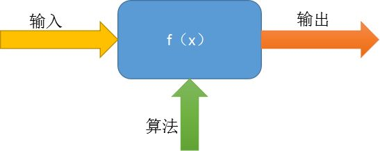
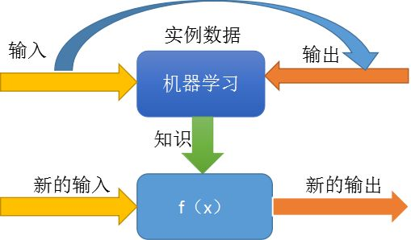
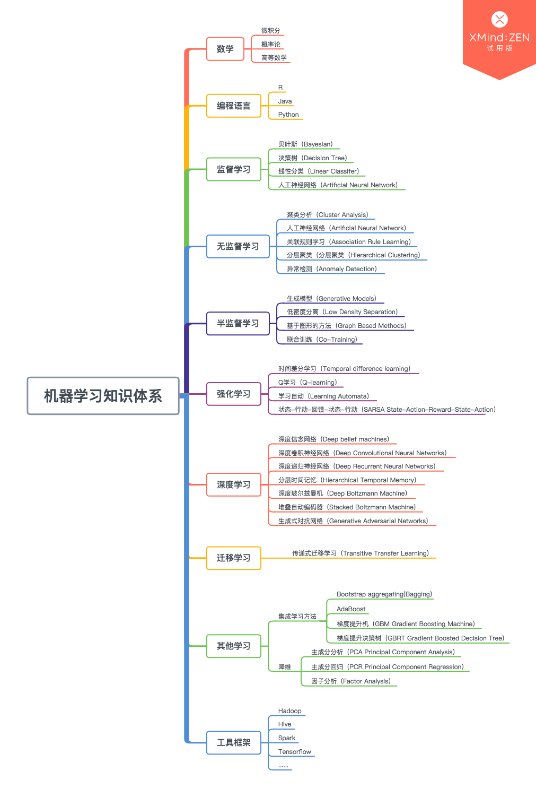
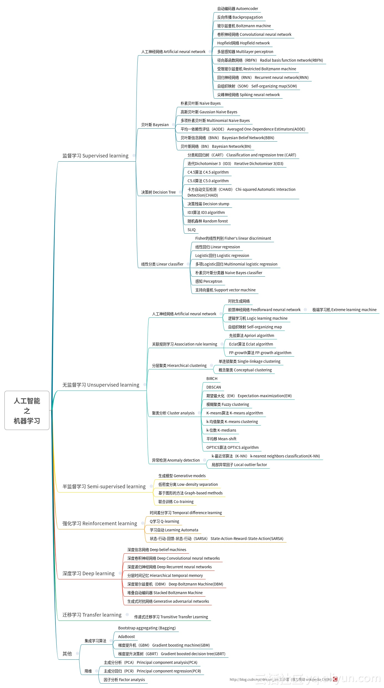

### 1.什么是机器学习

>机器学习（Machine Learning, ML）是一门多领域交叉学科，涉及概率论、统计学、逼近论、凸分析、算法复杂度理论等多门学科。专门研究计算机怎样模拟或实现人类的学习行为，以获取新的知识或技能，重新组织已有的知识结构使之不断改善自身的性能。

上述为**百度百科**定义，而在现实生活中，我们主要会碰到两类问题。一类是我们知道怎么去通过算法将输入转化为输出，通过学习此类模式得到相应输出结果。另一类是寻找不到此类模式，通过深度学习去做。

+ 给定一定的输入，通过施加一定条件或算法，得到最终的输出，类似于下图模式。

+ 以字符识别为例，输入的是手写数字图片，输出0-9字符串，我们并不知道怎么把输入转换成输出，因为手写体因人而异，随机性很大。换句话说就是我们缺的是知识如何映射，不过幸运的是我们有实例数据，而把这个知识通过机器学出来的过程叫做机器学习。

### 2.机器学习体系概括

机器学习包含多交叉学科，同时也在很多方面得到应用，如自然语言处理、图像处理、数据挖掘、推荐系统领域等。机器学习包含监督学习、无监督学习、半监督学习、强化学习、深度学习、迁移学习等，还有各种工具和框架的应用，因此Machine Learning的过程也是漫长而有趣的。

下图为开发者平台CSDN上王小雷整理的机器学习算法汇总，其中包含很多机器学习算法，知识体系较为庞大。目前个人已掌握知识点主要在监督学习、无监督学习、集成学习算法、降维方面，所以先给大家介绍这几类机器学习算法，半监督学习、强化学习、深度学习和迁移学习个人会继续学习。

机器学习算法中常用到的便是**监督学习**和**无监督学习**，监督学习包含**回归**和**分类**两方面，无监督学习为**聚类**。

**监督学习（Supervised Learning）**

当你有一些问题和他们的答案时，你要做的有监督学习就是学习这些已经知道答案的问题，当你具备此类学习的经验时，便是学习的成果。然后当你接受到一个新的此类问题时，便可通过学习得到的经验，得出新问题的答案。当我们有一些样本数据集时，对于每个单一的数据根据他的特征向量我们要去判断他的标签，那么就是监督学习。监督学习分为**回归分析（Regression Analysis）**和**分类（Classification）**两类。

+ **回归分析（Regression Analysis）**：其数据集是给定一个函数和他的一些坐标点，然后通过回归分析的算法，来估计原函数的模型，求得最符合这些数据集的函数解析式。然后我们就可以用来预估未知数据，输入一个自变量便会根据这个模型解析式输出因变量，这些自变量就是特征向量，因变量即为标签，而且标签的值是建立在连续范围的。
+ **分类（Classfication）**：其数据集由特征变量和标签组成，当你学习这些数据之后，给你一个只知道特征向量不知道标签的数据，让你求他的标签是哪一个？分类和回归的主要区别就是输出结果是连续还是离散。

**无监督学习（Unsupervised Learning）**

我们有一些问题，但是不知道答案，我们要做的无监督学习就是按照他们的性质把他们自动地分成很多组，每组的问题是具有类似性质的（比如数学问题会聚集在一组，英语问题聚集在一组……）。

所有的数据只有特征向量没有标签，但是可以发现这些数据呈现出聚群的结构，本质是相似的类型会聚集在一起。把这些没有标签的数据分成各个组合便是聚类。比如每天都会搜到大量新闻，然后把它们全部聚类，就会自动分成几十个不同的组（比如娱乐、科技、政治…），每个组内新闻都具有相似的内容结构。

### 3.如何开始学习

开始机器学习之前必须要有一定的数学知识，因为各算法之中涉及很多公式推导，用到的主要数学知识点为微积分、概率论、大学中高等数学知识点，忘记的同学可以在学习算法的过程中复习下。另外我们还需要掌握一门编程语言，这里推荐大家学习Python，为什么选择Python在这儿也就不讨论了，知乎平台上有很多介绍。

很好，我们掌握一门编程语言和数学知识之后便可开始Machine Learning，此过程中将使用相应Python标准库和第三方库，大家可以参考我以前写的文章，Python之NumPy使用教程、Python之Pandas使用教程、Python之MatPlotLib使用教程。中间过程中如涉及到其他Python库的使用，会及时写出相应教程。接下来一段时间将持续更新各种机器学习算法，包括线性回归、Logistic回归、支持向量机SVM、决策树、EM等算法。

---

### 4.推广

更多内容请关注公众号’谓之小一’，若有疑问可在公众号后台提问，随时回答，欢迎关注，内容转载请注明出处。

