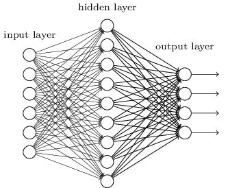
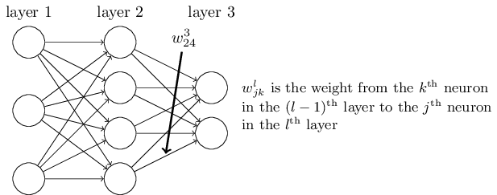
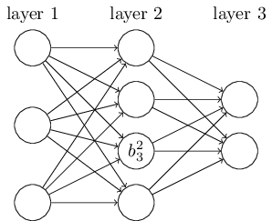

### 1.深度神经网络简介

**深度神经网络(Deep Neural Networks,DNN)**从字面上理解，也就是深层次的神经网络，从网络结构上看来就是有多个隐含层的神经网络。深度神经网络不仅能够用于分类和回归，在降维、聚类、语音识别、图像识别方面也有许多应用。由于神经网络内容较多，将分多次写作，本次主要讲解深度神经网络中的前向传播算法，后续还有反向传播算法、损失函数和激活函数、正则化。

### 2.从感知机到神经网络

在[机器学习之Logistic回归](https://mp.weixin.qq.com/s?__biz=MzU3MjA2NTQzMw==&mid=2247483814&idx=1&sn=16a56382d24e304a95ab2a2a028993c6&chksm=fcd7d250cba05b46e16e5db30a85965878d051a17517b90c27f3206d23c6f3784c4e363f06eb#rd)之中，我们利用过感知机的模型。如下图所示，也就是有若干个输入和一个输出的感知机模型。

感知机通过输入和输出学习得到一个线性模型，得到中间输出结果z。然后利用激活函数，从而得到我们希望的结果，例如1或-1。
$$
z=\sum _{i=1}^{m}w_i x_i +b
$$
$$
sign(z)=\left\{\begin{matrix}
-1 & z<0 \\ 
 1 & z \ge0 
\end{matrix}\right.
$$
上述模型只能用于二元分类，且无法学习比较复杂的非线形模型。而神经网络则是在感知机的模型上做扩展，主要增加以下三点。

+ **增加隐含层：**如下图所示，隐含层可以有多层，增加模型的表达能力。当然隐含层增加，模型的复杂度也就会增加。

+ **输出层的神经元可以有多个输出：**这样模型便能够灵活的应用于分类和回归，以及其他的机器学习领域，比如降维和聚类。如下图所示，输出层有4个神经元。

  

+ **扩展激活函数：**感知机的激活函数sign(z)处理能力有限，因此神经网络一般使用其他激活函数，比如我们在[逻辑回归](https://mp.weixin.qq.com/s?__biz=MzU3MjA2NTQzMw==&mid=2247483814&idx=1&sn=16a56382d24e304a95ab2a2a028993c6&chksm=fcd7d250cba05b46e16e5db30a85965878d051a17517b90c27f3206d23c6f3784c4e363f06eb#rd)里面使用的Sigmoid函数。当然还有tanx,softmax,ReLU等激活函数，通过使用不同的激活函数，神经网络的表达能力也就不同，对于各种常用的激活函数，我们在后面会进行专门介绍。

$$
f(z)=\frac{1}{1+e^{-z}}
$$

### 3.DNN基本结构

从DNN按照不同层的位置来划分，DNN内部的神经网络层可以分为三类，分别是输入层、隐含层、输出层。如下图所示，一般来说第一层是输入层，最后一层是输出层，而中间的层数都是隐含层。

DNN的层与层之间是全连接的，也就是说，第i层的任意一个神经元一定与第i+1层的任意一个神经元相连。虽然DNN看起来复杂，但是从局部模型来说，还是和感知机相同，即线性关系z加上激活函数σ(z)。由于DNN层数较多，那么线性关系系数w和偏移量b也就很多。但具体的参数在DNN之中如何定义呢？

首先我们来看看线性关系系数$w$的定义。以上述的三层DNN为例，第二层的第4个神经元到第三层的第2个神经元的线性系数定义为$w^{3}_{24}$。上标3代表线性系数$w$所在的层数，而下标对应的是输出的第三层的第2个神经元和输入的第二层的第4个神经元。

但是，为什么我们不用更方便的$w^{3}_{42}$表示，即输入的第二层的第4个神经元和输出的第三层的第2个神经元，而是用$w^{3}_{24}$表示呢？这样做的目的主要是为了方便矩阵运算，如果是$w^{3}_{42}$的话，那么每次运行的都是$w^Tx+b$，需要进行矩阵转置。将输出的索引放在前面的话，线性运算则不需要转置，直接运算$wx+b$即可。总结下也就是，第$l-1$层的第$k$个神经元到第$l$层的第$j$个神经元的线形系数为$w^{l}_{jk}$。

再来看偏倚量b的定义。以上述的三层DNN为例，第二层的第三个神经元对应的偏移量定义为$b^2_3$。其中上标2代表所在的层数，下标3代表所在神经元的索引。总结下也就是第$l$层的第$j$个神经元的偏倚量为$b^l_j$。

### 4.DNN前向传播算法的数学原理

我们已经了解DNN中线性关系系数w和偏倚量b的定义。现在假设选择的激活函数是σ(z)，隐含层和输出层的输出值为a。则对于下述的三层DNN，我们利用和感知机一样的思路，将上一层的输出当作下一层的输入，然后计算下一层的输出，重复下去，也就是DNN的前向传播算法。

对于第二层的输出$a^2_1,a^2_2,a^2_3$，我们能够得到
$$
a^2_1=\sigma(z^2_1)=\sigma(w^2_{11}x_1+w^2_{12}x_2+w^2_{13}x_3+b^2_1)
$$

$$
a^2_2=\sigma(z^2_2)=\sigma(w^2_{21}x_1+w^2_{22}x_2+w^2_{23}x_3+b^2_2)
$$

$$
a^2_3=\sigma(z^2_3)=\sigma(w^2_{31}x_1+w^2_{32}x_2+w^2_{33}x_3+b^2_3)
$$

对与第三层的输出$a^3_1$，我们有
$$
a^3_1=\sigma(z^3_1)=\sigma(w^3_{11}a^2_1+w^3_{12}a^2_2+w^3_{13}a^2_3+b^3_1)
$$
将上面的例子一般化，假设第$l-1$层共有$m$个神经元，则对于第$l$层的第$j$个神经元的输出$a^l_j$如下所示。另外，如果l=2，则对于$a^1_k$即为输入层的$x_k$。
$$
a^l_j=\sigma(z^l_j)=\sigma(\sum _{k=1}^{m} w^l_{jk}a^{l-1}_k+b^l_j)
$$
从上面可以看出，使用代数法表示运算比较复杂，因此我们使用比较简洁的矩阵表示。假设第$l-1$层共有m个神经元，而第$l$层共有$n$个神经元，则第$l$层的线性系数$w$组成一个$n\ast m$的矩阵$W^l$，第$l$层的偏倚$b$组成一个$n*1$的向量$b^l$。

第$l-1$层的输出$a$组成一个$m\ast 1$的向量$a^{l-1}$，第$l$层未激活前线性输出$z$组成一个$n\ast 1$的向量$z^l$，第$l$层的输出$a$组成了一个$n*1$的向量$a^l$。用矩阵法进行表示，第$l$层输出为
$$
a^l=\sigma(z^l)=\sigma(W^l a{^{l-1}}+b^l)
$$

### 5.DNN前向传播算法

DNN前向传播算法也就是利用若干个权重系数矩阵W，偏倚向量$b$，输入值向量x进行一系列线形运算和激活运算。从输入层开始，一层层的向后进行运算，直到运算到输出层，得到输出结果为止。

输入：隐含层和输出层对应的矩阵$W$，偏倚向量$b$，输入值向量$x$，层数$L$。

输出：输出层结果$a^L$。

+ 初始化$a^1=x$
+ $for \ l = 2\  to \ L$

$$
a^l=\sigma(z^l)=\sigma(W^l a{^{l-1}}+b^l)
$$

单独看DNN前向传播算法，通过运算之后，得到的结果并没有什么意义，误差似乎特别大。而且怎么得到初始的矩阵W,偏倚向量b，最优的矩阵W,偏倚向量b呢？下篇文章将通过深度神经网络之反向传播算法来解决这些问题。

参考

> [刘建平Pinard_深度神经网络（DNN）模型与前向传播算法](http://www.cnblogs.com/pinard/p/6418668.html)

### 6.推广

更多内容请关注公众号**谓之小一**，若有疑问可在公众号后台提问，随时回答，欢迎关注，内容转载请注明出处。

