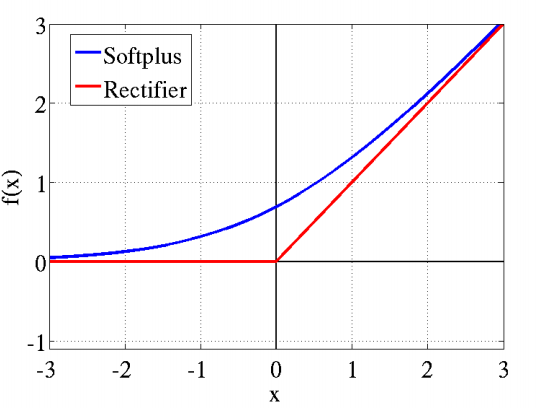

### 1.损失函数和激活函数简介

通过前面[深度神经网络之前向传播算法](https://mp.weixin.qq.com/s?__biz=MzU3MjA2NTQzMw==&mid=2247483903&idx=1&sn=4e3f92578399013eba9f203d35afe972&chksm=fcd7d209cba05b1ffc66494ea8008c669e40f3045398695b479aba14e1c425f85b7c8f033c4f&scene=38#wechat_redirect)和[深度神经网络之反向传播算法](https://mp.weixin.qq.com/s?__biz=MzU3MjA2NTQzMw==&mid=2247483911&idx=1&sn=bcc0fe6a4a0c20a422f254b3264a5fb8&chksm=fcd7d1f1cba058e7bddefb3d47ba6f87879663c15a5cea5c6653138d0fb1aa9d3454e2ea605a&scene=38#wechat_redirect)的学习，我们能够了解到损失函数是用来评估模型的预测值与真实值之间的差异程度。另外损失函数也是神经网络中优化的目标函数，神经网络训练或者优化的过程就是最小化损失函数的过程，损失函数越小，说明模型的预测值就越接近真实值，模型的准确性也就越好。前面我们已经学习过**平方损失函数**，**对数损失函数**、**交叉熵损失函数**等不同形式的损失函数，这里也就不做太多介绍。

那么在深度神经网络之中，激活函数的作用又是什么呢？首先我们来看单层感知机模型，如下图所示，感知机可以利用分割线将平面分割开来。

现在我们利用多个感知机进行组合，获得更强的分类能力，模型分类效果如下图所示。

但无论怎样组合，模型输出的时候都只是线性模型，如何解决非线性分类呢？好吧，上面是我们没有增加激活函数的情况。那么现在我们在每一层迭代完之后，增加一个激活函数，如下图的y=σ(a)所示，这样模型的输出便能解决非线性情况。将多个有激活函数的神经元组合起来，我们就可以得到一个相当复杂的函数。

引入非线性激活函数之中，模型的表达能力增强，能够有效解决非线性情况。通过不同形式的激活函数，模型也就能够学习到不同形式的分类方式，比如**平滑分类平面**，方面我们解决各种问题。

通过上面的介绍，我们能够了解到神经网络之中损失函数和激活函数的作用，但实际上DNN可以使用的损失函数和激活函数有不少，这时我们应该如何去做选择呢？下面我们介绍一些DNN之中常见的损失函数和激活函数。

### 2.交叉熵损失函数和Sigmoid激活函数

在[深度神经网络之反向传播算法](https://mp.weixin.qq.com/s?__biz=MzU3MjA2NTQzMw==&mid=2247483911&idx=1&sn=bcc0fe6a4a0c20a422f254b3264a5fb8&chksm=fcd7d1f1cba058e7bddefb3d47ba6f87879663c15a5cea5c6653138d0fb1aa9d3454e2ea605a&scene=38#wechat_redirect)之中，我们用的是均方差损失函数和Sigmoid激活函数，首先我们看看**均方差损失函数和Sigmoid激活函数**有什么问题。如下所示，是我们已经非常熟悉的Sigmoid激活函数表达式
$$
\sigma(z)=\frac{1}{1+e^{-z}}
$$
其中σ(z)的图像如下图所示，从图中可以看出，当z越来越大时，函数曲线也就变得越平缓，意味着此时导数σ′(z)也越小。同样，当z越来越小时，也会出现σ′(z)也越小。仅仅当z取值为0的附近时，导数σ′(z)取值较大。

在[深度神经网络之反向传播算法](https://mp.weixin.qq.com/s?__biz=MzU3MjA2NTQzMw==&mid=2247483911&idx=1&sn=bcc0fe6a4a0c20a422f254b3264a5fb8&chksm=fcd7d1f1cba058e7bddefb3d47ba6f87879663c15a5cea5c6653138d0fb1aa9d3454e2ea605a&scene=38#wechat_redirect)之中，我们了解到每次反向迭代递推时，都要乘以σ′(z)得到梯度变化值。而Sigmoid的曲线意味着在大多数时候，DNN的梯度变化值较小，则会导致W,b更新到极值的速度很慢。那么有什么办法可以改变这种情况呢？

常见的方法是选用交叉熵损失函数来代替均方差损失函数，首先来看看交叉熵损失函数的形式。其中 **∙** 为向量内积，我们在[机器学习之Logistic回归](https://mp.weixin.qq.com/s?__biz=MzU3MjA2NTQzMw==&mid=2247483814&idx=1&sn=16a56382d24e304a95ab2a2a028993c6&chksm=fcd7d250cba05b46e16e5db30a85965878d051a17517b90c27f3206d23c6f3784c4e363f06eb#rd)中便用到类似的交叉熵损失函数形式。
$$
J(W,b,a,y)=-y \cdot lna-(1-y)\cdot ln(1-a)
$$
然后应用交叉熵损失函数之后，输出层 $\delta ^L$的梯度变化情况如下所示。
$$
\delta^L=\frac{J(W,b,a^L,y)}{\partial z^L}=-y\frac{1}{a^L}(1-a^L)+(1-y)\frac{1}{1-a^L}a^L(1-a^L)
$$

$$
=-y(1-a^L)+(1-y)a^L=a^L-y
$$

使用交叉熵损失函数与[深度神经网络之反向传播算法](https://mp.weixin.qq.com/s?__biz=MzU3MjA2NTQzMw==&mid=2247483911&idx=1&sn=bcc0fe6a4a0c20a422f254b3264a5fb8&chksm=fcd7d1f1cba058e7bddefb3d47ba6f87879663c15a5cea5c6653138d0fb1aa9d3454e2ea605a&scene=38#wechat_redirect)中使用均方差损失函数的$\delta^L$有什么区别呢？我们发现使用均方差损失函数时$\delta^L=(a^L-y)\odot {\sigma}'(z)$，对比发现使用交叉熵损失函数没有${\sigma}'(z)$。这样求得的$w^l,b^l$便不包含${\sigma}'(z)$，因此避免了反向传播收敛速度慢的问题。通常情况下，使用Sigmoid激活函数时，交叉熵损失函数比均方差损失函数好用。

### 3.对数似然损失函数和softmax激活函数

前面我们假设模型的输出都是连续可导的值，但如果是分类问题，输出的是不同类别，那么怎么用DNN解决呢？比如我们有三个类别的分类问题，这样DNN输出层对应的便是三个神经元，每个神经元分别代表类别1、类别2、类别3，这样我们的期望输出应该是(1,0,0)、(0,1,0)、(0,0,1)，即样本真实类别对应的神经元输出应该无限接近或等于1。或者说，我们希望输出层的神经元对应的输出是若干个概率值，这若干个概率值即DNN模型对于输入值进行各类别的输出预测，同时这若干个概率之和为1。

很明显，现在普通DNN无法满足目前要求，我们需要作出相应改变，来让DNN分类模型输出层的输出值在0到1之间，同时所有输出值之和为1。为此，我们定义输出层第i个神经元的激活函数如下所示
$$
a_i^L=\frac{e^{z_i^L}}{\sum_{j=1}^{n_L}e^{z_j^L}}
$$
其中$n_L$为输出层的神经元个数，或者说分类问题的类别数。很容易看出，所有的$a_i^L$都是在(0,1)之间的数字，而$\sum_{j=1}^{n_L}e^{z_j^L}$保证所有的$a_i^L$之和为1。

下面我们通过例子来描述softmax激活函数在前向传播算法中的应用，假设输出层为三个神经元，未激活的输出为(3,1,-3)，求出各自的指数表达式为(20,2.7,0.05)，归一化后为22.75，求出三个类别的概率为(0.88,0.12,0)。

对于用作分类的softmax激活函数，对应的损失函数一般都是用对数似然函数，函数表达式如下所示。
$$
J(W,b,a^L,y)=-\sum_ky_klna_k^l
$$
其中$y_k$的取值为0或1，如果某一训练样本的输出为第i类，则$y_i=1$，其余的$j\neq i$都有$y_j=0$。由于每个样本只属于一个类别，所以对数似然函数简化为下式，其中i即为训练样本的类别序号。
$$
J(W,b,a^L,y)=-lna_i^L
$$
可见损失函数只是和真实类别对应的输出有关，这样假设真实类别是第i类，则其他不属于第i类序号对应的神经元梯度导数为0。对于真实类别第i类，所对应的梯度计算为
$$
\frac{\partial J(W,b,a^L,y)}{\partial W_i^L}=\frac{\partial J(W,b,a^L,y)}{\partial a_i^L}\frac{\partial a_i^L}{\partial z_i^L}\frac{\partial z_i^L}{\partial W_i^L}
$$

$$
=-\frac{1}{a_i^L}\frac{(e^{z_i^L})(\sum_{j=1}^{n_L}e^{z_j^L})-e^{z_i^L}e^{z_i^L}}{(\sum_{j=1}^{n_L}e^{z_j^L})^2}a_i^{L-1}=-\frac{1}{a_i^L}\{ \frac{e^{z_i^L}}{\sum_{j=1}^{n_L}e^{z_j^L}} -\frac{e^{z_i^L}}{\sum_{j=1}^{n_L}e^{z_j^L}}\frac{e^{z_i^L}}{\sum_{j=1}^{n_L}e^{z_j^L}} \}a_i^{L-1}
$$

$$
=-\frac{1}{a_i^L}a_i^L(1-a_i^L) a_i^{L-1}=(a_i^L-1)a_i^L
$$

$$
\frac{\partial J(W,b,a^L,y)}{\partial b_i^L}=a_i^L-1
$$

可见，梯度计算相对较简单，也不会出现前面训练速度慢的问题。同样对于上面的例子，经过softmax函数激活后的概率输出为(0.88,0.12,0)，对第二类训练样本反向传播时，反向传播梯度的偏倚向量为(0.88,0.12-1,0)。

### 4.DNN其他激活函数

#### 4.1 ReLU激活函数

ReLU(Rectified Linear Unit)表达式如下所示，也就是说，大于等于0则激活后不变，小于0则激活后为0。这个函数有什么意义呢？ReLU激活函数在梯度爆炸和梯度消失方面有重要应用。
$$
\sigma(z)=max(0,z)
$$
那什么是梯度爆炸和梯度消失呢？可以简单理解为，反向传播算法过程中，由于我们使用的是矩阵求导的链式法则，会有一系列连乘运算。如果连乘的数字在每层都是大于1的，则梯度越往前乘越大，最后导致梯度爆炸。同理，如果连乘的数字在每层都是小于1的，则梯度越往前乘越小，最后导致梯度消失。

例如在[深度神经网络之反向传播算法](https://mp.weixin.qq.com/s?__biz=MzU3MjA2NTQzMw==&mid=2247483911&idx=1&sn=bcc0fe6a4a0c20a422f254b3264a5fb8&chksm=fcd7d1f1cba058e7bddefb3d47ba6f87879663c15a5cea5c6653138d0fb1aa9d3454e2ea605a&scene=38#wechat_redirect)中介绍到的$\delta^l$的计算，表达式如下所示。如果每层$\frac{\partial z^{l+1}}{\partial z^{l}}$都小于1，则随着反向传播算法的进行，$\delta ^l$会越来越小，甚至接近于0，导致梯度消失。进而导致隐含层中的W,b参数随着迭代的进行，几乎没什么改变，更谈不上收敛。对于梯度爆炸和梯度消失问题，有很多解决方法，这里不做详细介绍，后续再专门写一篇文章进行讲解。
$$
\delta^l=\frac{\partial J(W,b,x,y)}{\partial z^l}=\frac{\partial J(W,b,x,y)}{\partial z^L}\frac{\partial z^L}{\partial z^{L-1}} \frac{\partial z^{L-1}}{\partial z^{L-2}}...\frac{\partial z^{l+1}}{\partial z^{l}}
$$

#### 4.2 Tanh激活函数

Tanh激活函数是Sigmoid函数的变种，Tanh表达式如下所示。Tanh和Sigmoid函数的不同点是Tanh函数的输出值落在[-1,1]之间，因此Tanh输出可以进行标准化。同时Tanh自变量变化较大时，曲线变得平坦的幅度没有Sigmoid那么大，这样求梯度变化值有一些优势。当然，是使用Tanh函数还是使用Sigmoid函数需要根据具体问题而定。
$$
tanh(z)=\frac{e^z-e^{-z}}{e^z+e^{-z}}
$$

$$
tanh(z)=2Sigmoid(2z)-1
$$

#### 4.3 Softplus激活函数

Softplus激活函数是Sigmoid函数的原函数，表达式如下所示，Softplus函数和ReLU函数图像类似。
$$
softplus(z)=log(1+e^z)
$$

#### 4.4 PReLU激活函数

PReLU激活函数是ReLU的变种，特点是如果激活值小于0，激活值不是简单的变为0，而是逐渐的变化。

和普通的机器学习算法一样，DNN也会遇到过拟合的问题，需要考虑泛化，下篇文章我们将进行讲解深度神经网络之中的正则化问题。

参考

> [知乎-神经网络激励函数的作用是什么？有没有形象的解释?-颜沁睿](https://www.zhihu.com/question/22334626/answer/21036590)
>
> [刘建平Pinard-深度神经网络(DNN)损失函数和激活函数的选择(BP)](https://www.cnblogs.com/pinard/p/6437495.html)

### 5.推广

更多内容请关注公众号**谓之小一**，若有疑问可在公众号后台提问，随时回答，欢迎关注，内容转载请注明出处。

