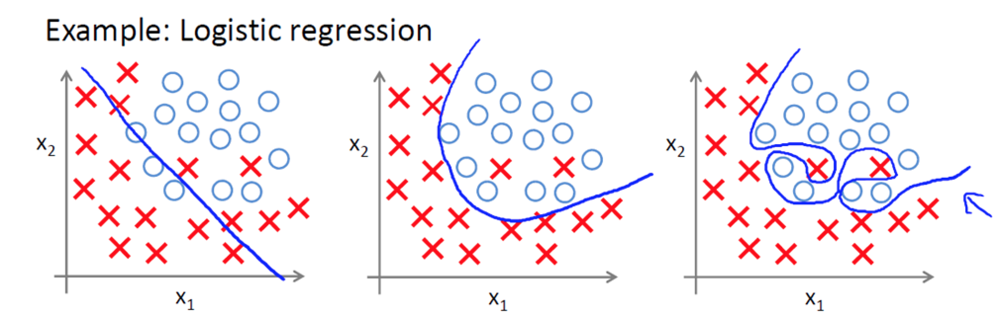
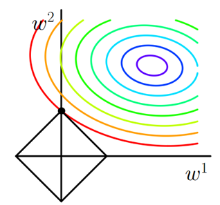
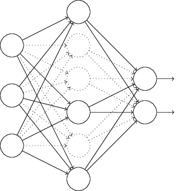

### 1.正则化

之前介绍的[文章](https://mp.weixin.qq.com/s/UeEL1rOdjMpaKqTFpclS3A)之中，我们已多次接触到正则化方法，但没有详细的解释为什么要正则化，什么是正则化，以及L1正则化和L2正则化的区别。本次文章之中，我们将详解机器学习中正则化的概念和深度神经网络中的正则化方法。

#### 1.1 为什么要正则化？

讲到为什么需要正则化，就需要了解什么是过拟合问题。以下面图片为例，我们能够看到有两个类别，其中以X代表男生，O代表女生。

我们想要通过学习来得到分类曲线，其中分类曲线能够有效区分男生和女生，现在来分析下上面的三种分类结果。

+ **欠拟合：**图1分类明显欠缺，有些男生被分为女生，有些女生被分为男生。
+ **正拟合：**图2虽然有两个男生被分类为女生，但能够理解，毕竟我们人类自己也有分类错误的情况，比如通过化妆，女装等方法。
+ **过拟合：**图3虽然能够全部分类正确，但结果全部正确就一定好吗？不一定，我们能够看到分类曲线明显过于复杂，模型学习的时候学习了过多的参数项，但其中某些参数项是无用的特征，比如**眼睛大小**。当我们进行识别测试集数据时，就需要提供更多的特征，如果测试集包含海量的数据，模型的时间复杂度可想而知。

#### 1.2 什么是正则化？

既然我们已经知道什么是过拟合，那么怎么解决过拟合问题呢？上面有介绍到，模型出现过拟合，是在模型**特征**上过于复杂。而特征又包含在我们的目标函数f(x)之中，那么只能从目标函数f(x)中寻找解决问题的方法。假设目标函数f(x)和损失函数J0为
$$
f(X)=w_0x_0+w_1x_1+w_2x_3+...+w_nx_n
$$

$$
J_0=||f(x)-y||_2^2=||XW-y||^2_2
$$

对于上式，如果特征项$x_0,x_1,x_2,...,x_n$越多的话，自然$w_0,w_1,w_2,...,w_n$也就越多。想要减少特征的数量，自然减小**N**也就好了。而N影响的是$X=(x_0,x_1,x_2,...,x_n)$和$W=(w_0,w_1,w_2,...,w_n)$两项，那么是从**X**解决问题还是从**W**解决问题呢？

如果从**X**入手解决问题，但训练过程中我们不知道下一个样本X是什么，会怎样的影响目标函数，所以此路不通。那么**W**如何呢？我们知道W系数是训练过程中通过学习历史数据得到的，和历史数据有关，所以应该可以。现在再回到我们原来的问题，希望减少N的数目，而让N最小化，其实就是让X向量或W向量中项的个数最小化，既然X不行，那么我们可以尝试让W向量中项的个数最小化。如何求解才能让W向量中项的个数最小，我们先简单介绍下0、1、2范数的概念。

+ **L0范数：**向量中非零元素的个数，记为$||W||_0$。
+ **L1范数：**绝对值之和，记为$||W||_1$。
+ **L2范数：**通常意义上的模，记为$||W||_2$。

所以为了防止过拟合，我们需要让$||W||_0$最小，同时让损失函数$J_0$最小，为了满足两项最小化，可以让$J_0$和$||W||_0$之和最小化。但因为$||W||_0$比较难求(NP难问题)，我们进而可以转化为求$||W||_1$。$||W||_1$是$||W||_0$的最优凸近似，都可以实现**稀疏**，比较容易求解，这也是为什么可以选用$||W||_1$的原因。最后损失函数后面添加的额外项$||W||_1$，也就是我们称作的L1正则化，$\alpha$含义在后面进行讲解。
$$
J=J_0+L1=||XW-y||^2_2+\alpha||W||_1
$$
说完L0范数和L1范数，就不得不提L2范数。L2范数是指先求向量各元素的平方和，然后再进行求平方根，也就是通常意义上的模。同样，对于正则化问题，我们的目标是让W向量中的每个元素都很小，也就是让L2范数最小。L1范数和L2范数的不同点在于，L1范数会让其中某些元素等于0，而L2范数只是让其中元素接近0，这里有很大不同，我们在后面会进行详细讲解。最后损失函数后面添加的额外项||W||2，也就是我们称作的L2正则化。
$$
J=J_0+L2=||XW-y||^2_2+\alpha ||W||_2
$$

#### 1.3 L1正则化和L2正则化

**L1正则化**可以产生稀疏值矩阵，即产生一个稀疏模型，可以用于特征选择和解决过拟合。那什么是稀疏值矩阵呢？稀疏矩阵是矩阵中很多元素为0，只有少数元素是非零值的矩阵，稀疏矩阵的好处就是能够帮助模型找到重要特征，而去掉无用特征或影响甚小的特征。

比如在分类或预测时，很多特征难以选择，如果代入稀疏矩阵，能够筛选出少数对目标函数有贡献的特征，去掉绝大部分贡献很小或没有贡献的特征(因为稀疏矩阵很多值是0或是很小值)。因此我们只需要关注系数是非零值的特征，从而达到特征选择和解决过拟合的问题。那么为什么L1正则化可以产生稀疏模型呢？

假如带有L1正则化的损失函数方程如下所示，其中$J_0$是原始损失函数，$\alpha \sum_{w}|w|$是正则化项，$\alpha$是正则化系数。根据1.2节的介绍，可以采用一定的方法，比如梯度下降法，求出在L1的约束下$J_0$的最小值。
$$
J=J_0+L_1=J_0+\alpha \sum_{w}|w|
$$
以上述损失函数为例，我们考虑二维的情况，即只有两个权值$w_1$和$w_2$，此时$L1=\alpha(|w|_1+|w|_2)$。对于梯度下降法，求解$J_0$的过程，可以画出如下的等值线。同时L1正则化函数也可以在$w_1,w_2$二维平面上表示出来，即黑色直线所围成的菱形。

从上图可以看出，当J0等值线与L1图形首次相交的点就是最优解，也就是上图中的(0,w)。而对于L1函数有许多突出的点(二维情况下是4个)，J0函数与这些顶点接触的概率远大于与L1其他部分接触的概率，恰好在这些顶点上会有很多权值等于0，这就是为什么L1正则化可以产生稀疏模型，进而可以用于特征选择。最后针对L1正则化再介绍下系数α，其目的是控制L1图形的大小。当α越小，L1的图形越大，α越大，L1图形也就越小。L1图形可以小到在原点附近，这也就是为什么w可以取到很小的原因。

另外**L2正则化**也可以很好的解决过拟合问题。从上面得知，拟合过程中通常都倾向于让权值尽可能小，最后构造出一个让所有参数都比较小的模型。因为一般认为参数值小的模型比较简单，能够适应于不同的数据集，比如对于目标方程，若参数很大，那么数据只要偏倚一点点，那么对结果的影响就很大。如果参数很小的话，即使数据变化范围比较大，对结果影响也不是很大。相对来说，参数较小的话，对模型的抗扰动能力强。那么为什么L2正则化可以获得很小的参数值呢？我们假设带有L2正则化的损失函数方程如下所示，并对损失函数进行求导。
$$
J=J_0+L_2=J_0+\frac{\lambda}{2n}\sum_{w}w^2
$$

$$
\frac{\partial J}{\partial w}=\frac{\partial J_0}{\partial w}+\frac{\lambda}{n}w
$$

$$
\frac{\partial J}{\partial b}=\frac{\partial J_0}{\partial n}
$$

当利用梯度下降算法进行更新w时，w变化如下所示，其中α是学习速率。
$$
w\rightarrow w-\alpha \frac{\partial J_0}{\partial w}-\frac{\alpha \lambda}{n}w
$$

$$
=(1-\frac{\alpha \lambda}{n})w-\alpha\frac{\partial J_0}{\partial w}
$$

可以看到在梯度下降算法过程中，w是不断进行减小的，也就是权重衰减，这样也就能得到一个让所有参数都比较小的模型，也就能解决过拟合问题。最后再解释下为什么L2正则化不具有稀疏性的原因，如下图所示，二维平面下L2正则化的函数图形是圆，与L1图形相比，没有了菱角。因此J0与L2接触时，使w1或w2等于0的机率就小了很多，所以L2正则化不具有稀疏性。

### 2.DNN之L1和L2正则化

和普通机器学习算法一样，DNN也会遇到过拟合的问题，因此需要考虑泛化。结合我们上面讲到的L1和L2正则化，这里对深度神经网络中的正则化做个总结，其中L1正则化和L2正则化原理类似，这里主要介绍L2正则化方法。通过[深度神经网络之前向传播算法](https://mp.weixin.qq.com/s?__biz=MzU3MjA2NTQzMw==&mid=2247483903&idx=1&sn=4e3f92578399013eba9f203d35afe972&chksm=fcd7d209cba05b1ffc66494ea8008c669e40f3045398695b479aba14e1c425f85b7c8f033c4f#rd)的学习，我们知道前向传播过程中损失函数为
$$
J(W,b)=\frac{1}{2m}\sum _{i=1}^{m}||a^L-y||_2^2
$$
加入L2正则化后，损失函数如下所示。其中λ是正则化参数，实际使用时需要我们进行调参。
$$
J(W,b)=\frac{1}{2m}\sum _{i=1}^{m}||a^L-y||_2^2+\frac{\lambda}{2m}\sum_{l=2}^{L}||w||_2^2
$$
如果使用上式的损失函数，进行反向传播算法时，流程和没有正则化时的反向传播算法相同。区别在于进行梯度下降时，W更新公式会进行改变。在[深度神经网络之反向传播算法](https://mp.weixin.qq.com/s?__biz=MzU3MjA2NTQzMw==&mid=2247483911&idx=1&sn=bcc0fe6a4a0c20a422f254b3264a5fb8&chksm=fcd7d1f1cba058e7bddefb3d47ba6f87879663c15a5cea5c6653138d0fb1aa9d3454e2ea605a#rd)中，W的梯度下降更新公式为
$$
W^l=W^l-\alpha \sum_{i=1}^{m} \delta^{i,l}(a^{x,l-1})^T
$$
加入L2正则化后，W迭代更新公式如下所示
$$
W^l=W^l-\alpha \sum_{i=1}^{m} \delta^{i,l}(a^{x,l-1})^T-\frac{\alpha }{m}\lambda W^l
$$
类似的正则化方法，同样可以用于其他损失函数，在这里不再介绍。

### 3.DNN之Dropout正则化

Dropout指的是在用前向传播算法和反向传播算法训练模型时，随机的从全连接DNN网络中去掉一部分隐含层的神经元。比如我们完整的DNN模型如下所示

然后随机的去掉部分隐含层的神经元，利用数据进行训练模型，更新所有的W,b。

总结下Dropout方法就是，每轮梯度下降迭代时，将训练数据分成若干批，然后分批进行迭代。每批数据迭代时，将原始的DNN模型随机去掉部分隐含层的神经元，然后用残缺的DNN模型来迭代更新W,b。每批数据迭代完成之后，将残缺的DNN模型恢复成原始的DNN模型，接着去训练模型，更新W,b。当然，运用Dropout正则化方法，需要有较大数据量支持，否则可能会出现欠拟合的情况。

### 4.DNN之集成学习正则化

在[机器学习之随机森林](https://mp.weixin.qq.com/s?__biz=MzU3MjA2NTQzMw==&mid=2247483845&idx=1&sn=5484385408d694ba03a8bdc3a03c2263&chksm=fcd7d233cba05b25b0f65289f8416466df9124b019b60704b4e3875d9864ff90e3388c666f66#rd)和[机器学习之梯度提升决策树](https://mp.weixin.qq.com/s?__biz=MzU3MjA2NTQzMw==&mid=2247483849&idx=1&sn=3cd3d40d26e600901cf3d72c43f7c696&chksm=fcd7d23fcba05b2923651f1b0808861b4e559de1b004f37a2adcec7fae9002dd9f11d99c7791#rd)之中，我们已经学习集成学习中的Bagging和Boosting方法，而DNN可以用Bagging方法来正则化。随机森林中，Bagging方法通过随机采样构建若干个相互独立的弱决策树学习器，最后通过采用加权平均法或者投票法决定集成的输出。

DNN中我们采用的是若干个DNN的网络，首先对原始的训练样本进行有放回的随机采样，构建N组m个样本的数据集，然后分别用这N组数据集去训练我们的DNN。通过利用前向传播算法和反向传播算法得到N个DNN模型的W,b参数组合，然后对N个DNN模型的输出用加权平均法或者投票法决定最后的输出。最后，因为DNN模型比较复杂，通过Bagging后模型参数会增加N倍，从而导致训练模型需要花费较长的时间，因此一般N的取值不能太大，5-10个即可。

### 5.DNN之增强数据集正则化

增强模型泛化能力最好的方法，是有更多更好的训练数据，但实际情况之中，对于某些数据，我们很难能够得到。那么，我们不如去构造一些数据，来让模型得到更强的泛化能力。对于传统的机器学习算法，比如上面提到的[机器学习之随机森林](https://mp.weixin.qq.com/s?__biz=MzU3MjA2NTQzMw==&mid=2247483845&idx=1&sn=5484385408d694ba03a8bdc3a03c2263&chksm=fcd7d233cba05b25b0f65289f8416466df9124b019b60704b4e3875d9864ff90e3388c666f66#rd)和[机器学习之梯度提升决策树](https://mp.weixin.qq.com/s?__biz=MzU3MjA2NTQzMw==&mid=2247483849&idx=1&sn=3cd3d40d26e600901cf3d72c43f7c696&chksm=fcd7d23fcba05b2923651f1b0808861b4e559de1b004f37a2adcec7fae9002dd9f11d99c7791#rd)算法，想要构造数据的话，能够很方便的构造输入数据，但是很难构造出对应的输出数据。

但对于深度神经网络来说，比如图像识别领域，对于原始数据集的图像，我们可以偏倚或者旋转图像之后，得到新的数据集。显然原始数据和新构造的数据输入是不同的图像，但输出是相同的，因此通过训练后，模型的泛化便能够增强。对应的例子，比如利用DNN识别手写数字，数字5旋转15度之后，识别之后还是5。

参考

> [深度神经网络(DNN)的正则化-刘建平Pinard](https://www.cnblogs.com/pinard/p/6472666.html)
>
> [机器学习中正则化项L1和L2的直观理解-阿拉丁吃米粉](https://blog.csdn.net/jinping_shi/article/details/52433975)
>
> [机器学习中常常提到的正则化到底是什么意思？-陶轻松](https://www.zhihu.com/question/20924039)

### 6.推广

更多内容请关注公众号**谓之小一**，若有疑问可在公众号后台提问，随时回答，欢迎关注，内容转载请注明出处。

