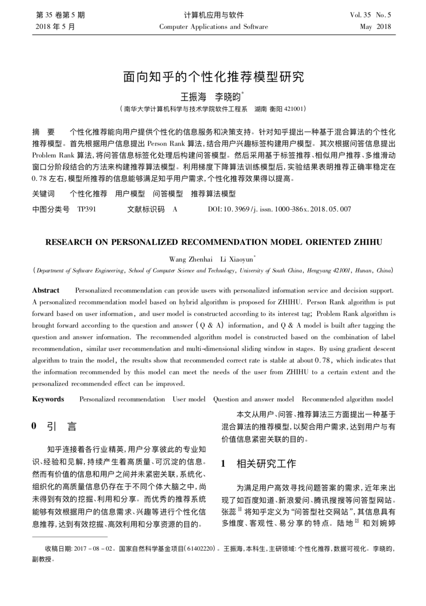
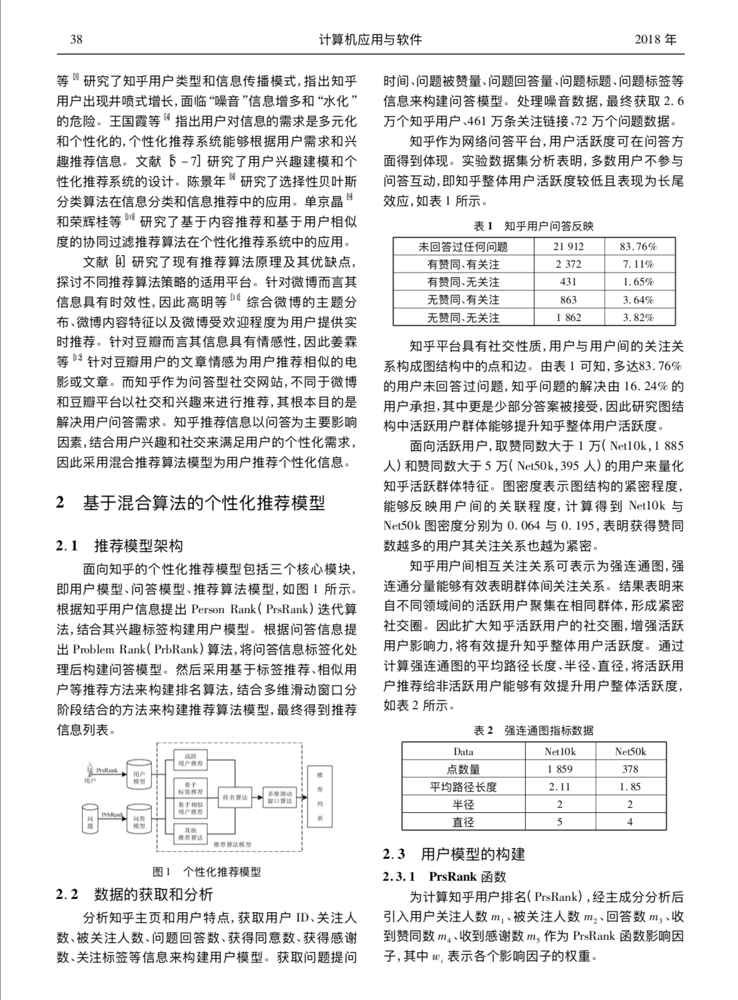
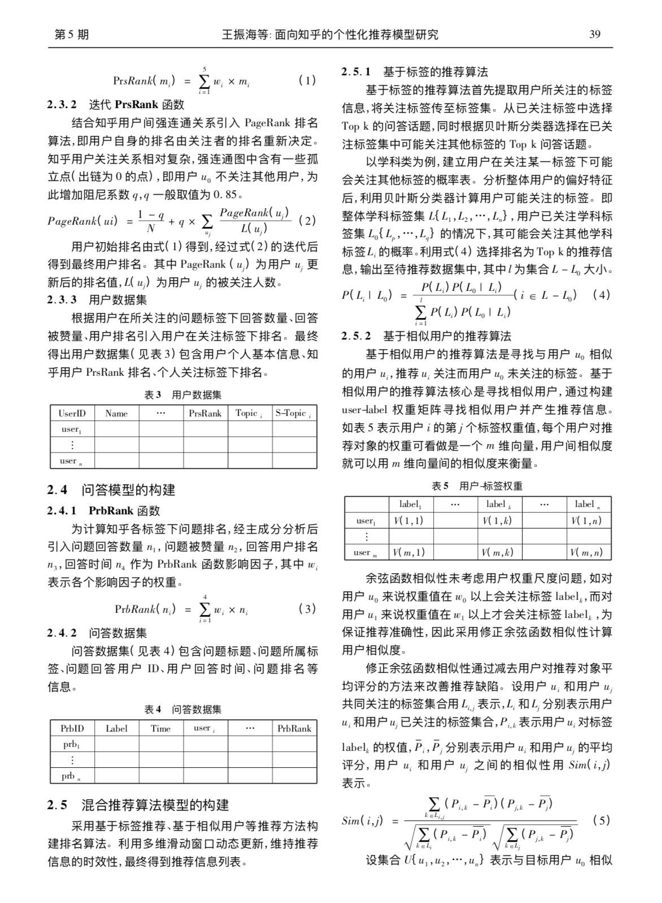
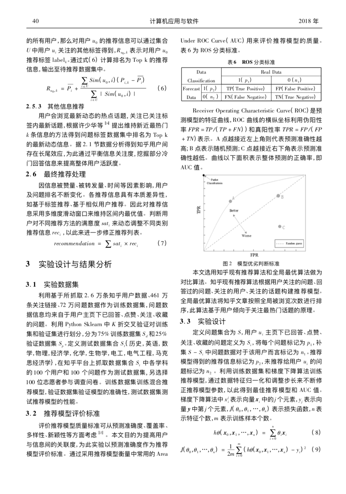
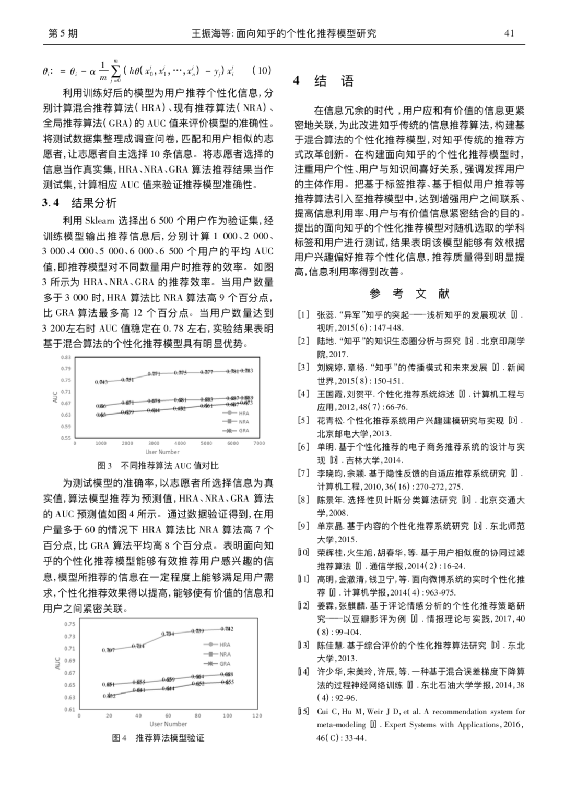

### 面向知乎的个性化推荐模型研究
《[面向知乎的个性化推荐模型研究](https://github.com/XiaoYiii/Paper/blob/master/Paper/%E9%9D%A2%E5%90%91%E7%9F%A5%E4%B9%8E%E7%9A%84%E4%B8%AA%E6%80%A7%E5%8C%96%E6%8E%A8%E8%8D%90%E6%A8%A1%E5%9E%8B%E7%A0%94%E7%A9%B6.pdf)》论文是大二暑假完成的，已投到《计算机应用与软件》中文核心期刊。论文主要对知乎提出一种基于混合算法的个性化推荐模型。论文基于用户模型、问题模型、推荐模型构建推荐系统，提出Person Rank、Problem Rank，并结合其他算法来优化推荐结果，利用数据训练推荐模型，最终得到面向知乎的个性化推荐模型。

----------
更多内容请关注公众号'谓之小一'，若有疑问可在公众号后台提问，随时回答，内容转载请注明出处。「谓之小一」希望提供给读者别处看不到的内容，关于互联网、机器学习、数据挖掘、编程、书籍、生活...

